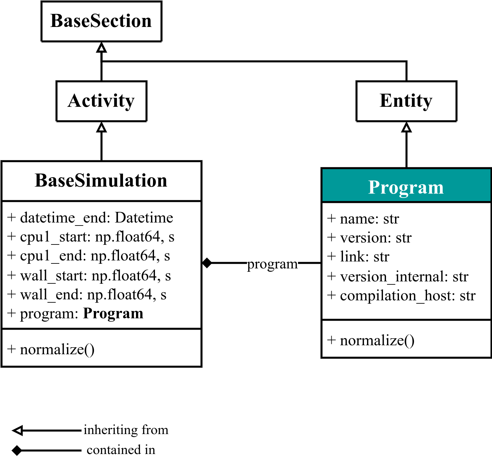

# `Program` 

The `Program` base section contains all the information about the program / software / code used to perform the simulation. We consider it to be a [`(Continuant) Entity`](http://purl.obolibrary.org/obo/BFO_0000002) and contained within `BaseSimulation` as a sub-section. The detailed UML diagram is:

<div class="click-zoom">
    <label>
        <input type="checkbox">
        
    </label>
</div>


When [writing a parser](https://nomad-lab.eu/prod/v1/staging/docs/howto/customization/parsers.html), we recommend to start by instantiating the `Program` section and populating its quantities, in order to get acquainted with the NOMAD parsing infrastructure.

For example, imagine we have a file which we want to parse with the following information:
```txt
! * * * * * * *
! Welcome to SUPERCODE, version 7.0
...
```

We can parse the program `name` and `version` by matching the texts (see, e.g., [Wikipedia page for Regular expressions, also called _regex_](https://en.wikipedia.org/wiki/Regular_expression)):

```python
from nomad.parsing.file_parser import TextParser, Quantity
from nomad_simulations import Simulation, Program


class SUPERCODEParser:
    """
    Class responsible to populate the NOMAD `archive` from the files given by a
    SUPERCODE simulation.
    """

    def parse(self, filepath, archive, logger):
        output_parser = TextParser(
            quantities=[
                Quantity('program_version', r'version *([\d\.]+) *', repeats=False)
            ]
        )
        output_parser.mainfile = filepath

        simulation = Simulation()
        simulation.program = Program(
            name='SUPERCODE',
            version=output_parser.get('program_version'),
        )
        # append `Simulation` as an `archive.data` section
        archive.data.append(simulation)
```
