# Atomic State Properties

**Purpose:** Detailed atomic-level properties within AtomsState: orbitals, core holes, and Hubbard interactions

**In scope:**

- AtomsState as the container for atomic property details
- OrbitalsState: quantum numbers (n, l, ml, j, mj, ms)
- Orbital degeneracy and occupation
- CoreHole: excited electron states for spectroscopy
- HubbardInteractions: U matrix, U_effective, J_Hunds for correlated systems
- Slater integrals for many-body interactions

**Out of scope:**

- Basic particle positions and velocities
- Cell and geometric information
- Methods that use these properties like DMFT
- CoreHoleSpectra method

## Relationship map


{: style="width: 80%; cursor: pointer;" class="click-zoom-img" title="Click to zoom"}

<div style="font-size: 0.9em; color: #666; margin-top: 8px; margin-bottom: 8px;">
<b>Legend:</b>
<svg width="24" height="12" style="vertical-align: middle; margin: 0 2px;"><line x1="20" y1="6" x2="4" y2="6" stroke="currentColor" stroke-width="1.5"/><polygon points="4,6 8,3 8,9" fill="none" stroke="currentColor" stroke-width="1.5"/></svg> inheritance ·
<svg width="24" height="12" style="vertical-align: middle; margin: 0 2px;"><line x1="4" y1="6" x2="20" y2="6" stroke="currentColor" stroke-width="1.5"/><polygon points="20,6 16,3 16,9" fill="currentColor"/></svg> containment ·
<svg width="24" height="12" style="vertical-align: middle; margin: 0 2px;"><line x1="4" y1="6" x2="20" y2="6" stroke="currentColor" stroke-width="1.5" stroke-dasharray="2,2"/><polygon points="20,6 16,3 16,9" fill="currentColor"/></svg> reference
</div>


## Key sections

| Section | Description | MetaInfo |
|---|---|---|
| `AtomsState` | A base section to define each atom state information. | [Open in MetaInfo browser](https://nomad-lab.eu/prod/v1/develop/gui/analyze/metainfo/nomad_simulations/section_definitions@nomad_simulations.schema_packages.atoms_state.AtomsState){:target="_blank"} |
| `OrbitalsState` | A base section used to define the orbital state of an atom. | [Open in MetaInfo browser](https://nomad-lab.eu/prod/v1/develop/gui/analyze/metainfo/nomad_simulations/section_definitions@nomad_simulations.schema_packages.atoms_state.OrbitalsState){:target="_blank"} |
| `CoreHole` | A base section used to define the core-hole state of an atom by referencing the `OrbitalsState` section where the core-hole was generated. | [Open in MetaInfo browser](https://nomad-lab.eu/prod/v1/develop/gui/analyze/metainfo/nomad_simulations/section_definitions@nomad_simulations.schema_packages.atoms_state.CoreHole){:target="_blank"} |
| `HubbardInteractions` | A base section to define the Hubbard interactions of the system. | [Open in MetaInfo browser](https://nomad-lab.eu/prod/v1/develop/gui/analyze/metainfo/nomad_simulations/section_definitions@nomad_simulations.schema_packages.atoms_state.HubbardInteractions){:target="_blank"} |


## Micro-examples

=== "YAML"

    ```yaml
    AtomsState:
      chemical_symbol:
      - null
      atomic_number:
      - null
      charge: 0
      spin: 0
      label:
      - null
      orbitals_state:
      - {}
      core_hole: {}
      hubbard_interactions: {}
    OrbitalsState:
      n_quantum_number:
      - null
      l_quantum_number:
      - null
      l_quantum_symbol:
      - null
      ml_quantum_number:
      - null
      ml_quantum_symbol:
      - null
      j_quantum_number:
      - null
      mj_quantum_number:
      - null
      ms_quantum_number:
      - null
      ms_quantum_symbol:
      - null
      degeneracy:
      - null
      occupation:
      - null
    CoreHole:
      orbital_ref:
      - null
      n_excited_electrons:
      - null
      dscf_state:
      - null
    HubbardInteractions:
      n_orbitals:
      - null
      orbitals_ref:
      - null
      u_matrix:
      - null
      u_interaction:
      - null
      j_hunds_coupling:
      - null
      u_interorbital_interaction:
      - null
      j_local_exchange_interaction:
      - null
      u_effective:
      - null
      slater_integrals:
      - null
      double_counting_correction:
      - null
    ```