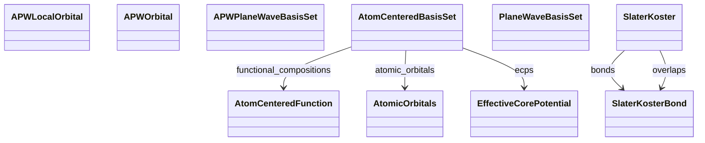

```mermaid
classDiagram
    class APWLocalOrbital
    class APWOrbital
    class APWPlaneWaveBasisSet
    class AtomCenteredBasisSet
    class AtomCenteredFunction
    class AtomicOrbitals
    class EffectiveCorePotential
    class PlaneWaveBasisSet
    class SlaterKoster
    class SlaterKosterBond
    AtomCenteredBasisSet --> AtomCenteredFunction : functional_compositions
    AtomCenteredBasisSet --> AtomicOrbitals : atomic_orbitals
    AtomCenteredBasisSet --> EffectiveCorePotential : ecps
    SlaterKoster --> SlaterKosterBond : bonds
    SlaterKoster --> SlaterKosterBond : overlaps
```