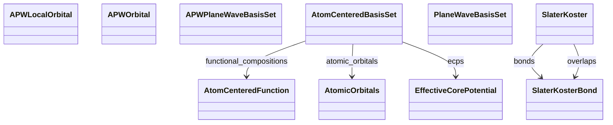

# Basis & Orbitals

**Purpose.** Representations used to expand wavefunctions or Hamiltonians.
**In scope:** plane wave parameters, APW/APW+lo, localized atomic basis, tight-binding tables
**Out of scope:** results derived from the basis (e.g., DOS)

## Relationship map





## Key sections

| Section | Description | MetaInfo |
|---|---|---|
| `PlaneWaveBasisSet` | Basis set over a reciprocal mesh, where each point $k_n$ represents a planar-wave basis function $rac{1}{\sqrt{\omega}} e^{i k_n r}$. | [Open in MetaInfo browser](https://nomad-lab.eu/prod/v1/oasis/gui/analyze/metainfo) |
| `AtomCenteredBasisSet` | Defines an **atom-centered basis set** for quantum chemistry calculations. | [Open in MetaInfo browser](https://nomad-lab.eu/prod/v1/oasis/gui/analyze/metainfo) |
| `APWPlaneWaveBasisSet` | A `PlaneWaveBasisSet` specialized to the APW use case. | [Open in MetaInfo browser](https://nomad-lab.eu/prod/v1/oasis/gui/analyze/metainfo) |
| `APWLocalOrbital` | Implementation of `APWWavefunction` capturing a local orbital extending a foundational APW basis set. | [Open in MetaInfo browser](https://nomad-lab.eu/prod/v1/oasis/gui/analyze/metainfo) |
| `APWOrbital` | Implementation of `APWWavefunction` capturing the foundational (S)(L)APW basis sets, all of the form $\sum_{lm} \left[ \sum_o c_{lmo} rac{\partial}{\partial r}u_l(r, \epsilon_l) 
ight] Y_lm$. | [Open in MetaInfo browser](https://nomad-lab.eu/prod/v1/oasis/gui/analyze/metainfo) |
| `AtomCenteredFunction` | Specifies a single contracted basis function in an atom-centered basis set. | [Open in MetaInfo browser](https://nomad-lab.eu/prod/v1/oasis/gui/analyze/metainfo) |
| `SlaterKoster` | A base section used to define the parameters used in a Slater-Koster tight-binding fitting. | [Open in MetaInfo browser](https://nomad-lab.eu/prod/v1/oasis/gui/analyze/metainfo) |
| `SlaterKosterBond` | A base section used to define the Slater-Koster bond information betwee two orbitals. | [Open in MetaInfo browser](https://nomad-lab.eu/prod/v1/oasis/gui/analyze/metainfo) |


## Micro-examples

=== "YAML"

    ```yaml
    PlaneWaveBasisSet:
      cutoff_energy:
      - null
      cutoff_radius:
      - null
    AtomCenteredBasisSet:
      basis_set:
      - null
      type:
      - null
      role:
      - null
      ao_ordering_convention: Gaussian
      ao_custom_order:
      - null
      n_total_basis_functions:
      - null
      functional_compositions:
      - {}
      atomic_orbitals: {}
      ecps:
      - {}
    APWPlaneWaveBasisSet:
      cutoff_fractional:
      - null
    APWLocalOrbital: {}
    APWOrbital:
      type:
      - null
    AtomCenteredFunction:
      angular_type: spherical
      function_type:
      - null
      angular_momentum:
      - null
      r_power:
      - null
      shell_normalization:
      - null
      n_primitive:
      - null
      exponents:
      - null
      contraction_coefficients:
      - null
      primitive_factor:
      - null
      point_charge:
      - null
    SlaterKoster:
      bonds:
      - {}
      overlaps:
      - {}
    SlaterKosterBond:
      orbital_1:
      - null
      orbital_2:
      - null
      bravais_vector:
      - 0
      - 0
      - 0
      name:
      - null
      integral_value:
      - null
    ```