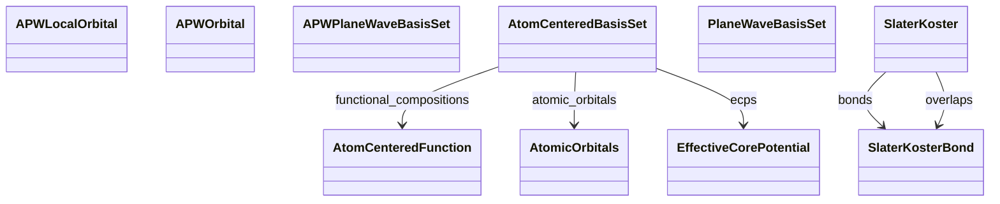

# Basis & Orbitals

**Purpose.** Representations used to expand wavefunctions or Hamiltonians.
**In scope:** plane wave parameters, APW/APW+lo, localized atomic basis, tight-binding tables
**Out of scope:** results derived from the basis (e.g., DOS)

## Relationship map





## Key sections

| Section | MetaInfo |
|---|---|
| `PlaneWaveBasisSet` | [Open in MetaInfo browser](https://nomad-lab.eu/prod/v1/gui/analyze/metainfo) |
| `AtomCenteredBasisSet` | [Open in MetaInfo browser](https://nomad-lab.eu/prod/v1/gui/analyze/metainfo) |
| `APWPlaneWaveBasisSet` | [Open in MetaInfo browser](https://nomad-lab.eu/prod/v1/gui/analyze/metainfo) |
| `APWLocalOrbital` | [Open in MetaInfo browser](https://nomad-lab.eu/prod/v1/gui/analyze/metainfo) |
| `APWOrbital` | [Open in MetaInfo browser](https://nomad-lab.eu/prod/v1/gui/analyze/metainfo) |
| `AtomCenteredFunction` | [Open in MetaInfo browser](https://nomad-lab.eu/prod/v1/gui/analyze/metainfo) |
| `SlaterKoster` | [Open in MetaInfo browser](https://nomad-lab.eu/prod/v1/gui/analyze/metainfo) |
| `SlaterKosterBond` | [Open in MetaInfo browser](https://nomad-lab.eu/prod/v1/gui/analyze/metainfo) |


## Micro-examples

=== "YAML"

    ```yaml
    PlaneWaveBasisSet:
      cutoff_energy:
      - null
      cutoff_radius:
      - null
    AtomCenteredBasisSet:
      basis_set:
      - null
      type:
      - null
      role:
      - null
      ao_ordering_convention: Gaussian
      ao_custom_order:
      - null
      n_total_basis_functions:
      - null
      functional_compositions:
      - {}
      atomic_orbitals: {}
      ecps:
      - {}
    APWPlaneWaveBasisSet:
      cutoff_fractional:
      - null
    APWLocalOrbital: {}
    APWOrbital:
      type:
      - null
    AtomCenteredFunction:
      angular_type: spherical
      function_type:
      - null
      angular_momentum:
      - null
      r_power:
      - null
      shell_normalization:
      - null
      n_primitive:
      - null
      exponents:
      - null
      contraction_coefficients:
      - null
      primitive_factor:
      - null
      point_charge:
      - null
    SlaterKoster:
      bonds:
      - {}
      overlaps:
      - {}
    SlaterKosterBond:
      orbital_1:
      - null
      orbital_2:
      - null
      bravais_vector:
      - 0
      - 0
      - 0
      name:
      - null
      integral_value:
      - null
    ```