# Cell and Geometric Spaces

**Purpose:** Geometric space hierarchy: GeometricSpace, Cell, and AtomicCell with lattice vectors

**In scope:**

- GeometricSpace: base section for defining geometrical spaces
- Cell: cell quantities and lattice vectors
- AtomicCell: atomic cell information extending Cell
- Lattice vectors, periodic boundary conditions
- Positions and cell geometry

**Out of scope:**

- Particle states within the cell
- Symmetry information
- Chemical formulas

## Relationship map

{: style="width: 40%; cursor: pointer;" class="click-zoom-img" title="Click to zoom"}

<b>Legend:</b>
<svg width="24" height="12" style="vertical-align: middle; margin: 0 2px;"><line x1="20" y1="6" x2="4" y2="6" stroke="currentColor" stroke-width="1.5"/><polygon points="4,6 8,3 8,9" fill="none" stroke="currentColor" stroke-width="1.5"/></svg> inheritance ·
<svg width="24" height="12" style="vertical-align: middle; margin: 0 2px;"><line x1="4" y1="6" x2="20" y2="6" stroke="currentColor" stroke-width="1.5"/><polygon points="20,6 16,3 16,9" fill="currentColor"/></svg> containment ·
<svg width="24" height="12" style="vertical-align: middle; margin: 0 2px;"><line x1="4" y1="6" x2="20" y2="6" stroke="currentColor" stroke-width="1.5" stroke-dasharray="2,2"/><polygon points="20,6 16,3 16,9" fill="currentColor"/></svg> reference

## Key sections

| Section | Description | MetaInfo |
|---|---|---|
| `GeometricSpace` | A base section used to define geometrical spaces and their entities. | [Open in MetaInfo browser](https://nomad-lab.eu/prod/v1/develop/gui/analyze/metainfo/nomad_simulations/section_definitions@nomad_simulations.schema_packages.model_system.GeometricSpace){:target="_blank"} |
| `Cell` | A base section used to specify the cell quantities of a system at a given moment in time. | [Open in MetaInfo browser](https://nomad-lab.eu/prod/v1/develop/gui/analyze/metainfo/nomad_simulations/section_definitions@nomad_simulations.schema_packages.model_system.Cell){:target="_blank"} |
| `AtomicCell` | A base section used to specify the atomic cell information of a system. | [Open in MetaInfo browser](https://nomad-lab.eu/prod/v1/develop/gui/analyze/metainfo/nomad_simulations/section_definitions@nomad_simulations.schema_packages.model_system.AtomicCell){:target="_blank"} |

## Quantities by section

### `GeometricSpace`

| Quantity | Type | Description |
|---|---|---|
| `length_vector_a` | m_float64(float64) | Length of the first basis vector. |
| `length_vector_b` | m_float64(float64) | Length of the second basis vector. |
| `length_vector_c` | m_float64(float64) | Length of the third basis vector. |
| `angle_vectors_b_c` | m_float64(float64) | Angle between second and third basis vector. |
| `angle_vectors_a_c` | m_float64(float64) | Angle between first and third basis vector. |
| `angle_vectors_a_b` | m_float64(float64) | Angle between first and second basis vector. |
| `volume` | m_float64(float64) | Volume of a 3D real space entity. |
| `surface_area` | m_float64(float64) | Surface area of a 3D real space entity. |
| `area` | m_float64(float64) | Area of a 2D real space entity. |
| `length` | m_float64(float64) | Total length of a 1D real space entity. |
| `coordinates_system` | Enum | 

Coordinate system used to define geometrical primitives of a shape in real
Coordinate system used to define geometrical primitives of a shape in real space. Defaults to 'cartesian'. \| name       \| description \| dimensionalities \| coordinates \| \|------------\|-------------\|------------------\|-------------\| \| cartesian  \| coordinate system with fixed angles between the axes (not necessarily 90°) \| 1, 2, 3 \| x, y, z \| \| cylindrical\| cylindrical symmetry \| 3 \| r, theta, z \| \| spherical  \| spherical symmetry \| 3 \| r, theta, phi \| \| ellipsoidal\| spherically elongated system \| 3 \| r, theta, phi \| \| polar      \| spherical symmetry \| 2 \| r, theta \|
 |
| `origin_shift` | m_float64(float64) (shape: [3]) | 

Vector `p` from the origin of a custom coordinates system to the origin of the
Vector `p` from the origin of a custom coordinates system to the origin of the global coordinates system. Together with the matrix `P` (stored in transformation_matrix), the transformation between the custom coordinates `x` and global coordinates `X` is then given by: `x` = `P` `X` + `p`.
 |
| `transformation_matrix` | m_float64(float64) (shape: [3, 3]) | 

Matrix `P` used to transform the custom coordinates system to the global coordinates system.
Matrix `P` used to transform the custom coordinates system to the global coordinates system. Together with the vector `p` (stored in origin_shift), the transformation between the custom coordinates `x` and global coordinates `X` is then given by: `x` = `P` `X` + `p`.
 |

### `Cell`

| Quantity | Type | Description |
|---|---|---|
| `name` | m_str(str) | Name of the specific cell section. This is typically used to easy identification of the `Cell` section. Possible values: "AtomicCell". |
| `type` | Enum | 

Representation type of the cell structure.
Representation type of the cell structure. It might be: - 'original' as in originally parsed, - 'primitive' as the primitive unit cell, - 'conventional' as the conventional cell used for referencing.
 |
| `n_cell_points` | m_int32(int32) | Number of cell points. |
| `lattice_vectors` | m_float64(float64) (shape: [3, 3]) | Lattice vectors of the simulated cell in Cartesian coordinates. The first index runs over each lattice vector. The second index runs over the $x, y, z$ Cartesian coordinates. |
| `periodic_boundary_conditions` | m_bool(bool) (shape: [3]) | If periodic boundary conditions are applied to each direction of the crystal axes. |
| `supercell_matrix` | m_int32(int32) (shape: [3, 3]) | 

Specifies the matrix that transforms the primitive unit cell into the supercell ...
Specifies the matrix that transforms the primitive unit cell into the supercell in which the actual calculation is performed. In the easiest example, it is a diagonal matrix whose elements multiply the lattice_vectors, e.g., [[3, 0, 0], [0, 3, 0], [0, 0, 3]] is a $3 x 3 x 3$ superlattice.
 |

### `AtomicCell`

| Quantity | Type | Description |
|---|---|---|
| `equivalent_atoms` | m_int32(int32) (shape: ['*']) | 

List of equivalent atoms as defined in `atoms`.
List of equivalent atoms as defined in `atoms`. If no equivalent atoms are found, then the list is simply the index of each element, e.g.: - [0, 1, 2, 3] all four atoms are non-equivalent. - [0, 0, 0, 3] three equivalent atoms and one non-equivalent.
 |
| `wyckoff_letters` | m_str(str) (shape: ['*']) | Wyckoff letters associated with each atom. |

