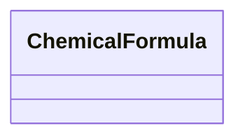

# Chemical Formula

**Purpose:** Chemical formulas in different formats: descriptive, reduced, IUPAC, Hill, anonymous

**In scope:**

- Descriptive formula
- Reduced formula
- IUPAC formula
- Hill formula
- Anonymous formula
- Automatic formula generation

## Relationship map

## Key sections

| Section | Description | MetaInfo |
|---|---|---|
| `ChemicalFormula` | A base section used to store the chemical formulas of a `ModelSystem` in different formats. | [Open in MetaInfo browser](https://nomad-lab.eu/prod/v1/develop/gui/analyze/metainfo/nomad_simulations/section_definitions@nomad_simulations.schema_packages.model_system.ChemicalFormula){:target="_blank"} |

## Quantities by section

### `ChemicalFormula`

| Quantity | Type | Description |
|---|---|---|
| `descriptive` | m_str(str) | The chemical formula of the system as a string to be descriptive of the computation. It is derived from `elemental_composition` if not specified, with non-reduced integer numbers for the proportions of the elements. |
| `reduced` | m_str(str) | Alphabetically sorted chemical formula with reduced integer chemical proportion numbers. The proportion number is omitted if it is 1. |
| `iupac` | m_str(str) | 

Chemical formula where the elements are ordered using a formal list based on
Chemical formula where the elements are ordered using a formal list based on electronegativity as defined in the IUPAC nomenclature of inorganic chemistry (2005): - https://en.wikipedia.org/wiki/List_of_inorganic_compounds Contains reduced integer chemical proportion numbers where the proportion number is omitted if it is 1.
 |
| `hill` | m_str(str) | Chemical formula where Carbon is placed first, then Hydrogen, and then all the other elements in alphabetical order. If Carbon is not present, the order is alphabetical. |
| `anonymous` | m_str(str) | 

Formula with the elements ordered by their reduced integer chemical proportion
Formula with the elements ordered by their reduced integer chemical proportion number, and the chemical species replaced by alphabetically ordered letters. The proportion number is omitted if it is 1. Examples: H2O becomes A2B and H2O2 becomes AB. The letters are drawn from the English alphabet that may be extended by increasing the number of letters: A, B, ..., Z, Aa, Ab and so on. This definition is in line with the similarly named OPTIMADE definition.
 |

