# Chemical Formula

**Purpose:** Chemical formulas in different formats: descriptive, reduced, IUPAC, Hill, anonymous

**In scope:**

- Descriptive formula
- Reduced formula
- IUPAC formula
- Hill formula
- Anonymous formula
- Automatic formula generation

**Out of scope:**

- Atomic positions
- Particle states

## Relationship map


{: style="width: 80%; cursor: pointer;" class="click-zoom-img" title="Click to zoom"}

<div style="font-size: 0.9em; color: #666; margin-top: 8px; margin-bottom: 8px;">
<b>Legend:</b>
<svg width="24" height="12" style="vertical-align: middle; margin: 0 2px;"><line x1="20" y1="6" x2="4" y2="6" stroke="currentColor" stroke-width="1.5"/><polygon points="4,6 8,3 8,9" fill="none" stroke="currentColor" stroke-width="1.5"/></svg> inheritance ·
<svg width="24" height="12" style="vertical-align: middle; margin: 0 2px;"><line x1="4" y1="6" x2="20" y2="6" stroke="currentColor" stroke-width="1.5"/><polygon points="20,6 16,3 16,9" fill="currentColor"/></svg> containment ·
<svg width="24" height="12" style="vertical-align: middle; margin: 0 2px;"><line x1="4" y1="6" x2="20" y2="6" stroke="currentColor" stroke-width="1.5" stroke-dasharray="2,2"/><polygon points="20,6 16,3 16,9" fill="currentColor"/></svg> reference
</div>


## Key sections

| Section | Description | MetaInfo |
|---|---|---|
| `ChemicalFormula` | A base section used to store the chemical formulas of a `ModelSystem` in different formats. | [Open in MetaInfo browser](https://nomad-lab.eu/prod/v1/develop/gui/analyze/metainfo/nomad_simulations/section_definitions@nomad_simulations.schema_packages.model_system.ChemicalFormula){:target="_blank"} |


## Micro-examples

=== "YAML"

    ```yaml
    ChemicalFormula:
      descriptive:
      - null
      reduced:
      - null
      iupac:
      - null
      hill:
      - null
      anonymous:
      - null
    ```