# Electronic Structure Properties

**Purpose:** Electronic eigenvalues, band structures, DOS, band gaps, occupancies, and Fermi surfaces

**In scope:**

- Eigenvalue hierarchy: BaseElectronicEigenvalues → ElectronicEigenvalues → ElectronicBandStructure
- Band structures along high-symmetry paths
- Density of states (DOS) profiles
- Electronic band gaps (direct, indirect)
- Orbital occupancies
- Fermi surface topology

**Out of scope:**

- Many-body properties like Green's functions
- Spectroscopic properties
- Thermodynamic properties

## Relationship map


{: style="width: 80%; cursor: pointer;" class="click-zoom-img" title="Click to zoom"}

<div style="font-size: 0.9em; color: #666; margin-top: 8px; margin-bottom: 8px;">
<b>Legend:</b>
<svg width="24" height="12" style="vertical-align: middle; margin: 0 2px;"><line x1="20" y1="6" x2="4" y2="6" stroke="currentColor" stroke-width="1.5"/><polygon points="4,6 8,3 8,9" fill="none" stroke="currentColor" stroke-width="1.5"/></svg> inheritance ·
<svg width="24" height="12" style="vertical-align: middle; margin: 0 2px;"><line x1="4" y1="6" x2="20" y2="6" stroke="currentColor" stroke-width="1.5"/><polygon points="20,6 16,3 16,9" fill="currentColor"/></svg> containment ·
<svg width="24" height="12" style="vertical-align: middle; margin: 0 2px;"><line x1="4" y1="6" x2="20" y2="6" stroke="currentColor" stroke-width="1.5" stroke-dasharray="2,2"/><polygon points="20,6 16,3 16,9" fill="currentColor"/></svg> reference
</div>


## Key sections

| Section | Description | MetaInfo |
|---|---|---|
| `BaseElectronicEigenvalues` | A base section used to define basic quantities for the `ElectronicEigenvalues`  and `ElectronicBandStructure` properties. | [Open in MetaInfo browser](https://nomad-lab.eu/prod/v1/develop/gui/analyze/metainfo/nomad_simulations/section_definitions@nomad_simulations.schema_packages.properties.band_structure.BaseElectronicEigenvalues){:target="_blank"} |
| `ElectronicEigenvalues` |  | [Open in MetaInfo browser](https://nomad-lab.eu/prod/v1/develop/gui/analyze/metainfo/nomad_simulations/section_definitions@nomad_simulations.schema_packages.properties.band_structure.ElectronicEigenvalues){:target="_blank"} |
| `ElectronicBandStructure` | Accessible energies by the charges (electrons and holes) in the reciprocal space. | [Open in MetaInfo browser](https://nomad-lab.eu/prod/v1/develop/gui/analyze/metainfo/nomad_simulations/section_definitions@nomad_simulations.schema_packages.properties.band_structure.ElectronicBandStructure){:target="_blank"} |
| `ElectronicBandGap` | Energy difference between the highest occupied electronic state and the lowest unoccupied electronic state. | [Open in MetaInfo browser](https://nomad-lab.eu/prod/v1/develop/gui/analyze/metainfo/nomad_simulations/section_definitions@nomad_simulations.schema_packages.properties.band_gap.ElectronicBandGap){:target="_blank"} |
| `DOSProfile` | A base section used to define the `value` of the `ElectronicDensityOfState` property. | [Open in MetaInfo browser](https://nomad-lab.eu/prod/v1/develop/gui/analyze/metainfo/nomad_simulations/section_definitions@nomad_simulations.schema_packages.properties.spectral_profile.DOSProfile){:target="_blank"} |
| `ElectronicDensityOfStates` | Number of electronic states accessible for the charges per energy and per volume. | [Open in MetaInfo browser](https://nomad-lab.eu/prod/v1/develop/gui/analyze/metainfo/nomad_simulations/section_definitions@nomad_simulations.schema_packages.properties.spectral_profile.ElectronicDensityOfStates){:target="_blank"} |
| `Occupancy` | Electrons occupancy of an atom per orbital and spin. | [Open in MetaInfo browser](https://nomad-lab.eu/prod/v1/develop/gui/analyze/metainfo/nomad_simulations/section_definitions@nomad_simulations.schema_packages.properties.band_structure.Occupancy){:target="_blank"} |
| `FermiSurface` | Energy boundary in reciprocal space that separates the filled and empty electronic states in a metal. | [Open in MetaInfo browser](https://nomad-lab.eu/prod/v1/develop/gui/analyze/metainfo/nomad_simulations/section_definitions@nomad_simulations.schema_packages.properties.fermi_surface.FermiSurface){:target="_blank"} |


## Micro-examples

=== "YAML"

    ```yaml
    BaseElectronicEigenvalues:
      n_bands:
      - null
      value:
      - null
    ElectronicEigenvalues:
      spin_channel:
      - null
      occupation:
      - null
      highest_occupied:
      - null
      lowest_unoccupied:
      - null
      reciprocal_cell:
      - null
      value_contributions:
      - {}
    ElectronicBandStructure:
      k_path: {}
    ElectronicBandGap:
      type:
      - null
      momentum_transfer:
      - null
      spin_channel:
      - null
      value:
      - null
    DOSProfile:
      value:
      - null
      energies: {}
    ElectronicDensityOfStates:
      spin_channel:
      - null
      energies_origin:
      - null
      normalization_factor:
      - null
      energies: {}
      projected_dos:
      - {}
    Occupancy:
      atoms_state_ref:
      - null
      orbitals_state_ref:
      - null
      spin_channel:
      - null
      value:
      - null
    FermiSurface:
      n_bands:
      - null
    ```