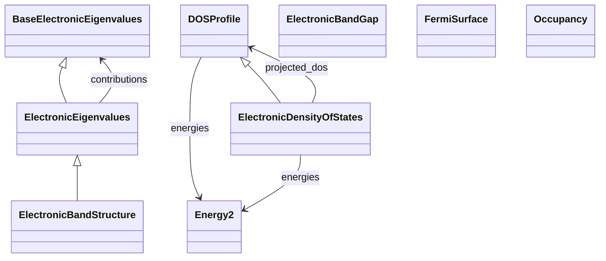

# Electronic Structure Properties

**Purpose:** Electronic eigenvalues, band structures, DOS, band gaps, occupancies, and Fermi surfaces

**In scope:**

- Eigenvalue hierarchy: BaseElectronicEigenvalues → ElectronicEigenvalues → ElectronicBandStructure
- Band structures along high-symmetry paths
- Density of states (DOS) profiles
- Electronic band gaps (direct, indirect)
- Orbital occupancies
- Fermi surface topology

## Relationship map

Legend

<svg class="uml-legend__swatch" viewBox="0 0 64 16" aria-hidden="true"><line class="uml-legend__line" x1="50" y1="8" x2="22" y2="8"/><path class="uml-legend__head uml-legend__head--filled" d="M22 8 L32 3 L32 13 Z"/></svg><code>Parent &lt;|-- Child</code> is-a relationship, Parent-Child inheritance

<svg class="uml-legend__swatch" viewBox="0 0 64 16" aria-hidden="true"><line class="uml-legend__line" x1="8" y1="8" x2="40" y2="8"/><path class="uml-legend__head uml-legend__head--open" d="M40 8 L48 4 M40 8 L48 12"/></svg><code>Owner --&gt; SubSection</code> has-a relationship, Owner-SubSection composition

## Key sections

| Section | Description | MetaInfo |
|---|---|---|
| `BaseElectronicEigenvalues` | A base section used to define basic quantities for the `ElectronicEigenvalues`  and `ElectronicBandStructure` properties. | [Open in MetaInfo browser](https://nomad-lab.eu/prod/v1/develop/gui/analyze/metainfo/nomad_simulations/section_definitions@nomad_simulations.schema_packages.properties.electronic_eigenvalues.BaseElectronicEigenvalues){:target="_blank"} |
| `ElectronicEigenvalues` |  | [Open in MetaInfo browser](https://nomad-lab.eu/prod/v1/develop/gui/analyze/metainfo/nomad_simulations/section_definitions@nomad_simulations.schema_packages.properties.electronic_eigenvalues.ElectronicEigenvalues){:target="_blank"} |
| `ElectronicBandStructure` | Accessible energies by the charges (electrons and holes) in the reciprocal space. | [Open in MetaInfo browser](https://nomad-lab.eu/prod/v1/develop/gui/analyze/metainfo/nomad_simulations/section_definitions@nomad_simulations.schema_packages.properties.band_structure.ElectronicBandStructure){:target="_blank"} |
| `ElectronicBandGap` | Energy difference between the highest occupied electronic state and the lowest unoccupied electronic state. | [Open in MetaInfo browser](https://nomad-lab.eu/prod/v1/develop/gui/analyze/metainfo/nomad_simulations/section_definitions@nomad_simulations.schema_packages.properties.band_gap.ElectronicBandGap){:target="_blank"} |
| `DOSProfile` | A base section used to define the `value` of the `ElectronicDensityOfState` property. | [Open in MetaInfo browser](https://nomad-lab.eu/prod/v1/develop/gui/analyze/metainfo/nomad_simulations/section_definitions@nomad_simulations.schema_packages.properties.spectral_profile.DOSProfile){:target="_blank"} |
| `ElectronicDensityOfStates` | Number of electronic states accessible for the charges per energy and per volume. | [Open in MetaInfo browser](https://nomad-lab.eu/prod/v1/develop/gui/analyze/metainfo/nomad_simulations/section_definitions@nomad_simulations.schema_packages.properties.spectral_profile.ElectronicDensityOfStates){:target="_blank"} |
| `Occupancy` | Electrons occupancy of an atom per orbital and spin. | [Open in MetaInfo browser](https://nomad-lab.eu/prod/v1/develop/gui/analyze/metainfo/nomad_simulations/section_definitions@nomad_simulations.schema_packages.properties.electronic_eigenvalues.Occupancy){:target="_blank"} |
| `FermiSurface` | Energy boundary in reciprocal space that separates the filled and empty electronic states in a metal. | [Open in MetaInfo browser](https://nomad-lab.eu/prod/v1/develop/gui/analyze/metainfo/nomad_simulations/section_definitions@nomad_simulations.schema_packages.properties.fermi_surface.FermiSurface){:target="_blank"} |

## Quantities by section

### `BaseElectronicEigenvalues`

| Quantity | Type | Description |
|---|---|---|
| `n_levels` | m_int32(int32) | 

Number of energy levels per sampling point.
Number of energy levels per sampling point. In periodic systems these correspond to electronic bands; in molecular calculations they correspond to (spin-resolved) molecular orbitals or similar one-particle states.
 |
| `value` | m_float64(float64) (shape: ['*', '*']) | Value of the electronic eigenvalues. |

### `ElectronicEigenvalues`

| Quantity | Type | Description |
|---|---|---|
| `spin_channel` | m_int32(int32) | Spin channel of the corresponding electronic eigenvalues. It can take values of 0 or 1. |
| `occupation` | m_float64(float64) (shape: ['*', 'n_levels']) | 

Occupation of the electronic eigenvalues.
Occupation of the electronic eigenvalues. This is a number depending whether the `spin_channel` has been set or not. If `spin_channel` is set, then this number is between 0 and 1, where 0 means that the state is unoccupied and 1 means that the state is fully occupied; if `spin_channel` is not set, then this number is between 0 and 2. The shape of this quantity is defined as `[K.n_points, K.dimensionality, n_levels]`, where `K` is a `variable` which can be `KMesh` or `KLinePath`, depending whether the simulation mapped the whole Brillouin zone or just a specific path.
 |
| `highest_occupied` | m_float64(float64) | Highest occupied electronic eigenvalue. Together with `lowest_unoccupied`, it defines the electronic band gap. |
| `lowest_unoccupied` | m_float64(float64) | Lowest unoccupied electronic eigenvalue. Together with `highest_occupied`, it defines the electronic band gap. |

### `ElectronicBandStructure`

| Quantity | Type | Description |
|---|---|---|
| `reciprocal_cell` | QuantityReference | Reciprocal lattice vectors associated with the k-space sampling used for these eigenvalues, taken from the corresponding `KSpace` numerical settings. |

### `ElectronicBandGap`

| Quantity | Type | Description |
|---|---|---|
| `type` | Enum | Type categorization of the electronic band gap. This quantity is directly related with `momentum_transfer` as by definition, the electronic band gap is `'direct'` for zero momentum transfer (or if `momentum_transfer` is `None`) and `'indirect'` for finite momentum transfer. |
| `momentum_transfer` | m_float64(float64) (shape: [2, 3]) | 

If the electronic band gap is `'indirect'`, the reciprocal momentum transfer for...
If the electronic band gap is `'indirect'`, the reciprocal momentum transfer for which the band gap is defined in units of the `reciprocal_lattice_vectors`. The initial and final momentum 3D vectors are given in the first and second element. Example, the momentum transfer in bulk Si2 happens between the Γ and the (approximately) X points in the Brillouin zone; thus: `momentum_transfer = [[0, 0, 0], [0.5, 0.5, 0]]`. Note: this quantity only refers to scalar `value`, not to arrays of `value`.
 |
| `spin_channel` | m_int32(int32) | Spin channel of the corresponding electronic band gap. It can take values of 0 or 1. |
| `value` | m_float_bounded(float) | The value of the electronic band gap. This value must be positive. |

### `DOSProfile`

| Quantity | Type | Description |
|---|---|---|
| `value` | m_float_bounded(float) (shape: ['*']) | The value of the electronic DOS. Must be positive. |

### `ElectronicDensityOfStates`

| Quantity | Type | Description |
|---|---|---|
| `spin_channel` | m_int32(int32) | Spin channel of the corresponding electronic DOS. It can take values of 0 or 1. |
| `energies_origin` | m_float64(float64) | Energy level denoting the origin along the energy axis, used for comparison and visualization. It is defined as the `ElectronicEigenvalues.highest_occupied_energy`. |
| `normalization_factor` | m_float64(float64) | Normalization factor for electronic DOS to get a cell-independent intensive DOS. The cell-independent intensive DOS is as the integral from the lowest (most negative) energy to the Fermi level for a neutrally charged system (i.e., the sum of `AtomsState.charge` is zero). |

### `Occupancy`

| Quantity | Type | Description |
|---|---|---|
| `orbitals_state_ref` | Reference | Reference to the `ElectronicState` section in which the occupancy is calculated. This can reference individual orbitals, orbital manifolds, or hybrid/molecular orbitals. The parent AtomsState can be accessed via `orbitals_state_ref.get_parent_entity()`. |
| `spin_channel` | m_int32(int32) | Spin channel of the corresponding electronic property. It can take values of 0 and 1. |
| `value` | m_float64(float64) | 

Value of the electronic occupancy for the orbital defined by `orbitals_state_ref`.
Value of the electronic occupancy for the orbital defined by `orbitals_state_ref`. If `spin_channel` is set, then this number is between 0 and 1, where 0 means that the state is unoccupied and 1 means that the state is fully occupied; if `spin_channel` is not set, then this number is between 0 and 2.
 |

### `FermiSurface`

| Quantity | Type | Description |
|---|---|---|
| `n_bands` | m_int32(int32) | Number of bands / eigenvalues. |

