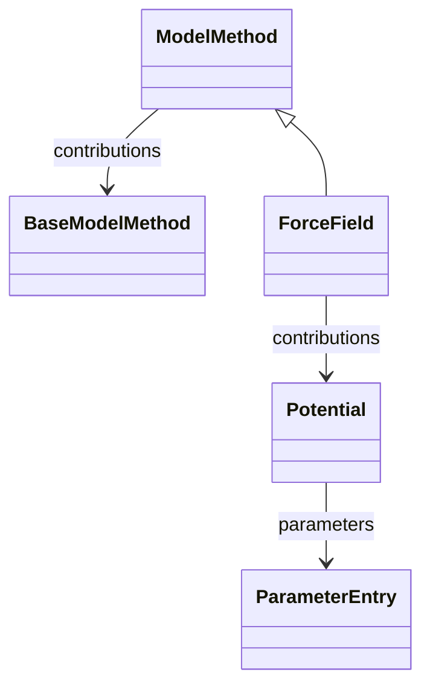

# Force Field

**Purpose:** Classical force-field model method branch rooted at ForceField

**In scope:**

- ForceField as a ModelMethod subclass
- Potential family entry-point used by ForceField contributions
- Bridge between model methods and classical interaction potentials

## Relationship map

**Legend**

<svg width="56" height="16" aria-hidden="true"><line x1="48" y1="8" x2="18" y2="8" stroke="currentColor" stroke-width="1.8"/><polygon points="18,8 26,4 26,12" fill="white" stroke="currentColor" stroke-width="1.8"/></svg><code>Parent &lt;|-- Child</code> inheritance (Child extends Parent)

<svg width="56" height="16" aria-hidden="true"><line x1="8" y1="8" x2="38" y2="8" stroke="currentColor" stroke-width="1.8"/><polygon points="46,8 38,4 38,12" fill="currentColor"/></svg><code>Owner --&gt; SubSection</code> containment/subsection

## Key sections

| Section | Description | MetaInfo |
|---|---|---|
| `ModelMethod` | A base section containing the mathematical model parameters. | [Open in MetaInfo browser](https://nomad-lab.eu/prod/v1/develop/gui/analyze/metainfo/nomad_simulations/section_definitions@nomad_simulations.schema_packages.model_method.ModelMethod){:target="_blank"} |
| `ForceField` | Section containing the parameters of a (classical, particle-based) force field model. | [Open in MetaInfo browser](https://nomad-lab.eu/prod/v1/develop/gui/analyze/metainfo/nomad_simulations/section_definitions@nomad_simulations.schema_packages.force_field.ForceField){:target="_blank"} |
| `Potential` | Section containing information about an interaction potential. | [Open in MetaInfo browser](https://nomad-lab.eu/prod/v1/develop/gui/analyze/metainfo/nomad_simulations/section_definitions@nomad_simulations.schema_packages.force_field.Potential){:target="_blank"} |

## Quantities by section

### `ModelMethod`

*This section has no direct quantities.*

### `ForceField`

| Quantity | Type | Description |
|---|---|---|
| `kimid` | URL | Reference to a model stored on the OpenKim database. |

### `Potential`

| Quantity | Type | Description |
|---|---|---|
| `type` | Enum | Denotes the classification of the interaction. |
| `functional_form` | m_str(str) | Specifies the functional form of the interaction potential, e.g., harmonic, Morse, Lennard-Jones, etc. |
| `n_interactions` | m_int32(int32) | Total number of interactions in the system for this potential. |
| `n_particles` | m_int32(int32) | Number of particles interacting via (each instance of) this potential. |
| `particle_labels` | m_str(str_) (shape: ['n_interactions', 'n_particles']) | Labels of the particles for each instance of this potential, stored as a list of tuples. |
| `particle_indices` | m_int32(int32) (shape: ['n_interactions', 'n_particles']) | Indices of the particles for each instance of this potential, stored as a list of tuples. |

## Related Pages

- [Model Method Overview](../explanation/model_method/overview.md)
