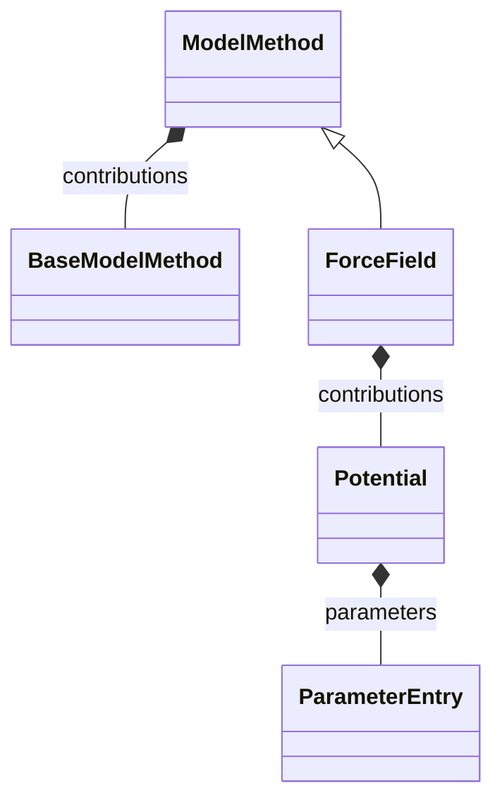

# Force Field

**Purpose:** Classical force-field model method branch rooted at ForceField

## Relationship map

Legend

<svg class="uml-legend__swatch" viewBox="0 0 64 16" aria-hidden="true"><line class="uml-legend__line" x1="54" y1="8" x2="22" y2="8"/><path class="uml-legend__head uml-legend__head--open" d="M10 8 L22 2 L22 14 Z"/></svg>inheritance (is-a)

<svg class="uml-legend__swatch" viewBox="0 0 64 16" aria-hidden="true"><path class="uml-legend__head uml-legend__head--filled" d="M10 8 L16 2 L22 8 L16 14 Z"/><line class="uml-legend__line" x1="22" y1="8" x2="52" y2="8"/></svg>composition (has-a)

## Quantities by Key Sections

### `ModelMethod`

| Section | Description | MetaInfo |
|---|---|---|
| `ModelMethod` | A base section for the method-defining choices of a simulation. | [Open in MetaInfo browser](https://nomad-lab.eu/prod/v1/develop/gui/analyze/metainfo/nomad_simulations/section_definitions@nomad_simulations.schema_packages.model_method.ModelMethod){:target="_blank"} |

*This section has no direct quantities.*

### `ForceField`

| Section | Description | MetaInfo |
|---|---|---|
| `ForceField` | Section containing the parameters of a (classical, particle-based) force field model. | [Open in MetaInfo browser](https://nomad-lab.eu/prod/v1/develop/gui/analyze/metainfo/nomad_simulations/section_definitions@nomad_simulations.schema_packages.force_field.ForceField){:target="_blank"} |

| Quantity | Type | Description |
|---|---|---|
| `kimid` | URL | Reference to a model stored on the OpenKim database. |

### `Potential`

| Section | Description | MetaInfo |
|---|---|---|
| `Potential` | Section containing information about an interaction potential. | [Open in MetaInfo browser](https://nomad-lab.eu/prod/v1/develop/gui/analyze/metainfo/nomad_simulations/section_definitions@nomad_simulations.schema_packages.force_field.Potential){:target="_blank"} |

| Quantity | Type | Description |
|---|---|---|
| `type` | Enum | Denotes the classification of the interaction. |
| `functional_form` | m_str(str) | Specifies the functional form of the interaction potential, e.g., harmonic, Morse, Lennard-Jones, etc. |
| `n_interactions` | m_int32(int32) | Total number of interactions in the system for this potential. |
| `n_particles` | m_int32(int32) | Number of particles interacting via (each instance of) this potential. |
| `particle_labels` | m_str(str_) (shape: ['n_interactions', 'n_particles']) | Labels of the particles for each instance of this potential, stored as a list of tuples. |
| `particle_indices` | m_int32(int32) (shape: ['n_interactions', 'n_particles']) | Indices of the particles for each instance of this potential, stored as a list of tuples. |

## Related Pages

- [Model Method Overview](../explanation/model_method/overview.md)
