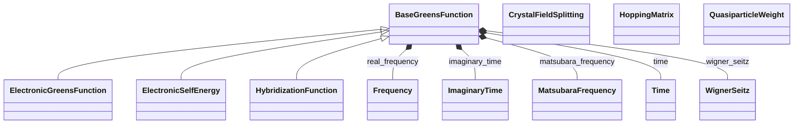

# Many-Body Properties

**Purpose:** Green's functions, self-energies, hybridization, quasiparticle weights, hopping matrices

## Relationship map

Legend

<svg class="uml-legend__swatch" viewBox="0 0 64 16" aria-hidden="true"><line class="uml-legend__line" x1="54" y1="8" x2="22" y2="8"/><path class="uml-legend__head uml-legend__head--open" d="M10 8 L22 2 L22 14 Z"/></svg>inheritance (is-a)

<svg class="uml-legend__swatch" viewBox="0 0 64 16" aria-hidden="true"><path class="uml-legend__head uml-legend__head--filled" d="M10 8 L16 2 L22 8 L16 14 Z"/><line class="uml-legend__line" x1="22" y1="8" x2="52" y2="8"/></svg>composition (has-a)

## Quantities by Key Sections

### `BaseGreensFunction`

| Section | Description | MetaInfo |
|---|---|---|
| `BaseGreensFunction` | A base class used to define shared commonalities between Green's function-related properties. | [Open in MetaInfo browser](https://nomad-lab.eu/prod/v1/develop/gui/analyze/metainfo/nomad_simulations/section_definitions@nomad_simulations.schema_packages.properties.greens_function.BaseGreensFunction){:target="_blank"} |

| Quantity | Type | Description |
|---|---|---|
| `n_atoms` | m_int32(int32) | Number of atoms involved in the correlations effect and used for the matrix representation of the property. Can be derived from entity_ref if needed. |
| `entity_ref` | Reference | Reference to the `ElectronicState` section describing the correlated orbitals for which the Green's function properties are calculated. The parent AtomsState can be accessed via `entity_ref.get_parent_entity()`. |
| `spin_channel` | m_int32(int32) | Spin channel of the corresponding electronic property. It can take values of 0 and 1. |
| `local_model_type` | Enum | 

Type of Green's function calculated from the mapping of the local Hubbard-Kanamo...
Type of Green's function calculated from the mapping of the local Hubbard-Kanamori model into the Anderson impurity model. The `impurity` Green's function describe the electronic correlations for the impurity, and it is a local function. The `lattice` Green's function includes the coupling to the lattice and hence it is a non-local function. In DMFT, the `lattice` term is approximated to be the `impurity` one, so that these simulations are converged if both types of the local part of the `lattice` Green's function coincides with the `impurity` Green's function.
 |
| `space_id` | Enum | 

String used to identify the space in which the Green's function property is represented.
String used to identify the space in which the Green's function property is represented. The spaces are: \| `space_id` \| variable type \| \| ------ \| ------ \| \| 'r' \| WignerSeitz \| \| 'rt' \| WignerSeitz + Time \| \| 'rw' \| WignerSeitz + Frequency \| \| 'rit' \| WignerSeitz + ImaginaryTime \| \| 'riw' \| WignerSeitz + MatsubaraFrequency \| \| 'k' \| KMesh \| \| 'kt' \| KMesh + Time \| \| 'kw' \| KMesh + Frequency \| \| 'kit' \| KMesh + ImaginaryTime \| \| 'kiw' \| KMesh + MatsubaraFrequency \| \| 't' \| Time \| \| 'it' \| Frequency \| \| 'w' \| ImaginaryTime \| \| 'iw' \| MatsubaraFrequency \|
 |

### `ElectronicGreensFunction`

| Section | Description | MetaInfo |
|---|---|---|
| `ElectronicGreensFunction` | Charge-charge correlation functions. | [Open in MetaInfo browser](https://nomad-lab.eu/prod/v1/develop/gui/analyze/metainfo/nomad_simulations/section_definitions@nomad_simulations.schema_packages.properties.greens_function.ElectronicGreensFunction){:target="_blank"} |

| Quantity | Type | Description |
|---|---|---|
| `value` | HDF5Dataset | 

Value of the electronic Green's function matrix stored as an HDF5 dataset.
Value of the electronic Green's function matrix stored as an HDF5 dataset. The conventional dataset layout is [n_kpoints, n_frequencies, n_orbitals, n_orbitals] for k- and frequency-resolved Green's functions, but the actual dimensions depend on the represented spaces set via the `space_id` field.
 |

### `ElectronicSelfEnergy`

| Section | Description | MetaInfo |
|---|---|---|
| `ElectronicSelfEnergy` | Corrections to the energy of an electron due to its interactions with its environment. | [Open in MetaInfo browser](https://nomad-lab.eu/prod/v1/develop/gui/analyze/metainfo/nomad_simulations/section_definitions@nomad_simulations.schema_packages.properties.greens_function.ElectronicSelfEnergy){:target="_blank"} |

| Quantity | Type | Description |
|---|---|---|
| `value` | HDF5Dataset | 

Value of the electronic self-energy matrix stored as an HDF5 dataset.
Value of the electronic self-energy matrix stored as an HDF5 dataset. The conventional dataset layout is [n_kpoints, n_frequencies, n_orbitals, n_orbitals] for k- and frequency-resolved self-energies, but the actual dimensions depend on the represented spaces set via the `space_id` field.
 |

### `HybridizationFunction`

| Section | Description | MetaInfo |
|---|---|---|
| `HybridizationFunction` | Dynamical hopping of the electrons in a lattice in and out of the reservoir or bath. | [Open in MetaInfo browser](https://nomad-lab.eu/prod/v1/develop/gui/analyze/metainfo/nomad_simulations/section_definitions@nomad_simulations.schema_packages.properties.greens_function.HybridizationFunction){:target="_blank"} |

| Quantity | Type | Description |
|---|---|---|
| `value` | HDF5Dataset | 

Value of the electronic hybridization function stored as an HDF5 dataset.
Value of the electronic hybridization function stored as an HDF5 dataset. The conventional dataset layout is [n_kpoints, n_frequencies, n_orbitals, n_orbitals] for k- and frequency-resolved hybridization functions, but the actual dimensions depend on the represented spaces set via the `space_id` field.
 |

### `QuasiparticleWeight`

| Section | Description | MetaInfo |
|---|---|---|
| `QuasiparticleWeight` | Renormalization of the electronic mass due to the interactions with the environment. | [Open in MetaInfo browser](https://nomad-lab.eu/prod/v1/develop/gui/analyze/metainfo/nomad_simulations/section_definitions@nomad_simulations.schema_packages.properties.greens_function.QuasiparticleWeight){:target="_blank"} |

| Quantity | Type | Description |
|---|---|---|
| `system_correlation_strengths` | Enum | 

String used to identify the type of system based on the strength of the electron-electron interactions.
String used to identify the type of system based on the strength of the electron-electron interactions. \| `type` \| Description \| \| ------ \| ------ \| \| 'non-correlated metal' \| All `value` are above 0.7. Renormalization effects are negligible. \| \| 'strongly-correlated metal' \| All `value` are below 0.4 and above 0. Renormalization effects are important. \| \| 'OSMI' \| Orbital-selective Mott insulator: some orbitals have a zero `value` while others a finite one. \| \| 'Mott insulator' \| All `value` are 0.0. Mott insulator state. \|
 |
| `n_atoms` | m_int32(int32) | Number of atoms involved in the correlations effect and used for the matrix representation of the quasiparticle weight. Can be derived from entity_ref if needed. |
| `n_correlated_orbitals` | m_int32(int32) | Number of orbitals involved in the correlations effect and used for the matrix representation of the quasiparticle weight. |
| `entity_ref` | Reference | Reference to the `ElectronicState` section describing the correlated orbitals for which the quasiparticle weight is calculated. The parent AtomsState can be accessed via `entity_ref.get_parent_entity()`. |
| `spin_channel` | m_int32(int32) | Spin channel of the corresponding electronic property. It can take values of 0 and 1. |
| `value` | m_float_bounded(float) (shape: ['*']) | Value of the quasi-particle weight matrices. Must be between 0 and 1. |

### `HoppingMatrix`

| Section | Description | MetaInfo |
|---|---|---|
| `HoppingMatrix` | Transition probability between two atomic orbitals in a tight-binding model. | [Open in MetaInfo browser](https://nomad-lab.eu/prod/v1/develop/gui/analyze/metainfo/nomad_simulations/section_definitions@nomad_simulations.schema_packages.properties.hopping_matrix.HoppingMatrix){:target="_blank"} |

| Quantity | Type | Description |
|---|---|---|
| `n_orbitals` | m_int32(int32) | Number of orbitals in the tight-binding model. The `entity_ref` reference is used to refer to the `ElectronicState` section, which navigates to the relevant basis orbitals (e.g., `SphericalSymmetryState`). |
| `degeneracy_factors` | m_int32(int32) (shape: ['*']) | Degeneracy of each Wigner-Seitz point. |
| `value` | HDF5Dataset | 

Value of the hopping matrix in joules stored as an HDF5 dataset.
Value of the hopping matrix in joules stored as an HDF5 dataset. The elements are complex numbers defined for each Wigner-Seitz point and each pair of orbitals. Note this contains also the onsite values, i.e., it includes the Wigner-Seitz point (0, 0, 0), hence the `CrystalFieldSplitting` values. The conventional dataset layout is [n_wigner_seitz_points, n_orbitals, n_orbitals].
 |

### `CrystalFieldSplitting`

| Section | Description | MetaInfo |
|---|---|---|
| `CrystalFieldSplitting` | Energy difference between the degenerated orbitals of an ion in a crystal field environment. | [Open in MetaInfo browser](https://nomad-lab.eu/prod/v1/develop/gui/analyze/metainfo/nomad_simulations/section_definitions@nomad_simulations.schema_packages.properties.hopping_matrix.CrystalFieldSplitting){:target="_blank"} |

| Quantity | Type | Description |
|---|---|---|
| `n_orbitals` | m_int32(int32) | Number of orbitals in the tight-binding model. The `entity_ref` reference is used to refer to the `ElectronicState` section, which navigates to the relevant basis orbitals (e.g., `SphericalSymmetryState`). |
| `value` | m_float64(float64) | Value of the crystal field splittings in joules. This is the intra-orbital local contribution, i.e., the same orbital at the same Wigner-Seitz point (0, 0, 0). |

