# Many-Body Properties

**Purpose:** Green's functions, self-energies, hybridization, quasiparticle weights, hopping matrices

**In scope:**

Green's function base class and electronic specialization

Self-energies from GW and DMFT

Hybridization functions for impurity problems

Quasiparticle renormalization weights

Hopping matrices from tight-binding

Crystal field splittings in correlated systems

**Out of scope:**

Methods that compute these (GW, BSE, DMFT in model_method)

Basic electronic properties (see electronic_properties)

## Relationship map

!!! tip "Interactive Diagram"
    **Click on the diagram below to zoom in.** Click again to zoom out.

    The diagram shows the relationships between the key sections in this vertical domain.


{: style="width: 80%; cursor: pointer;" class="click-zoom-img" title="Click to zoom"}


## Key sections

| Section | Description | MetaInfo |
|---|---|---|
| `BaseGreensFunction` | A base class used to define shared commonalities between Green's function-related properties. | [Open in MetaInfo browser](https://nomad-lab.eu/prod/v1/develop/gui/analyze/metainfo/nomad_simulations/section_definitions@nomad_simulations.schema_packages.properties.greens_function.BaseGreensFunction){:target="_blank"} |
| `ElectronicGreensFunction` | Charge-charge correlation functions. | [Open in MetaInfo browser](https://nomad-lab.eu/prod/v1/develop/gui/analyze/metainfo/nomad_simulations/section_definitions@nomad_simulations.schema_packages.properties.greens_function.ElectronicGreensFunction){:target="_blank"} |
| `ElectronicSelfEnergy` | Corrections to the energy of an electron due to its interactions with its environment. | [Open in MetaInfo browser](https://nomad-lab.eu/prod/v1/develop/gui/analyze/metainfo/nomad_simulations/section_definitions@nomad_simulations.schema_packages.properties.greens_function.ElectronicSelfEnergy){:target="_blank"} |
| `HybridizationFunction` | Dynamical hopping of the electrons in a lattice in and out of the reservoir or bath. | [Open in MetaInfo browser](https://nomad-lab.eu/prod/v1/develop/gui/analyze/metainfo/nomad_simulations/section_definitions@nomad_simulations.schema_packages.properties.greens_function.HybridizationFunction){:target="_blank"} |
| `QuasiparticleWeight` | Renormalization of the electronic mass due to the interactions with the environment. | [Open in MetaInfo browser](https://nomad-lab.eu/prod/v1/develop/gui/analyze/metainfo/nomad_simulations/section_definitions@nomad_simulations.schema_packages.properties.greens_function.QuasiparticleWeight){:target="_blank"} |
| `HoppingMatrix` | Transition probability between two atomic orbitals in a tight-binding model. | [Open in MetaInfo browser](https://nomad-lab.eu/prod/v1/develop/gui/analyze/metainfo/nomad_simulations/section_definitions@nomad_simulations.schema_packages.properties.hopping_matrix.HoppingMatrix){:target="_blank"} |
| `CrystalFieldSplitting` | Energy difference between the degenerated orbitals of an ion in a crystal field environment. | [Open in MetaInfo browser](https://nomad-lab.eu/prod/v1/develop/gui/analyze/metainfo/nomad_simulations/section_definitions@nomad_simulations.schema_packages.properties.hopping_matrix.CrystalFieldSplitting){:target="_blank"} |


## Micro-examples

=== "YAML"

    ```yaml
    BaseGreensFunction:
      n_atoms:
      - null
      atoms_state_ref:
      - null
      n_correlated_orbitals:
      - null
      correlated_orbitals_ref:
      - null
      spin_channel:
      - null
      local_model_type:
      - null
      space_id:
      - null
      wigner_seitz: {}
      k_mesh: {}
      matsubara_frequency: {}
      real_frequency: {}
      time: {}
      imaginary_time: {}
    ElectronicGreensFunction:
      value:
      - null
    ElectronicSelfEnergy:
      value:
      - null
    HybridizationFunction:
      value:
      - null
    QuasiparticleWeight:
      system_correlation_strengths:
      - null
      n_atoms:
      - null
      atoms_state_ref:
      - null
      n_correlated_orbitals:
      - null
      correlated_orbitals_ref:
      - null
      spin_channel:
      - null
      value:
      - null
    HoppingMatrix:
      n_orbitals:
      - null
      degeneracy_factors:
      - null
      value:
      - null
    CrystalFieldSplitting:
      n_orbitals:
      - null
      value:
      - null
    ```