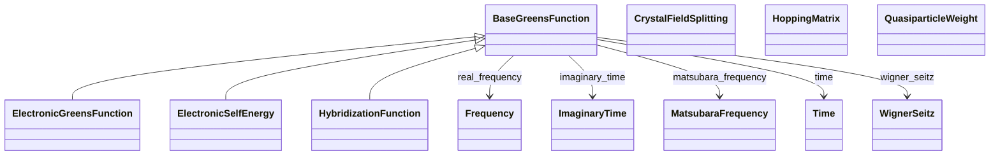

# Many-Body Properties

**Purpose:** Green's functions, self-energies, hybridization, quasiparticle weights, hopping matrices

**In scope:**

- Green's function base class and electronic specialization
- Self-energies from GW and DMFT
- Hybridization functions for impurity problems
- Quasiparticle renormalization weights
- Hopping matrices from tight-binding
- Crystal field splittings in correlated systems

**Out of scope:**

- Methods that compute these (GW, BSE, DMFT in model_method)
- Basic electronic properties

## Relationship map

<b>Legend:</b>
<svg width="24" height="12" style="vertical-align: middle; margin: 0 2px;"><line x1="20" y1="6" x2="4" y2="6" stroke="currentColor" stroke-width="1.5"/><polygon points="4,6 8,3 8,9" fill="none" stroke="currentColor" stroke-width="1.5"/></svg> inheritance ·
<svg width="24" height="12" style="vertical-align: middle; margin: 0 2px;"><line x1="4" y1="6" x2="20" y2="6" stroke="currentColor" stroke-width="1.5"/><polygon points="20,6 16,3 16,9" fill="currentColor"/></svg> containment ·
<svg width="24" height="12" style="vertical-align: middle; margin: 0 2px;"><line x1="4" y1="6" x2="20" y2="6" stroke="currentColor" stroke-width="1.5" stroke-dasharray="2,2"/><polygon points="20,6 16,3 16,9" fill="currentColor"/></svg> reference

## Key sections

| Section | Description | MetaInfo |
|---|---|---|
| `BaseGreensFunction` | A base class used to define shared commonalities between Green's function-related properties. | [Open in MetaInfo browser](https://nomad-lab.eu/prod/v1/develop/gui/analyze/metainfo/nomad_simulations/section_definitions@nomad_simulations.schema_packages.properties.greens_function.BaseGreensFunction){:target="_blank"} |
| `ElectronicGreensFunction` | Charge-charge correlation functions. | [Open in MetaInfo browser](https://nomad-lab.eu/prod/v1/develop/gui/analyze/metainfo/nomad_simulations/section_definitions@nomad_simulations.schema_packages.properties.greens_function.ElectronicGreensFunction){:target="_blank"} |
| `ElectronicSelfEnergy` | Corrections to the energy of an electron due to its interactions with its environment. | [Open in MetaInfo browser](https://nomad-lab.eu/prod/v1/develop/gui/analyze/metainfo/nomad_simulations/section_definitions@nomad_simulations.schema_packages.properties.greens_function.ElectronicSelfEnergy){:target="_blank"} |
| `HybridizationFunction` | Dynamical hopping of the electrons in a lattice in and out of the reservoir or bath. | [Open in MetaInfo browser](https://nomad-lab.eu/prod/v1/develop/gui/analyze/metainfo/nomad_simulations/section_definitions@nomad_simulations.schema_packages.properties.greens_function.HybridizationFunction){:target="_blank"} |
| `QuasiparticleWeight` | Renormalization of the electronic mass due to the interactions with the environment. | [Open in MetaInfo browser](https://nomad-lab.eu/prod/v1/develop/gui/analyze/metainfo/nomad_simulations/section_definitions@nomad_simulations.schema_packages.properties.greens_function.QuasiparticleWeight){:target="_blank"} |
| `HoppingMatrix` | Transition probability between two atomic orbitals in a tight-binding model. | [Open in MetaInfo browser](https://nomad-lab.eu/prod/v1/develop/gui/analyze/metainfo/nomad_simulations/section_definitions@nomad_simulations.schema_packages.properties.hopping_matrix.HoppingMatrix){:target="_blank"} |
| `CrystalFieldSplitting` | Energy difference between the degenerated orbitals of an ion in a crystal field environment. | [Open in MetaInfo browser](https://nomad-lab.eu/prod/v1/develop/gui/analyze/metainfo/nomad_simulations/section_definitions@nomad_simulations.schema_packages.properties.hopping_matrix.CrystalFieldSplitting){:target="_blank"} |

## Quantities by section

### `BaseGreensFunction`

| Quantity | Type | Description |
|---|---|---|
| `n_atoms` | m_int32(int32) | Number of atoms involved in the correlations effect and used for the matrix representation of the property. |
| `atoms_state_ref` | <nomad.metainfo.metainfo.Reference object at 0x7601b8fa7d40> (shape: ['n_atoms']) | Reference to the `AtomsState` section in which the Green's function properties are calculated. |
| `n_correlated_orbitals` | m_int32(int32) | Number of orbitals involved in the correlations effect and used for the matrix representation of the property. |
| `correlated_orbitals_ref` | <nomad.metainfo.metainfo.Reference object at 0x7601b8fa7e60> (shape: ['n_correlated_orbitals']) | Reference to the `OrbitalsState` section in which the Green's function properties are calculated. |
| `spin_channel` | m_int32(int32) | Spin channel of the corresponding electronic property. It can take values of 0 and 1. |
| `local_model_type` | Enum | 

Type of Green's function calculated from the mapping of the local Hubbard-Kanamo...
Type of Green's function calculated from the mapping of the local Hubbard-Kanamori model into the Anderson impurity model. The `impurity` Green's function describe the electronic correlations for the impurity, and it is a local function. The `lattice` Green's function includes the coupling to the lattice and hence it is a non-local function. In DMFT, the `lattice` term is approximated to be the `impurity` one, so that these simulations are converged if both types of the local part of the `lattice` Green's function coincides with the `impurity` Green's function.
 |
| `space_id` | Enum | 

String used to identify the space in which the Green's function property is represented.
String used to identify the space in which the Green's function property is represented. The spaces are: \| `space_id` \| variable type \| \| ------ \| ------ \| \| 'r' \| WignerSeitz \| \| 'rt' \| WignerSeitz + Time \| \| 'rw' \| WignerSeitz + Frequency \| \| 'rit' \| WignerSeitz + ImaginaryTime \| \| 'riw' \| WignerSeitz + MatsubaraFrequency \| \| 'k' \| KMesh \| \| 'kt' \| KMesh + Time \| \| 'kw' \| KMesh + Frequency \| \| 'kit' \| KMesh + ImaginaryTime \| \| 'kiw' \| KMesh + MatsubaraFrequency \| \| 't' \| Time \| \| 'it' \| Frequency \| \| 'w' \| ImaginaryTime \| \| 'iw' \| MatsubaraFrequency \|
 |

### `ElectronicGreensFunction`

| Quantity | Type | Description |
|---|---|---|
| `value` | m_complex128(complex128) | Value of the electronic Green's function matrix. |

### `ElectronicSelfEnergy`

| Quantity | Type | Description |
|---|---|---|
| `value` | m_complex128(complex128) | Value of the electronic self-energy matrix. |

### `HybridizationFunction`

| Quantity | Type | Description |
|---|---|---|
| `value` | m_complex128(complex128) | Value of the electronic hybridization function. |

### `QuasiparticleWeight`

| Quantity | Type | Description |
|---|---|---|
| `system_correlation_strengths` | Enum | 

String used to identify the type of system based on the strength of the electron-electron interactions.
String used to identify the type of system based on the strength of the electron-electron interactions. \| `type` \| Description \| \| ------ \| ------ \| \| 'non-correlated metal' \| All `value` are above 0.7. Renormalization effects are negligible. \| \| 'strongly-correlated metal' \| All `value` are below 0.4 and above 0. Renormalization effects are important. \| \| 'OSMI' \| Orbital-selective Mott insulator: some orbitals have a zero `value` while others a finite one. \| \| 'Mott insulator' \| All `value` are 0.0. Mott insulator state. \|
 |
| `n_atoms` | m_int32(int32) | Number of atoms involved in the correlations effect and used for the matrix representation of the quasiparticle weight. |
| `atoms_state_ref` | <nomad.metainfo.metainfo.Reference object at 0x7601b8fa63c0> (shape: ['n_atoms']) | Reference to the `AtomsState` section in which the Green's function properties are calculated. |
| `n_correlated_orbitals` | m_int32(int32) | Number of orbitals involved in the correlations effect and used for the matrix representation of the quasiparticle weight. |
| `correlated_orbitals_ref` | <nomad.metainfo.metainfo.Reference object at 0x7601b8fa6db0> (shape: ['n_correlated_orbitals']) | Reference to the `OrbitalsState` section in which the Green's function properties are calculated. |
| `spin_channel` | m_int32(int32) | Spin channel of the corresponding electronic property. It can take values of 0 and 1. |
| `value` | m_float_bounded(float) (shape: ['*']) | Value of the quasi-particle weight matrices. Must be between 0 and 1. |

### `HoppingMatrix`

| Quantity | Type | Description |
|---|---|---|
| `n_orbitals` | m_int32(int32) | Number of orbitals in the tight-binding model. The `entity_ref` reference is used to refer to the `OrbitalsState` section. |
| `degeneracy_factors` | m_int32(int32) (shape: ['*']) | Degeneracy of each Wigner-Seitz point. |
| `value` | m_complex128(complex128) | Value of the hopping matrix in joules. The elements are complex numbers defined for each Wigner-Seitz point and each pair of orbitals. Note this contains also the onsite values, i.e., it includes the Wigner-Seitz point (0, 0, 0), hence the `CrystalFieldSplitting` values. |

### `CrystalFieldSplitting`

| Quantity | Type | Description |
|---|---|---|
| `n_orbitals` | m_int32(int32) | Number of orbitals in the tight-binding model. The `entity_ref` reference is used to refer to the `OrbitalsState` section. |
| `value` | m_float64(float64) | Value of the crystal field splittings in joules. This is the intra-orbital local contribution, i.e., the same orbital at the same Wigner-Seitz point (0, 0, 0). |

