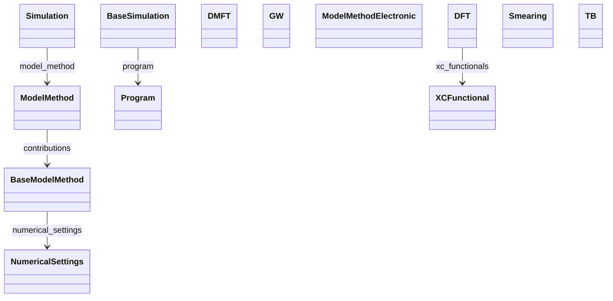

```mermaid
classDiagram
    class BaseModelMethod
    class BaseSimulation
    class DFT
    class DMFT
    class GW
    class ModelMethod
    class ModelMethodElectronic
    class NumericalSettings
    class Program
    class Simulation
    class Smearing
    class TB
    class XCFunctional
    BaseModelMethod --> NumericalSettings : numerical_settings
    BaseSimulation --> Program : program
    DFT --> XCFunctional : xc_functionals
    ModelMethod --> BaseModelMethod : contributions
    Simulation --> ModelMethod : model_method
```