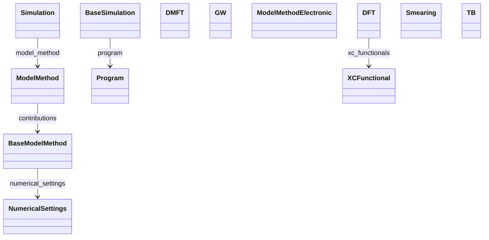

# Methods & Parameters

**Purpose.** Code-agnostic method choices and numerical controls that drive reproducibility.**In scope:** electronic-structure family, XC selection, smearing, numerical cutoffs/settings**Out of scope:** runtime logs, post-processed properties
## Relationship map




## Key sections- `ModelMethod` — [open in MetaInfo browser](https://nomad-lab.eu/prod/v1/gui/analyze/metainfo)- `ModelMethodElectronic` — [open in MetaInfo browser](https://nomad-lab.eu/prod/v1/gui/analyze/metainfo)- `DFT` — [open in MetaInfo browser](https://nomad-lab.eu/prod/v1/gui/analyze/metainfo)- `TB` — [open in MetaInfo browser](https://nomad-lab.eu/prod/v1/gui/analyze/metainfo)- `DMFT` — [open in MetaInfo browser](https://nomad-lab.eu/prod/v1/gui/analyze/metainfo)- `GW` — [open in MetaInfo browser](https://nomad-lab.eu/prod/v1/gui/analyze/metainfo)- `XCFunctional` — [open in MetaInfo browser](https://nomad-lab.eu/prod/v1/gui/analyze/metainfo)- `NumericalSettings` — [open in MetaInfo browser](https://nomad-lab.eu/prod/v1/gui/analyze/metainfo)- `Smearing` — [open in MetaInfo browser](https://nomad-lab.eu/prod/v1/gui/analyze/metainfo)- `Program` — [open in MetaInfo browser](https://nomad-lab.eu/prod/v1/gui/analyze/metainfo)
## Micro-examples

=== "YAML"
```yaml
ModelMethod:
  contributions:
  - {}
ModelMethodElectronic:
  is_spin_polarized:
  - null
  relativity_method:
  - null
DFT:
  jacobs_ladder:
  - null
  exact_exchange_mixing_factor:
  - null
  self_interaction_correction_method:
  - null
  van_der_waals_correction:
  - null
  xc_functionals:
  - {}
TB:
  type: unavailable
  n_orbitals_per_atom:
  - null
  n_atoms_per_unit_cell:
  - null
  n_total_orbitals:
  - null
  orbitals_ref:
  - null
DMFT:
  impurity_solver:
  - null
  n_impurities:
  - null
  n_orbitals:
  - null
  orbitals_ref:
  - null
  n_electrons:
  - null
  inverse_temperature:
  - null
  magnetic_state:
  - null
GW:
  type:
  - null
  analytical_continuation:
  - null
  interval_qp_corrections:
  - null
  screening_ref:
  - null
XCFunctional:
  libxc_name:
  - null
  name:
  - null
  weight:
  - null
NumericalSettings:
  name:
  - null
Smearing:
  name:
  - null
Program:
  name:
  - null
  version:
  - null
  link:
  - null
  version_internal:
  - null
  subroutine_name_internal:
  - null
  compilation_host:
  - null
