# Model Methods

**Purpose:** Complete ModelMethod tree: electronic structure methods and their hierarchy

**In scope:**

- Method inheritance hierarchy: BaseModelMethod → ModelMethod → ModelMethodElectronic
- DFT: Jacobs ladder, XC functionals, exact exchange, van der Waals
- Tight-binding (TB): DFTB, xTB, Wannier, Slater-Koster
- Excited states: ExcitedStateMethodology → GW, BSE
- Screening for many-body methods
- CoreHoleSpectra for X-ray spectroscopy
- DMFT for strongly correlated systems
- Method contributions and references between methods

**Out of scope:**

- Numerical settings like meshes and basis sets
- Output properties computed by these methods

## Relationship map

{: style="width: 80%; cursor: pointer;" class="click-zoom-img" title="Click to zoom"}

<b>Legend:</b>
<svg width="24" height="12" style="vertical-align: middle; margin: 0 2px;"><line x1="20" y1="6" x2="4" y2="6" stroke="currentColor" stroke-width="1.5"/><polygon points="4,6 8,3 8,9" fill="none" stroke="currentColor" stroke-width="1.5"/></svg> inheritance ·
<svg width="24" height="12" style="vertical-align: middle; margin: 0 2px;"><line x1="4" y1="6" x2="20" y2="6" stroke="currentColor" stroke-width="1.5"/><polygon points="20,6 16,3 16,9" fill="currentColor"/></svg> containment ·
<svg width="24" height="12" style="vertical-align: middle; margin: 0 2px;"><line x1="4" y1="6" x2="20" y2="6" stroke="currentColor" stroke-width="1.5" stroke-dasharray="2,2"/><polygon points="20,6 16,3 16,9" fill="currentColor"/></svg> reference

## Key sections

| Section | Description | MetaInfo |
|---|---|---|
| `BaseModelMethod` | A base section used to define the abstract class of a Hamiltonian section. | [Open in MetaInfo browser](https://nomad-lab.eu/prod/v1/develop/gui/analyze/metainfo/nomad_simulations/section_definitions@nomad_simulations.schema_packages.model_method.BaseModelMethod){:target="_blank"} |
| `ModelMethod` | A base section containing the mathematical model parameters. | [Open in MetaInfo browser](https://nomad-lab.eu/prod/v1/develop/gui/analyze/metainfo/nomad_simulations/section_definitions@nomad_simulations.schema_packages.model_method.ModelMethod){:target="_blank"} |
| `ModelMethodElectronic` | A base section used to define the parameters of a model Hamiltonian used in electronic structure calculations (TB, DFT, GW, BSE, DMFT, etc). | [Open in MetaInfo browser](https://nomad-lab.eu/prod/v1/develop/gui/analyze/metainfo/nomad_simulations/section_definitions@nomad_simulations.schema_packages.model_method.ModelMethodElectronic){:target="_blank"} |
| `DFT` | A base section used to define the parameters used in a density functional theory (DFT) calculation. | [Open in MetaInfo browser](https://nomad-lab.eu/prod/v1/develop/gui/analyze/metainfo/nomad_simulations/section_definitions@nomad_simulations.schema_packages.model_method.DFT){:target="_blank"} |
| `XCFunctional` | A base section used to define the parameters of an exchange or correlation functional. | [Open in MetaInfo browser](https://nomad-lab.eu/prod/v1/develop/gui/analyze/metainfo/nomad_simulations/section_definitions@nomad_simulations.schema_packages.model_method.XCFunctional){:target="_blank"} |
| `TB` | A base section containing the parameters pertaining to a tight-binding (TB) model calculation. | [Open in MetaInfo browser](https://nomad-lab.eu/prod/v1/develop/gui/analyze/metainfo/nomad_simulations/section_definitions@nomad_simulations.schema_packages.model_method.TB){:target="_blank"} |
| `Wannier` | A base section used to define the parameters used in a Wannier tight-binding fitting. | [Open in MetaInfo browser](https://nomad-lab.eu/prod/v1/develop/gui/analyze/metainfo/nomad_simulations/section_definitions@nomad_simulations.schema_packages.model_method.Wannier){:target="_blank"} |
| `SlaterKoster` | A base section used to define the parameters used in a Slater-Koster tight-binding fitting. | [Open in MetaInfo browser](https://nomad-lab.eu/prod/v1/develop/gui/analyze/metainfo/nomad_simulations/section_definitions@nomad_simulations.schema_packages.model_method.SlaterKoster){:target="_blank"} |
| `SlaterKosterBond` | A base section used to define the Slater-Koster bond information betwee two orbitals. | [Open in MetaInfo browser](https://nomad-lab.eu/prod/v1/develop/gui/analyze/metainfo/nomad_simulations/section_definitions@nomad_simulations.schema_packages.model_method.SlaterKosterBond){:target="_blank"} |
| `xTB` | A base section used to define the parameters used in an extended tight-binding (xTB) calculation. | [Open in MetaInfo browser](https://nomad-lab.eu/prod/v1/develop/gui/analyze/metainfo/nomad_simulations/section_definitions@nomad_simulations.schema_packages.model_method.xTB){:target="_blank"} |
| `ExcitedStateMethodology` | A base section used to define the parameters typical of excited-state calculations. | [Open in MetaInfo browser](https://nomad-lab.eu/prod/v1/develop/gui/analyze/metainfo/nomad_simulations/section_definitions@nomad_simulations.schema_packages.model_method.ExcitedStateMethodology){:target="_blank"} |
| `Screening` | A base section used to define the parameters that define the calculation of screening. | [Open in MetaInfo browser](https://nomad-lab.eu/prod/v1/develop/gui/analyze/metainfo/nomad_simulations/section_definitions@nomad_simulations.schema_packages.model_method.Screening){:target="_blank"} |
| `GW` | A base section used to define the parameters of a GW calculation. | [Open in MetaInfo browser](https://nomad-lab.eu/prod/v1/develop/gui/analyze/metainfo/nomad_simulations/section_definitions@nomad_simulations.schema_packages.model_method.GW){:target="_blank"} |
| `BSE` | A base section used to define the parameters of a BSE calculation. | [Open in MetaInfo browser](https://nomad-lab.eu/prod/v1/develop/gui/analyze/metainfo/nomad_simulations/section_definitions@nomad_simulations.schema_packages.model_method.BSE){:target="_blank"} |
| `CoreHoleSpectra` | A base section used to define the parameters used in a core-hole spectra calculation. | [Open in MetaInfo browser](https://nomad-lab.eu/prod/v1/develop/gui/analyze/metainfo/nomad_simulations/section_definitions@nomad_simulations.schema_packages.model_method.CoreHoleSpectra){:target="_blank"} |
| `Photon` | A base section used to define parameters of a photon, typically used for optical responses. | [Open in MetaInfo browser](https://nomad-lab.eu/prod/v1/develop/gui/analyze/metainfo/nomad_simulations/section_definitions@nomad_simulations.schema_packages.model_method.Photon){:target="_blank"} |
| `DMFT` | A base section used to define the parameters of a DMFT calculation. | [Open in MetaInfo browser](https://nomad-lab.eu/prod/v1/develop/gui/analyze/metainfo/nomad_simulations/section_definitions@nomad_simulations.schema_packages.model_method.DMFT){:target="_blank"} |

## Quantities by section

### `BaseModelMethod`

| Quantity | Type | Description |
|---|---|---|
| `name` | m_str(str) | Name of the mathematical model. This is typically used to identify the model Hamiltonian used in the simulation. Typical standard names: 'DFT', 'TB', 'GW', 'BSE', 'DMFT', 'NMR', 'kMC'. |
| `type` | m_str(str) | Identifier used to further specify the kind or sub-type of model Hamiltonian. Example: a TB model can be 'Wannier', 'DFTB', 'xTB' or 'Slater-Koster'. This quantity should be rewritten to a MEnum when inheriting from this class. |
| `external_reference` | URL | External reference to the model e.g. DOI, URL. |

### `ModelMethod`

*This section has no direct quantities.*

### `ModelMethodElectronic`

| Quantity | Type | Description |
|---|---|---|
| `is_spin_polarized` | m_bool(bool) | If the simulation is done considering the spin degrees of freedom (then there are two spin channels, 'down' and 'up') or not. |
| `relativity_method` | Enum | Describes the relativistic treatment used for the calculation of the final energy and related quantities. If `None`, no relativistic treatment is applied. |

### `DFT`

| Quantity | Type | Description |
|---|---|---|
| `jacobs_ladder` | Enum | Functional classification in line with Jacob's Ladder. See: - https://doi.org/10.1063/1.1390175 (original paper) - https://doi.org/10.1103/PhysRevLett.91.146401 (meta-GGA) - https://doi.org/10.1063/1.1904565 (hyper-GGA) |
| `exact_exchange_mixing_factor` | m_float64(float64) | Amount of exact exchange mixed in with the XC functional (value range = [0, 1]). |
| `self_interaction_correction_method` | m_str(str) | Contains the name for the self-interaction correction (SIC) treatment used to
calculate the final energy and related quantities. If skipped or empty, no special
correction is applied.

The following SIC methods are available:

| SIC method                | Description                       |

| ------------------------- | --------------------------------  |

| `""`                      | No correction                     |

| `"SIC_AD"`                | The average density correction    |

| `"SIC_SOSEX"`             | Second order screened exchange    |

| `"SIC_EXPLICIT_ORBITALS"` | (scaled) Perdew-Zunger correction explicitly on a
set of orbitals |

| `"SIC_MAURI_SPZ"`         | (scaled) Perdew-Zunger expression on the spin
density / doublet unpaired orbital |

| `"SIC_MAURI_US"`          | A (scaled) correction proposed by Mauri and co-
workers on the spin density / doublet unpaired orbital | |
| `van_der_waals_correction` | Enum | Describes the Van der Waals (VdW) correction methodology. If `None`, no VdW correction is applied.

| VdW method  | Reference                               |
| --------------------- | ----------------------------------------- |
| `"TS"`  | http://dx.doi.org/10.1103/PhysRevLett.102.073005 |
| `"OBS"` | http://dx.doi.org/10.1103/PhysRevB.73.205101 |
| `"G06"` | http://dx.doi.org/10.1002/jcc.20495 |
| `"JCHS"` | http://dx.doi.org/10.1002/jcc.20570 |
| `"MDB"` | http://dx.doi.org/10.1103/PhysRevLett.108.236402 and http://dx.doi.org/10.1063/1.4865104 |
| `"XC"` | The method to calculate the VdW energy uses a non-local functional | |

### `XCFunctional`

| Quantity | Type | Description |
|---|---|---|
| `libxc_name` | m_str(str) | Provides the name of one of the exchange or correlation (XC) functional following the libxc convention. For the code base containing the conventions, see https://gitlab.com/libxc/libxc. |
| `name` | Enum | Name of the XC functional. It can be one of the following: 'exchange', 'correlation', 'hybrid', or 'contribution'. |
| `weight` | m_float64(float64) | Weight of the functional. This quantity is relevant when defining linear combinations of the different functionals. If not specified, its value is 1. |

### `TB`

| Quantity | Type | Description |
|---|---|---|
| `type` | Enum | Tight-binding model Hamiltonian type. The default is set to `'unavailable'` in case none of the
standard types can be recognized. These can be:

| Value | Reference |
| --------- | ----------------------- |
| `'DFTB'` | https://en.wikipedia.org/wiki/DFTB |
| `'xTB'` | https://xtb-docs.readthedocs.io/en/latest/ |
| `'Wannier'` | https://www.wanniertools.org/theory/tight-binding-model/ |
| `'SlaterKoster'` | https://journals.aps.org/pr/abstract/10.1103/PhysRev.94.1498 |
| `'unavailable'` | - | |
| `n_orbitals_per_atom` | m_int32(int32) | Number of orbitals per atom in the unit cell used as a basis to obtain the `TB` model. This quantity is resolved from `orbitals_ref` via normalization. |
| `n_atoms_per_unit_cell` | m_int32(int32) | Number of atoms per unit cell relevant for the `TB` model. This quantity is resolved from `n_total_orbitals` and `n_orbitals_per_atom` via normalization. |
| `n_total_orbitals` | m_int32(int32) | Total number of orbitals used as a basis to obtain the `TB` model. This quantity is parsed by the specific parsing code. This is related with `n_orbitals_per_atom` and `n_atoms_per_unit_cell` as: `n_total_orbitals` = `n_orbitals_per_atom` * `n_atoms_per_unit_cell` |
| `orbitals_ref` | <nomad.metainfo.metainfo.Reference object at 0x7062407155e0> (shape: ['n_orbitals_per_atom']) | References to the `OrbitalsState` sections that contain the orbitals per atom in the unit cell information which are relevant for the `TB` model. This quantity is resolved from normalization when the active atoms sub-systems `model_system.model_system[*]` are populated. Example: hydrogenated graphene with 3 atoms in the unit cell. The full list of `AtomsState` would be [ AtomsState(chemical_symbol='C', orbitals_state=[OrbitalsState('s'), OrbitalsState('px'), OrbitalsState('py'), OrbitalsState('pz')]), AtomsState(chemical_symbol='C', orbitals_state=[OrbitalsState('s'), OrbitalsState('px'), OrbitalsState('py'), OrbitalsState('pz')]), AtomsState(chemical_symbol='H', orbitals_state=[OrbitalsState('s')]), ] The relevant orbitals for the TB model are the `'pz'` ones for each `'C'` atom. Then, we define: orbitals_ref= [OrbitalState('pz'), OrbitalsState('pz')] The relevant atoms information can be accessed from the parent AtomsState sections: atom_state = orbitals_ref[i].m_parent index = orbitals_ref[i].m_parent_index atom_position = orbitals_ref[i].m_parent.m_parent.positions[index] |

### `Wannier`

| Quantity | Type | Description |
|---|---|---|
| `is_maximally_localized` | m_bool(bool) | If the projected orbitals are maximally localized or just a single-shot projection. |
| `localization_type` | Enum | Localization type of the Wannier orbitals. |
| `n_bloch_bands` | m_int32(int32) | Number of input Bloch bands to calculate the projection matrix. |
| `energy_window_outer` | m_float64(float64) (shape: [2]) | Bottom and top of the outer energy window used for the projection. |
| `energy_window_inner` | m_float64(float64) (shape: [2]) | Bottom and top of the inner energy window used for the projection. |

### `SlaterKoster`

*This section has no direct quantities.*

### `SlaterKosterBond`

| Quantity | Type | Description |
|---|---|---|
| `orbital_1` | <nomad.metainfo.metainfo.Reference object at 0x706240730890> | Reference to the first `OrbitalsState` section. |
| `orbital_2` | <nomad.metainfo.metainfo.Reference object at 0x7062407306e0> | Reference to the second `OrbitalsState` section. |
| `bravais_vector` | m_int32(int32) (shape: [3]) | The Bravais vector of the cell in 3 dimensional. This is defined as the vector that connects the two atoms that define the Slater-Koster bond. A bond can be defined between orbitals in the same unit cell (bravais_vector = [0, 0, 0]) or in neighboring cells (bravais_vector = [m, n, p] with m, n, p are integers). Default is [0, 0, 0]. |
| `name` | Enum | The name of the Slater-Koster bond. The name is composed by the `l_quantum_symbol` of the orbitals
and the cell index. Table of possible values:

| Value   | `orbital_1.l_quantum_symbol` | `orbital_2.l_quantum_symbol` | `bravais_vector` |
| ------- | ---------------------------- | ---------------------------- | ------------ |
| `'sss'` | 's' | 's' | [0, 0, 0] |
| `'sps'` | 's' | 'p' | [0, 0, 0] |
| `'sds'` | 's' | 'd' | [0, 0, 0] | |
| `integral_value` | m_float64(float64) | The Slater-Koster bond integral value. |

### `xTB`

*This section has no direct quantities.*

### `ExcitedStateMethodology`

| Quantity | Type | Description |
|---|---|---|
| `n_states` | m_int32(int32) | Number of states used to calculate the excitations. |
| `n_empty_states` | m_int32(int32) | Number of empty states used to calculate the excitations. This quantity is complementary to `n_states`. |
| `broadening` | m_float64(float64) | Lifetime broadening applied to the spectra in full-width at half maximum for excited-state calculations. |

### `Screening`

| Quantity | Type | Description |
|---|---|---|
| `dielectric_infinity` | m_int32(int32) | Value of the static dielectric constant at infinite q. For metals, this is infinite (or a very large value), while for insulators is finite. |

### `GW`

| Quantity | Type | Description |
|---|---|---|
| `type` | Enum | GW Hedin's self-consistency cycle:

| Name      | Description                      | Reference             |
| --------- | -------------------------------- | --------------------- |
| `'G0W0'`  | single-shot                      | https://journals.aps.org/prb/abstract/10.1103/PhysRevB.74.035101 |
| `'scGW'`  | self-consistent G and W               | https://journals.aps.org/prb/abstract/10.1103/PhysRevB.75.235102 |
| `'scGW0'` | self-consistent G with fixed W0  | https://journals.aps.org/prb/abstract/10.1103/PhysRevB.54.8411 |
| `'scG0W'` | self-consistent W with fixed G0  | -                     |
| `'ev-scGW0'`  | eigenvalues self-consistent G with fixed W0   | https://journals.aps.org/prb/abstract/10.1103/PhysRevB.34.5390 |
| `'ev-scGW'`  | eigenvalues self-consistent G and W   | https://journals.aps.org/prb/abstract/10.1103/PhysRevB.74.045102 |
| `'qp-scGW0'`  | quasiparticle self-consistent G with fixed W0 | https://journals.aps.org/prb/abstract/10.1103/PhysRevB.76.115109 |
| `'qp-scGW'`  | quasiparticle self-consistent G and W | https://journals.aps.org/prl/abstract/10.1103/PhysRevLett.96.226402 | |
| `analytical_continuation` | Enum | Analytical continuation approximations of the GW self-energy:

| Name           | Description         | Reference                        |
| -------------- | ------------------- | -------------------------------- |
| `'pade'` | Pade's approximant  | https://link.springer.com/article/10.1007/BF00655090 |
| `'contour_deformation'` | Contour deformation | https://journals.aps.org/prb/abstract/10.1103/PhysRevB.67.155208 |
| `'ppm_GodbyNeeds'` | Godby-Needs plasmon-pole model | https://journals.aps.org/prl/abstract/10.1103/PhysRevLett.62.1169 |
| `'ppm_HybertsenLouie'` | Hybertsen and Louie plasmon-pole model | https://journals.aps.org/prb/abstract/10.1103/PhysRevB.34.5390 |
| `'ppm_vonderLindenHorsh'` | von der Linden and P. Horsh plasmon-pole model | https://journals.aps.org/prb/abstract/10.1103/PhysRevB.37.8351 |
| `'ppm_FaridEngel'` | Farid and Engel plasmon-pole model  | https://journals.aps.org/prb/abstract/10.1103/PhysRevB.47.15931 |
| `'multi_pole'` | Multi-pole fitting  | https://journals.aps.org/prl/abstract/10.1103/PhysRevLett.74.1827 | |
| `interval_qp_corrections` | m_int32(int32) (shape: [2]) | Band indices (in an interval) for which the GW quasiparticle corrections are calculated. |
| `screening_ref` | <nomad.metainfo.metainfo.Reference object at 0x706240717e90> | Reference to the `Screening` section that the GW calculation used to obtain the screened Coulomb interactions. |

### `BSE`

| Quantity | Type | Description |
|---|---|---|
| `type` | Enum | Type of the BSE Hamiltonian solved:

H_BSE = H_diagonal + 2 * gx * Hx - gc * Hc

Online resources for the theory:
- http://exciting.wikidot.com/carbon-excited-states-from-bse#toc1
- https://www.vasp.at/wiki/index.php/Bethe-Salpeter-equations_calculations
- https://docs.abinit.org/theory/bse/
- https://www.yambo-code.eu/wiki/index.php/Bethe-Salpeter_kernel

| Name | Description |
| --------- | ----------------------- |
| `'Singlet'` | gx = 1, gc = 1 |
| `'Triplet'` | gx = 0, gc = 1 |
| `'IP'` | Independent-particle approach |
| `'RPA'` | Random Phase Approximation | |
| `solver` | Enum | Solver algotithm used to diagonalize the BSE Hamiltonian.

| Name | Description | Reference |
| --------- | ----------------------- | ----------- |
| `'Full-diagonalization'` | Full diagonalization of the BSE Hamiltonian | - |
| `'Lanczos-Haydock'` | Subspace iterative Lanczos-Haydock algorithm | https://doi.org/10.1103/PhysRevB.59.5441 |
| `'GMRES'` | Generalized minimal residual method | https://doi.org/10.1137/0907058 |
| `'SLEPc'` | Scalable Library for Eigenvalue Problem Computations | https://slepc.upv.es/ |
| `'TDA'` | Tamm-Dancoff approximation | https://doi.org/10.1016/S0009-2614(99)01149-5 | |
| `screening_ref` | <nomad.metainfo.metainfo.Reference object at 0x7062407313a0> | Reference to the `Screening` section that the BSE calculation used to obtain the screened Coulomb interactions. |

### `CoreHoleSpectra`

| Quantity | Type | Description |
|---|---|---|
| `type` | Enum | Type of the CoreHole excitation spectra calculated, either "absorption" or "emission". |
| `edge` | Enum | Edge label of the excited core-hole. This is obtained by normalization by using `core_hole_ref`. |
| `core_hole_ref` | <nomad.metainfo.metainfo.Reference object at 0x706240730050> | Reference to the `CoreHole` section that contains the information of the edge of the excited core-hole. |
| `excited_state_method_ref` | <nomad.metainfo.metainfo.Reference object at 0x706240730350> | Reference to the `ModelMethodElectronic` section (e.g., `DFT` or `BSE`) that was used to obtain the core-hole spectra. |

### `Photon`

| Quantity | Type | Description |
|---|---|---|
| `multipole_type` | Enum | Type used for the multipolar expansion: dipole, quadrupole, NRIXS, Raman, etc. |
| `polarization` | m_float64(float64) (shape: [3]) | Direction of the photon polarization in cartesian coordinates. |
| `energy` | m_float64(float64) | Photon energy. |
| `momentum_transfer` | m_float64(float64) (shape: [3]) | Momentum transfer to the lattice. This quanitity is important for inelastic scatterings, like the ones happening in quadrupolar, Raman, or NRIXS processes. |

### `DMFT`

| Quantity | Type | Description |
|---|---|---|
| `impurity_solver` | Enum | Impurity solver method used in the DMFT loop:

| Name              | Reference                            |
| ----------------- | ------------------------------------ |
| `'CT-INT'`        | https://link.springer.com/article/10.1134/1.1800216 |
| `'CT-HYB'`        | https://journals.aps.org/prl/abstract/10.1103/PhysRevLett.97.076405 |
| `'CT-AUX'`        | https://iopscience.iop.org/article/10.1209/0295-5075/82/57003 |
| `'ED'`            | https://journals.aps.org/prl/abstract/10.1103/PhysRevLett.72.1545 |
| `'NRG'`           | https://journals.aps.org/rmp/abstract/10.1103/RevModPhys.80.395 |
| `'MPS'`           | https://journals.aps.org/prb/abstract/10.1103/PhysRevB.90.045144 |
| `'IPT'`           | https://journals.aps.org/prb/abstract/10.1103/PhysRevB.45.6479 |
| `'NCA'`           | https://journals.aps.org/prb/abstract/10.1103/PhysRevB.47.3553 |
| `'OCA'`           | https://journals.aps.org/prb/abstract/10.1103/PhysRevB.47.3553 |
| `'slave_bosons'`  | https://journals.aps.org/prl/abstract/10.1103/PhysRevLett.57.1362 |
| `'hubbard_I'`     | https://iopscience.iop.org/article/10.1088/0953-8984/24/7/075604 | |
| `n_impurities` | m_int32(int32) | Number of impurities mapped from the correlated atoms in the unit cell. This defines whether the DMFT calculation is done in a single-impurity or multi-impurity run. |
| `n_orbitals` | m_int32(int32) (shape: ['n_impurities']) | Number of correlated orbitals per impurity. |
| `orbitals_ref` | <nomad.metainfo.metainfo.Reference object at 0x706240732240> (shape: ['n_orbitals']) | References to the `OrbitalsState` sections that contain the orbitals information which are relevant for the `DMFT` calculation. Example: hydrogenated graphene with 3 atoms in the unit cell. The full list of `AtomsState` would be [ AtomsState(chemical_symbol='C', orbitals_state=[OrbitalsState('s'), OrbitalsState('px'), OrbitalsState('py'), OrbitalsState('pz')]), AtomsState(chemical_symbol='C', orbitals_state=[OrbitalsState('s'), OrbitalsState('px'), OrbitalsState('py'), OrbitalsState('pz')]), AtomsState(chemical_symbol='H', orbitals_state=[OrbitalsState('s')]), ] The relevant orbitals for the TB model are the `'pz'` ones for each `'C'` atom. Then, we define: orbitals_ref= [OrbitalState('pz'), OrbitalsState('pz')] The relevant impurities information can be accesed from the parent AtomsState sections: impurity_state = orbitals_ref[i].m_parent index = orbitals_ref[i].m_parent_index impurity_position = orbitals_ref[i].m_parent.m_parent.positions[index] |
| `n_electrons` | m_float64(float64) (shape: ['n_impurities']) | Initial number of valence electrons per impurity. |
| `inverse_temperature` | m_float64(float64) | Inverse temperature = 1/(kB*T). |
| `magnetic_state` | Enum | Magnetic state in which the DMFT calculation is done. This quantity can be obtained from `orbitals_ref` and their spin state. |

