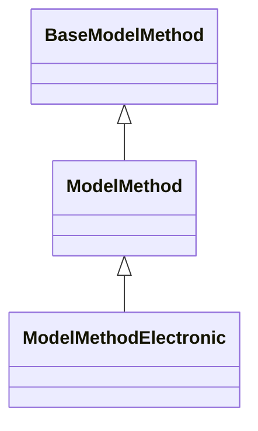

# Model Method

**Purpose:** Base method hierarchy up to ModelMethodElectronic

**In scope:**

- Top-level inheritance chain: BaseModelMethod → ModelMethod → ModelMethodElectronic
- Entry point for all electronic-method subclasses

**Out of scope:**

- Detailed electronic method subclasses
- Classical force-field methods
- Numerical settings like meshes and basis sets
- Output properties computed by these methods

## Relationship map

**Legend**

- `Parent <|-- Child`: inheritance (`Child` extends `Parent`)
- `Owner --> SubSection`: containment/subsection relationship
- `Source ..> Target`: typed reference from one section to another

## Key sections

| Section | Description | MetaInfo |
|---|---|---|
| `BaseModelMethod` | A base section used to define the abstract class of a Hamiltonian section. | [Open in MetaInfo browser](https://nomad-lab.eu/prod/v1/develop/gui/analyze/metainfo/nomad_simulations/section_definitions@nomad_simulations.schema_packages.model_method.BaseModelMethod){:target="_blank"} |
| `ModelMethod` | A base section containing the mathematical model parameters. | [Open in MetaInfo browser](https://nomad-lab.eu/prod/v1/develop/gui/analyze/metainfo/nomad_simulations/section_definitions@nomad_simulations.schema_packages.model_method.ModelMethod){:target="_blank"} |
| `ModelMethodElectronic` | A base section used to define the parameters of a model Hamiltonian used in electronic structure calculations (TB, DFT, GW, BSE, DMFT, etc). | [Open in MetaInfo browser](https://nomad-lab.eu/prod/v1/develop/gui/analyze/metainfo/nomad_simulations/section_definitions@nomad_simulations.schema_packages.model_method.ModelMethodElectronic){:target="_blank"} |

## Quantities by section

### `BaseModelMethod`

| Quantity | Type | Description |
|---|---|---|
| `name` | m_str(str) | Name of the mathematical model. This is typically used to identify the model Hamiltonian used in the simulation. Typical standard names: 'DFT', 'TB', 'GW', 'BSE', 'DMFT', 'NMR', 'kMC'. |
| `type` | m_str(str) | Identifier used to further specify the kind or sub-type of model Hamiltonian. Example: a TB model can be 'Wannier', 'DFTB', 'xTB' or 'Slater-Koster'. This quantity should be rewritten to a MEnum when inheriting from this class. |
| `external_reference` | URL | External reference to the model e.g. DOI, URL. |

### `ModelMethod`

*This section has no direct quantities.*

### `ModelMethodElectronic`

| Quantity | Type | Description |
|---|---|---|
| `is_spin_polarized` | m_bool(bool) | If the simulation is done considering the spin degrees of freedom (then there are two spin channels, 'down' and 'up') or not. |
| `determinant` | Enum | 

The spin-coupling form of the determinant used for the
The spin-coupling form of the determinant used for the self-consistent field (SCF) calculation. - **restricted**  (RHF/RKS): α and β electrons share the same spatial orbitals - **unrestricted** (UHF/UKS): α and β orbitals are optimized independently - **restricted-open-shell** (ROHF/ROKS): closed-shell core with spin-unpaired electrons sharing spatial orbitals in the open-shell manifold
 |

