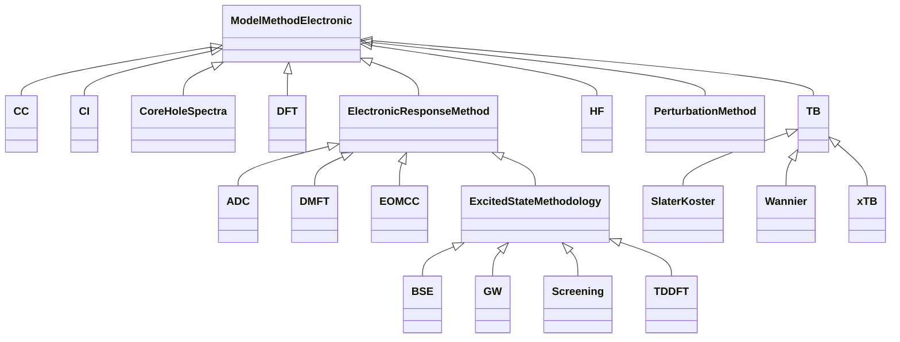

# Model Method Electronic - Full Screen Diagram

!!! tip "Interactive Zoom & Pan"
    - **Scroll wheel** or **+/-** buttons to zoom
    - **Click and drag** to pan
    - **Keyboard shortcuts**: `+`/`-` to zoom, `0` to reset, `f` to fit
    - **↗** button to open in separate window
    - **⬇** button to download as SVG

This diagram shows the relationships between schema classes:

Legend

<svg class="uml-legend__swatch" viewBox="0 0 64 16" aria-hidden="true"><line class="uml-legend__line" x1="54" y1="8" x2="22" y2="8"/><path class="uml-legend__head uml-legend__head--open" d="M10 8 L22 2 L22 14 Z"/></svg>inheritance (is-a)

