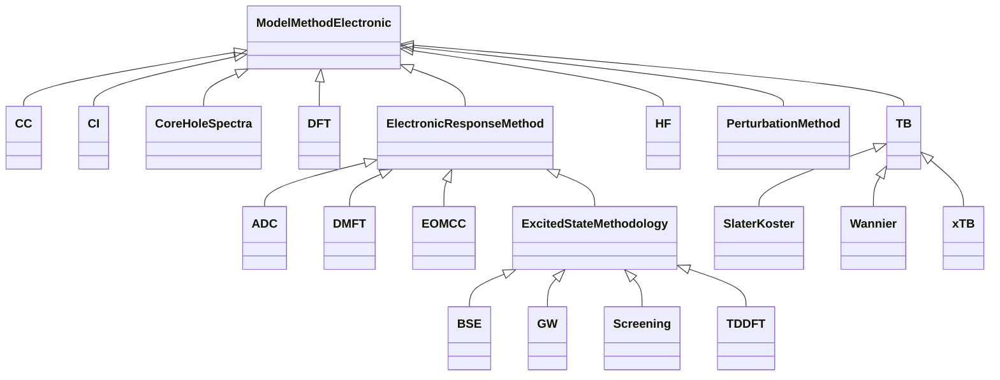

# Model Method Electronic

**Purpose:** Electronic method subclasses branching from ModelMethodElectronic


## Relationship map


<div class="uml-diagram-card" markdown="1">



<p class="uml-legend__title">Legend</p>
<div class="uml-legend" role="list" aria-label="Diagram relationship legend">
<div class="uml-legend__item" role="listitem"><svg class="uml-legend__swatch" viewBox="0 0 64 16" aria-hidden="true"><line class="uml-legend__line" x1="54" y1="8" x2="22" y2="8"/><path class="uml-legend__head uml-legend__head--open" d="M10 8 L22 2 L22 14 Z"/></svg><span>inheritance (is-a)</span></div>
</div>

</div>


## Quantities by Key Sections

### `ModelMethodElectronic`

| Section | Description | MetaInfo |
|---|---|---|
| `ModelMethodElectronic` | A base section used to define the parameters of a model Hamiltonian used in electronic structure calculations (TB, DFT, GW, BSE, DMFT, etc). | [Open in MetaInfo browser](https://nomad-lab.eu/prod/v1/develop/gui/analyze/metainfo/nomad_simulations/section_definitions@nomad_simulations.schema_packages.model_method.ModelMethodElectronic){:target="_blank"} |

| Quantity | Type | Description |
|---|---|---|
| `is_spin_polarized` | m_bool(bool) | If the simulation is done considering the spin degrees of freedom (then there are two spin channels, 'down' and 'up') or not. |

### `ElectronicResponseMethod`

| Section | Description | MetaInfo |
|---|---|---|
| `ElectronicResponseMethod` | Base section for electronic-structure methods that compute excitations, spectra, quasiparticle corrections, response properties, or correlation functions through a response, propagator, Green's-function, self-energy, or equation-of-motion formalism. | [Open in MetaInfo browser](https://nomad-lab.eu/prod/v1/develop/gui/analyze/metainfo/nomad_simulations/section_definitions@nomad_simulations.schema_packages.model_method.ElectronicResponseMethod){:target="_blank"} |

| Quantity | Type | Description |
|---|---|---|
| `response_formalism` | Enum | <details><summary>Broad response or propagator formalism used by the method.</summary>Broad response or propagator formalism used by the method.<br>- `linear_response`: response to a weak perturbation in the linear<br>regime, e.g. LR-TDDFT, LR-CC, response CI.<br>- `real_time`: real-time propagation after an external perturbation,<br>e.g. real-time TDDFT.<br>- `equation_of_motion`: EOM formulation in a many-body state space,<br>e.g. EOM-CC, EOM-MRCC.<br>- `greens_function`: Green's-function formulation, e.g. one-particle<br>Green's-function based quasiparticle or spectral methods.<br>- `polarization_propagator`: propagator formulation for neutral<br>excitations or response functions, e.g. ADC-like methods.<br>- `self_energy`: self-energy based formulation, e.g. GW or DMFT-like<br>treatments where the central object is an electronic self-energy.<br>- `sum_over_states`: explicit sum-over-states response representation.<br>- `other`: method-specific response formalism not covered by the enum.</details> |
| `representation_domain` | Enum | <details><summary>Domain in which the response, propagator, or equation-of-motion problem</summary>Domain in which the response, propagator, or equation-of-motion problem<br>is represented or solved.<br>- `time`: real-time propagation or time-domain response.<br>- `frequency`: real-frequency response, spectra, dielectric functions,<br>or quasiparticle corrections.<br>- `imaginary_time`: imaginary-time Green's functions or propagators.<br>- `matsubara_frequency`: finite-temperature Matsubara-frequency<br>representation.<br>- `state_space`: matrix/eigenvalue problem in a many-body, excitation,<br>electron-hole, or configuration space, e.g. EOM-CC, ADC, BSE.<br>- `mixed`: method combines multiple domains, e.g. imaginary-frequency<br>integration plus analytic continuation.<br>- `other`: code-specific or uncommon representation.</details> |
| `target_sector` | Enum | <details><summary>Physical sector or class of states/properties targeted by the response</summary>Physical sector or class of states/properties targeted by the response<br>or propagator method.<br>Examples:<br>- `neutral_excitation`: neutral excited states, e.g. TDDFT, BSE,<br>EOM-EE-CC, ADC for excitation energies.<br>- `ionization`: ionized states or electron-removal sector, e.g.<br>IP-EOM-CC.<br>- `electron_attachment`: electron-addition sector, e.g. EA-EOM-CC.<br>- `spin_flip`: spin-flip excitation sector.<br>- `double_ionization`: double electron-removal sector.<br>- `double_electron_attachment`: double electron-addition sector.<br>- `quasiparticle`: quasiparticle corrections, e.g. GW.<br>- `optical_response`: optical absorption or dielectric response.<br>- `magnetic_response`: magnetic-field response, NMR-like or magnetic<br>susceptibility response.<br>- `core_excitation`: core-level excitations, e.g. XAS/XES-related<br>response calculations.<br>- `charge_transfer`: charge-transfer target states or response.<br>- `other`: method-specific target sector.</details> |
| `response_order` | m_int_bounded(int) | <details><summary>Order of the response with respect to the external perturbation.</summary>Order of the response with respect to the external perturbation.<br>Examples:<br>- 1: linear response<br>- 2: quadratic or second-order response<br>- 3: cubic or third-order response<br>This is not the same as many-body perturbation order, ADC order, or<br>excitation rank.</details> |
| `operator_excitation_order` | m_int32(int32) (shape: ['*']) | <details><summary>Excitation ranks included in the response, equation-of-motion, or</summary>Excitation ranks included in the response, equation-of-motion, or<br>propagator operator manifold, where applicable.<br>Examples:<br>- EOM-CCSD: [1, 2]<br>- CIS / TDA-like single excitations: [1]<br>- EOM-CCSDT: [1, 2, 3]<br>This quantity should be left unset for methods where excitation rank is<br>not the appropriate descriptor, such as many GW or DMFT implementations.</details> |
| `n_states` | m_int32(int32) | Number of target states, roots, poles, or quasiparticle solutions requested or computed by the method, when applicable. |
| `target_spin_multiplicities` | m_int32(int32) (shape: ['*']) | Spin multiplicities of the targeted states, if specified. |
| `target_symmetry_labels` | m_str(str) (shape: ['*']) | Code-specific symmetry, irrep, k-point, or sector labels for targeted states or response solutions. |
| `uses_tamm_dancoff_approximation` | m_bool(bool) | Whether the Tamm-Dancoff approximation or an equivalent resonant-block approximation is used. Common in TDDFT, BSE, and related response eigenvalue problems. |
| `is_self_consistent` | m_bool(bool) | Whether the response/propagator/self-energy method is solved self-consistently with respect to its central response object, Green's function, self-energy, or density response, depending on the method. |

### `DFT`

| Section | Description | MetaInfo |
|---|---|---|
| `DFT` | A base section used to define the parameters used in a density functional theory (DFT) calculation. | [Open in MetaInfo browser](https://nomad-lab.eu/prod/v1/develop/gui/analyze/metainfo/nomad_simulations/section_definitions@nomad_simulations.schema_packages.model_method.DFT){:target="_blank"} |

| Quantity | Type | Description |
|---|---|---|
| `jacobs_ladder` | Enum | <details><summary>Highest Jacob's ladder rung present among XC components.</summary>Highest Jacob's ladder rung present among XC components.<br>See:<br>- https://doi.org/10.1063/1.1390175 (original paper)<br>- https://doi.org/10.1103/PhysRevLett.91.146401 (meta-GGA)<br>- https://doi.org/10.1063/1.1904565 (hyper-GGA)</details> |
| `reference_form` | Enum | <details><summary>Kohn-Sham reference form used for the DFT calculation.</summary>Kohn-Sham reference form used for the DFT calculation.<br>- **RKS**: restricted Kohn-Sham reference<br>- **UKS**: unrestricted Kohn-Sham reference<br>- **ROKS**: restricted open-shell Kohn-Sham reference</details> |

### `TB`

| Section | Description | MetaInfo |
|---|---|---|
| `TB` | A base section containing the parameters pertaining to a tight-binding (TB) model calculation. | [Open in MetaInfo browser](https://nomad-lab.eu/prod/v1/develop/gui/analyze/metainfo/nomad_simulations/section_definitions@nomad_simulations.schema_packages.model_method.TB){:target="_blank"} |

| Quantity | Type | Description |
|---|---|---|
| `type` | Enum | <details><summary>Tight-binding model Hamiltonian type.</summary>Tight-binding model Hamiltonian type. The default is set to `'unavailable'` in case none of the<br>standard types can be recognized. These can be:<br>\| Value \| Reference \|<br>\| --------- \| ----------------------- \|<br>\| `'DFTB'` \| https://en.wikipedia.org/wiki/DFTB \|<br>\| `'xTB'` \| https://xtb-docs.readthedocs.io/en/latest/ \|<br>\| `'Wannier'` \| https://www.wanniertools.org/theory/tight-binding-model/ \|<br>\| `'SlaterKoster'` \| https://journals.aps.org/pr/abstract/10.1103/PhysRev.94.1498 \|<br>\| `'unavailable'` \| - \|</details> |
| `n_orbitals_per_atom` | m_int32(int32) | Number of orbitals per atom in the unit cell used as a basis to obtain the `TB` model. This quantity is resolved from `orbitals_ref` via normalization. |
| `n_atoms_per_unit_cell` | m_int32(int32) | Number of atoms per unit cell relevant for the `TB` model. This quantity is resolved from `n_total_orbitals` and `n_orbitals_per_atom` via normalization. |
| `n_total_orbitals` | m_int32(int32) | Total number of orbitals used as a basis to obtain the `TB` model. This quantity is parsed by the specific parsing code. This is related with `n_orbitals_per_atom` and `n_atoms_per_unit_cell` as: `n_total_orbitals` = `n_orbitals_per_atom` * `n_atoms_per_unit_cell` |
| `orbitals_ref` | Reference (shape: ['n_orbitals_per_atom']) | <details><summary>References to the `ElectronicState` that contain system's the orbitals (with a mapping to each atom) relevant for the `TB` model.</summary>References to the `ElectronicState` that contain system's the orbitals (with a mapping to each atom) relevant for the `TB` model. This quantity is resolved from normalization when the active atoms sub-systems `model_system.model_system[*]`<br>are populated.<br>The relevant orbitals for the TB model are the `'pz'` ones for each `'C'` atom. Then, we define:<br>`orbitals_ref= [ElectronicState('pz'), ElectronicState('pz')]`<br>The relevant atoms information can be accessed from the parent AtomsState sections:<br>```<br>atom_state = orbitals_ref[i].m_parent<br>index = orbitals_ref[i].m_parent_index<br>atom_position = orbitals_ref[i].m_parent.m_parent.positions[index]<br>```</details> |

### `xTB`

| Section | Description | MetaInfo |
|---|---|---|
| `xTB` | A base section used to define the parameters used in an extended tight-binding (xTB) calculation. | [Open in MetaInfo browser](https://nomad-lab.eu/prod/v1/develop/gui/analyze/metainfo/nomad_simulations/section_definitions@nomad_simulations.schema_packages.model_method.xTB){:target="_blank"} |

*This section has no direct quantities.*

### `Wannier`

| Section | Description | MetaInfo |
|---|---|---|
| `Wannier` | A base section used to define the parameters used in a Wannier tight-binding fitting. | [Open in MetaInfo browser](https://nomad-lab.eu/prod/v1/develop/gui/analyze/metainfo/nomad_simulations/section_definitions@nomad_simulations.schema_packages.model_method.Wannier){:target="_blank"} |

| Quantity | Type | Description |
|---|---|---|
| `is_maximally_localized` | m_bool(bool) | If the projected orbitals are maximally localized or just a single-shot projection. |
| `localization_type` | Enum | Localization type of the Wannier orbitals. |
| `n_bloch_bands` | m_int32(int32) | Number of input Bloch bands to calculate the projection matrix. |
| `energy_window_outer` | m_float64(float64) (shape: [2]) | Bottom and top of the outer energy window used for the projection. |
| `energy_window_inner` | m_float64(float64) (shape: [2]) | Bottom and top of the inner energy window used for the projection. |

### `SlaterKoster`

| Section | Description | MetaInfo |
|---|---|---|
| `SlaterKoster` | A base section used to define the parameters used in a Slater-Koster tight-binding fitting. | [Open in MetaInfo browser](https://nomad-lab.eu/prod/v1/develop/gui/analyze/metainfo/nomad_simulations/section_definitions@nomad_simulations.schema_packages.model_method.SlaterKoster){:target="_blank"} |

*This section has no direct quantities.*

### `ExcitedStateMethodology`

| Section | Description | MetaInfo |
|---|---|---|
| `ExcitedStateMethodology` | A base section used to define the parameters typical of excited-state calculations. | [Open in MetaInfo browser](https://nomad-lab.eu/prod/v1/develop/gui/analyze/metainfo/nomad_simulations/section_definitions@nomad_simulations.schema_packages.model_method.ExcitedStateMethodology){:target="_blank"} |

| Quantity | Type | Description |
|---|---|---|
| `n_states` | m_int32(int32) | Number of states used to calculate the excitations. |
| `n_empty_states` | m_int32(int32) | Number of empty states used to calculate the excitations. This quantity is complementary to `n_states`. |
| `broadening` | m_float64(float64) | Lifetime broadening applied to the spectra in full-width at half maximum for excited-state calculations. |

### `Screening`

| Section | Description | MetaInfo |
|---|---|---|
| `Screening` | A base section used to define the parameters that define the calculation of screening. | [Open in MetaInfo browser](https://nomad-lab.eu/prod/v1/develop/gui/analyze/metainfo/nomad_simulations/section_definitions@nomad_simulations.schema_packages.model_method.Screening){:target="_blank"} |

| Quantity | Type | Description |
|---|---|---|
| `dielectric_infinity` | m_int32(int32) | Value of the static dielectric constant at infinite q. For metals, this is infinite (or a very large value), while for insulators is finite. |

### `GW`

| Section | Description | MetaInfo |
|---|---|---|
| `GW` | GW approximation for quasiparticle corrections based on a one-particle Green's function and screened Coulomb interaction. | [Open in MetaInfo browser](https://nomad-lab.eu/prod/v1/develop/gui/analyze/metainfo/nomad_simulations/section_definitions@nomad_simulations.schema_packages.model_method.GW){:target="_blank"} |

| Quantity | Type | Description |
|---|---|---|
| `type` | Enum | <details><summary>GW Hedin's self-consistency cycle:</summary>GW Hedin's self-consistency cycle:<br>\| Name      \| Description                      \| Reference             \|<br>\| --------- \| -------------------------------- \| --------------------- \|<br>\| `'G0W0'`  \| single-shot                      \| https://journals.aps.org/prb/abstract/10.1103/PhysRevB.74.035101 \|<br>\| `'GW0'`  \| self-consistent G with fixed W0  \| https://journals.aps.org/prb/abstract/10.1103/PhysRevB.54.8411 \|<br>\| `'scGW'`  \| self-consistent G and W               \| https://journals.aps.org/prb/abstract/10.1103/PhysRevB.75.235102 \|<br>\| `'scGW0'` \| self-consistent G with fixed W0  \| https://journals.aps.org/prb/abstract/10.1103/PhysRevB.54.8411 \|<br>\| `'scG0W'` \| self-consistent W with fixed G0  \| -                     \|<br>\| `'evGW'`  \| eigenvalues self-consistent G and W   \| https://journals.aps.org/prb/abstract/10.1103/PhysRevB.74.045102 \|<br>\| `'ev-scGW0'`  \| eigenvalues self-consistent G with fixed W0   \| https://journals.aps.org/prb/abstract/10.1103/PhysRevB.34.5390 \|<br>\| `'ev-scGW'`  \| eigenvalues self-consistent G and W   \| https://journals.aps.org/prb/abstract/10.1103/PhysRevB.74.045102 \|<br>\| `'qsGW'`  \| quasiparticle self-consistent G and W \| https://journals.aps.org/prl/abstract/10.1103/PhysRevLett.96.226402 \|<br>\| `'qp-scGW0'`  \| quasiparticle self-consistent G with fixed W0 \| https://journals.aps.org/prb/abstract/10.1103/PhysRevB.76.115109 \|<br>\| `'qp-scGW'`  \| quasiparticle self-consistent G and W \| https://journals.aps.org/prl/abstract/10.1103/PhysRevLett.96.226402 \|<br>\| `'other'`  \| code-specific GW variant \|</details> |
| `analytical_continuation` | Enum | <details><summary>Analytical continuation approximations of the GW self-energy:</summary>Analytical continuation approximations of the GW self-energy:<br>\| Name           \| Description         \| Reference                        \|<br>\| -------------- \| ------------------- \| -------------------------------- \|<br>\| `'pade'` \| Pade's approximant  \| https://link.springer.com/article/10.1007/BF00655090 \|<br>\| `'contour_deformation'` \| Contour deformation \| https://journals.aps.org/prb/abstract/10.1103/PhysRevB.67.155208 \|<br>\| `'ppm_GodbyNeeds'` \| Godby-Needs plasmon-pole model \| https://journals.aps.org/prl/abstract/10.1103/PhysRevLett.62.1169 \|<br>\| `'ppm_HybertsenLouie'` \| Hybertsen and Louie plasmon-pole model \| https://journals.aps.org/prb/abstract/10.1103/PhysRevB.34.5390 \|<br>\| `'ppm_vonderLindenHorsh'` \| von der Linden and P. Horsh plasmon-pole model \| https://journals.aps.org/prb/abstract/10.1103/PhysRevB.37.8351 \|<br>\| `'ppm_FaridEngel'` \| Farid and Engel plasmon-pole model  \| https://journals.aps.org/prb/abstract/10.1103/PhysRevB.47.15931 \|<br>\| `'multi_pole'` \| Multi-pole fitting  \| https://journals.aps.org/prl/abstract/10.1103/PhysRevLett.74.1827 \|</details> |
| `interval_qp_corrections` | m_int32(int32) (shape: [2]) | Band indices (in an interval) for which the GW quasiparticle corrections are calculated. |
| `screening_ref` | Reference | Reference to the `Screening` section that the GW calculation used to obtain the screened Coulomb interactions. |

### `BSE`

| Section | Description | MetaInfo |
|---|---|---|
| `BSE` | Bethe-Salpeter equation method for two-particle/electron-hole response, often used for optical excitations in solids and molecules. | [Open in MetaInfo browser](https://nomad-lab.eu/prod/v1/develop/gui/analyze/metainfo/nomad_simulations/section_definitions@nomad_simulations.schema_packages.model_method.BSE){:target="_blank"} |

| Quantity | Type | Description |
|---|---|---|
| `type` | Enum | <details><summary>Type of the BSE Hamiltonian solved:</summary>Type of the BSE Hamiltonian solved:<br>H_BSE = H_diagonal + 2 * gx * Hx - gc * Hc<br>Online resources for the theory:<br>- http://exciting.wikidot.com/carbon-excited-states-from-bse#toc1<br>- https://www.vasp.at/wiki/index.php/Bethe-Salpeter-equations_calculations<br>- https://docs.abinit.org/theory/bse/<br>- https://www.yambo-code.eu/wiki/index.php/Bethe-Salpeter_kernel<br>\| Name \| Description \|<br>\| --------- \| ----------------------- \|<br>\| `'Singlet'` \| gx = 1, gc = 1 \|<br>\| `'Triplet'` \| gx = 0, gc = 1 \|<br>\| `'IP'` \| Independent-particle approach \|<br>\| `'RPA'` \| Random Phase Approximation \|</details> |
| `solver` | Enum | <details><summary>Solver algotithm used to diagonalize the BSE Hamiltonian.</summary>Solver algotithm used to diagonalize the BSE Hamiltonian.<br>\| Name \| Description \| Reference \|<br>\| --------- \| ----------------------- \| ----------- \|<br>\| `'Full-diagonalization'` \| Full diagonalization of the BSE Hamiltonian \| - \|<br>\| `'Lanczos-Haydock'` \| Subspace iterative Lanczos-Haydock algorithm \| https://doi.org/10.1103/PhysRevB.59.5441 \|<br>\| `'GMRES'` \| Generalized minimal residual method \| https://doi.org/10.1137/0907058 \|<br>\| `'SLEPc'` \| Scalable Library for Eigenvalue Problem Computations \| https://slepc.upv.es/ \|<br>\| `'TDA'` \| Tamm-Dancoff approximation \| https://doi.org/10.1016/S0009-2614(99)01149-5 \|</details> |
| `screening_ref` | Reference | Reference to the `Screening` section that the BSE calculation used to obtain the screened Coulomb interactions. |
| `kernel` | Enum | BSE interaction kernel treatment, if known. |

### `TDDFT`

| Section | Description | MetaInfo |
|---|---|---|
| `TDDFT` | Time-dependent density functional theory settings. | [Open in MetaInfo browser](https://nomad-lab.eu/prod/v1/develop/gui/analyze/metainfo/nomad_simulations/section_definitions@nomad_simulations.schema_packages.model_method.TDDFT){:target="_blank"} |

| Quantity | Type | Description |
|---|---|---|
| `type` | Enum | TDDFT flavour: - linear_response: frequency-domain response (Casida/Sternheimer/Liouv.-Lanczos) - real_time: explicit time propagation under a perturbation |
| `solver` | Enum | Numerical formulation / driver: - Casida, Sternheimer, Liouville-Lanczos: linear-response formulations - propagation: real-time propagation formulation |
| `approximation` | Enum | Approximation level of the TDDFT equations. - full: full linear-response TDDFT (includes coupling terms) - TDA : Tamm-Dancoff approximation (linear-response only) |
| `field_polarization_ref` | Reference | External field / polarization used to drive the response or propagation. |
| `target_property` | Enum | Intended spectral/response target of the TDDFT input. |

### `HF`

| Section | Description | MetaInfo |
|---|---|---|
| `HF` | Defines a Hartree-Fock (HF) calculation. | [Open in MetaInfo browser](https://nomad-lab.eu/prod/v1/develop/gui/analyze/metainfo/nomad_simulations/section_definitions@nomad_simulations.schema_packages.model_method.HF){:target="_blank"} |

| Quantity | Type | Description |
|---|---|---|
| `reference_form` | Enum | Hartree-Fock reference form used for the HF calculation. |

### `CC`

| Section | Description | MetaInfo |
|---|---|---|
| `CC` | A base section used to define the parameters of a Coupled Cluster calculation. | [Open in MetaInfo browser](https://nomad-lab.eu/prod/v1/develop/gui/analyze/metainfo/nomad_simulations/section_definitions@nomad_simulations.schema_packages.model_method.CC){:target="_blank"} |

| Quantity | Type | Description |
|---|---|---|
| `type` | m_str(str) | <details><summary>String labeling the Coupled Cluster flavor (e.g., CC2, CC3, CCD, CCSD, CCSDT, etc.).</summary>String labeling the Coupled Cluster flavor (e.g., CC2, CC3, CCD, CCSD, CCSDT, etc.).<br>If a known standard approach, it might match these examples:<br>- CC2, CC3  : approximate CC models (commonly used for excited-state calculations)<br>- CCD       : Coupled Cluster Doubles<br>- CCSD      : Singles and Doubles<br>- CCSDT     : Singles, Doubles, and Triples<br>- CCSDTQ    : Singles, Doubles, Triples, and Quadruples<br>By default, the "perturbative corrections" like (T) are not included in this string.</details> |
| `excitation_order` | m_int32(int32) (shape: ['*']) | <details><summary>The excitation orders explicitly included in the cluster operator, e.g.</summary>The excitation orders explicitly included in the cluster operator, e.g. [1,2]<br>for CCSD.<br>- 1 = singles<br>- 2 = doubles<br>- 3 = triples<br>- 4 = quadruples, etc.<br>Example: CCSDT => [1, 2, 3].</details> |
| `perturbative_correction_order` | m_int32(int32) (shape: ['*']) | The excitation orders included only in a perturbative manner. For instance, in CCSD(T), singles and doubles are solved iteratively, while triples appear as a perturbative correction => [3]. |
| `perturbative_correction` | Enum | <details><summary>Label for the perturbative corrections:</summary>Label for the perturbative corrections:<br>- '(T)'   : standard perturbative triples<br>- '[T]'   : Brueckner-based or other variant<br>- '(T0)'  : approximate version of (T)<br>- '[T0]'  : approximate, typically for Brueckner references<br>- '(Q)'   : perturbative quadruples, e.g., CCSDT(Q)</details> |
| `explicit_correlation` | Enum | <details><summary>Explicit correlation treatment.</summary>Explicit correlation treatment.<br>These methods introduce the interelectronic distance coordinate<br>directly into the wavefunction to treat dynamical electron correlation.<br>It can be added linearly (R12) or exponentially (F12).</details> |

### `EOMCC`

| Section | Description | MetaInfo |
|---|---|---|
| `EOMCC` | Equation-of-motion coupled-cluster method for excited, ionized, electron-attached, spin-flip, or related target states. | [Open in MetaInfo browser](https://nomad-lab.eu/prod/v1/develop/gui/analyze/metainfo/nomad_simulations/section_definitions@nomad_simulations.schema_packages.model_method.EOMCC){:target="_blank"} |

| Quantity | Type | Description |
|---|---|---|
| `reference_cc` | m_str(str) | Coupled-cluster reference or parent method label, e.g. CCSD, CCSDT, CC3, CCSDTQ. |

### `CI`

| Section | Description | MetaInfo |
|---|---|---|
| `CI` | Single-reference Configuration Interaction (CI) methods using atom-centered basis sets. | [Open in MetaInfo browser](https://nomad-lab.eu/prod/v1/develop/gui/analyze/metainfo/nomad_simulations/section_definitions@nomad_simulations.schema_packages.model_method.CI){:target="_blank"} |

| Quantity | Type | Description |
|---|---|---|
| `type` | Enum | CI variant to employ |
| `excitation_order` | m_int32(int32) (shape: ['*']) | List of excitation orders included in the CI expansion (1=singles, 2=doubles, 3=triples, 4=quadruples, …). |

### `ADC`

| Section | Description | MetaInfo |
|---|---|---|
| `ADC` | Algebraic diagrammatic construction / polarization propagator method. | [Open in MetaInfo browser](https://nomad-lab.eu/prod/v1/develop/gui/analyze/metainfo/nomad_simulations/section_definitions@nomad_simulations.schema_packages.model_method.ADC){:target="_blank"} |

| Quantity | Type | Description |
|---|---|---|
| `order` | m_int32(int32) | ADC perturbation order, e.g. 2 for ADC(2), 3 for ADC(3). This is not the same as `response_order`. |

### `PerturbationMethod`

| Section | Description | MetaInfo |
|---|---|---|
| `PerturbationMethod` |  | [Open in MetaInfo browser](https://nomad-lab.eu/prod/v1/develop/gui/analyze/metainfo/nomad_simulations/section_definitions@nomad_simulations.schema_packages.model_method.PerturbationMethod){:target="_blank"} |

| Quantity | Type | Description |
|---|---|---|
| `type` | Enum | <details><summary>Perturbation approach.</summary>Perturbation approach. The abbreviations stand for:<br>\| Abbreviation \| Description \|<br>\| ------------ \| ----------- \|<br>\| `'MP'`       \| Møller-Plesset \|<br>\| `'RS'`       \| Rayleigh-Schrödinger \|<br>\| `'BW'`       \| Brillouin-Wigner \|</details> |
| `order` | m_int32(int32) | Order up to which the perturbation is expanded. |
| `density` | Enum | unrelaxed density: no orbital-response terms. relaxed density  : incorporates orbital relaxation. |
| `spin_component_scaling` | Enum | <details><summary>Spin-component scaling approach for perturbation methods:</summary>Spin-component scaling approach for perturbation methods:<br>- SCS   : spin-component scaled (Grimme's approach, https://doi.org/10.1002/wcms.1110)<br>- SOS   : spin-opposite scaled<br>- custom: user-defined scaling factors<br>Typically used for MP2; SCS/SOS variants also exist for some approximate CC models.</details> |

### `CoreHoleSpectra`

| Section | Description | MetaInfo |
|---|---|---|
| `CoreHoleSpectra` | A base section used to define the parameters used in a core-hole spectra calculation. | [Open in MetaInfo browser](https://nomad-lab.eu/prod/v1/develop/gui/analyze/metainfo/nomad_simulations/section_definitions@nomad_simulations.schema_packages.model_method.CoreHoleSpectra){:target="_blank"} |

| Quantity | Type | Description |
|---|---|---|
| `type` | Enum | Type of the CoreHole excitation spectra calculated, either "absorption" or "emission". |
| `edge` | Enum | Edge label of the excited core-hole. This is obtained by normalization by using `core_hole_ref`. |
| `core_hole_ref` | Reference | Reference to the `CoreHole` section that contains the information of the edge of the excited core-hole. |
| `excited_state_method_ref` | Reference | Reference to the `ModelMethodElectronic` section (e.g., `DFT` or `BSE`) that was used to obtain the core-hole spectra. |

### `DMFT`

| Section | Description | MetaInfo |
|---|---|---|
| `DMFT` | Dynamical mean-field theory method based on a local impurity problem and a frequency- or imaginary-time-dependent self-energy. | [Open in MetaInfo browser](https://nomad-lab.eu/prod/v1/develop/gui/analyze/metainfo/nomad_simulations/section_definitions@nomad_simulations.schema_packages.model_method.DMFT){:target="_blank"} |

| Quantity | Type | Description |
|---|---|---|
| `impurity_solver` | Enum | <details><summary>Impurity solver method used in the DMFT loop:</summary>Impurity solver method used in the DMFT loop:<br>\| Name              \| Reference                            \|<br>\| ----------------- \| ------------------------------------ \|<br>\| `'CT-INT'`        \| https://link.springer.com/article/10.1134/1.1800216 \|<br>\| `'CT-HYB'`        \| https://journals.aps.org/prl/abstract/10.1103/PhysRevLett.97.076405 \|<br>\| `'CT-AUX'`        \| https://iopscience.iop.org/article/10.1209/0295-5075/82/57003 \|<br>\| `'ED'`            \| https://journals.aps.org/prl/abstract/10.1103/PhysRevLett.72.1545 \|<br>\| `'NRG'`           \| https://journals.aps.org/rmp/abstract/10.1103/RevModPhys.80.395 \|<br>\| `'MPS'`           \| https://journals.aps.org/prb/abstract/10.1103/PhysRevB.90.045144 \|<br>\| `'IPT'`           \| https://journals.aps.org/prb/abstract/10.1103/PhysRevB.45.6479 \|<br>\| `'NCA'`           \| https://journals.aps.org/prb/abstract/10.1103/PhysRevB.47.3553 \|<br>\| `'OCA'`           \| https://journals.aps.org/prb/abstract/10.1103/PhysRevB.47.3553 \|<br>\| `'slave_bosons'`  \| https://journals.aps.org/prl/abstract/10.1103/PhysRevLett.57.1362 \|<br>\| `'hubbard_I'`     \| https://iopscience.iop.org/article/10.1088/0953-8984/24/7/075604 \|</details> |
| `n_impurities` | m_int32(int32) | Number of impurities mapped from the correlated atoms in the unit cell. This defines whether the DMFT calculation is done in a single-impurity or multi-impurity run. |
| `n_orbitals` | m_int32(int32) (shape: ['n_impurities']) | Number of correlated orbitals per impurity. |
| `orbitals_ref` | Reference (shape: ['n_orbitals']) | <details><summary>References to the `ElectronicState` sections that contain the orbitals informati...</summary>References to the `ElectronicState` sections that contain the orbitals information which are<br>relevant for the `DMFT` calculation.<br>Example: hydrogenated graphene with 3 atoms in the unit cell. The full list of `AtomsState` would<br>be<br>[<br>AtomsState(chemical_symbol='C', electronic_state=ElectronicState(basis_orbitals=[SphericalSymmetryState('s'), SphericalSymmetryState('px'), SphericalSymmetryState('py'), SphericalSymmetryState('pz')])),<br>AtomsState(chemical_symbol='C', electronic_state=ElectronicState(basis_orbitals=[SphericalSymmetryState('s'), SphericalSymmetryState('px'), SphericalSymmetryState('py'), SphericalSymmetryState('pz')])),<br>AtomsState(chemical_symbol='H', electronic_state=ElectronicState(basis_orbitals=[SphericalSymmetryState('s')])),<br>]<br>The relevant orbitals for the TB model are the `'pz'` ones for each `'C'` atom. Then, we define:<br>orbitals_ref = [ElectronicState('pz'), ElectronicState('pz')]<br>The relevant impurities information can be accesed from the parent AtomsState sections:<br>impurity_state = orbitals_ref[i].m_parent<br>index = orbitals_ref[i].m_parent_index<br>impurity_position = orbitals_ref[i].m_parent.m_parent.positions[index]</details> |
| `n_electrons` | m_float64(float64) (shape: ['n_impurities']) | Initial number of valence electrons per impurity. |
| `inverse_temperature` | m_float64(float64) | Inverse temperature = 1/(kB*T). |
| `magnetic_state` | Enum | Magnetic state in which the DMFT calculation is done. This quantity can be obtained from `orbitals_ref` and their spin state. |


## Related Pages

- [Model Method Overview](../explanation/model_method/overview.md)
