# Model System

**Purpose:** Root ModelSystem section containing the complete system tree

**In scope:**

- ModelSystem as the root of the system tree
- Recursive sub_systems containment (ModelSystem contains ModelSystem)
- System type and dimensionality
- References to Cell, ParticleState, Symmetry, ChemicalFormula subsections

**Out of scope:**

- Cell and geometric details
- Particle state details
- Symmetry details
- Chemical formula details
- Detailed atomic properties like orbitals
- Core holes and Hubbard interactions
- Methods that use the system
- Outputs computed from the system

## Relationship map

{: style="width: 80%; cursor: pointer;" class="click-zoom-img" title="Click to zoom"}

<b>Legend:</b>
<svg width="24" height="12" style="vertical-align: middle; margin: 0 2px;"><line x1="20" y1="6" x2="4" y2="6" stroke="currentColor" stroke-width="1.5"/><polygon points="4,6 8,3 8,9" fill="none" stroke="currentColor" stroke-width="1.5"/></svg> inheritance ·
<svg width="24" height="12" style="vertical-align: middle; margin: 0 2px;"><line x1="4" y1="6" x2="20" y2="6" stroke="currentColor" stroke-width="1.5"/><polygon points="20,6 16,3 16,9" fill="currentColor"/></svg> containment ·
<svg width="24" height="12" style="vertical-align: middle; margin: 0 2px;"><line x1="4" y1="6" x2="20" y2="6" stroke="currentColor" stroke-width="1.5" stroke-dasharray="2,2"/><polygon points="20,6 16,3 16,9" fill="currentColor"/></svg> reference

## Key sections

| Section | Description | MetaInfo |
|---|---|---|
| `ModelSystem` | Model system used as an input for simulating the material. | [Open in MetaInfo browser](https://nomad-lab.eu/prod/v1/develop/gui/analyze/metainfo/nomad_simulations/section_definitions@nomad_simulations.schema_packages.model_system.ModelSystem){:target="_blank"} |

## Quantities by section

### `ModelSystem`

| Quantity | Type | Description |
|---|---|---|
| `name` | m_str(str) | Any verbose naming refering to the ModelSystem. Can be left empty if it is a simple crystal or it can be filled up. For example, an heterostructure of graphene (G) sandwiched in between hexagonal boron nitrides (hBN) slabs could be named 'hBN/G/hBN'. |
| `type` | Enum | Type of the system (atom, bulk, surface, etc.) which is determined by the normalizer. |
| `dimensionality` | m_int32(int32) | Dimensionality of the system: 0, 1, 2, or 3 dimensions. For atomistic systems this is automatically evaluated by using the topology-scaling algorithm: https://doi.org/10.1103/PhysRevLett.118.106101. |
| `is_representative` | m_bool(bool) | If the model system section is the one representative of the computational simulation. Defaults to False and set to True by the `Computation.normalize()`. If set to True, the `ModelSystem.normalize()` function is ran (otherwise, it is not). |
| `time_step` | m_int32(int32) | Specific time snapshot of the ModelSystem. The time evolution is then encoded in a list of ModelSystems under Computation where for each element this quantity defines the time step. |
| `branch_label` | m_str(str) | Label of the specific branch in the hierarchical `ModelSystem` tree. |
| `branch_depth` | m_int32(int32) | Index refering to the depth of a branch in the hierarchical `ModelSystem` tree. |
| `particle_indices` | m_int32(int32) (shape: ['*']) | Global indices of the particles that belong to this subsystem, counted from the representative (top-level) ModelSystem. **Example (SrTiO_3 primitive cell)** parent particle_states : ['Sr', 'Ti', 'O', 'O', 'O'] # → indices 0-4 Ti-only subsystem : particle_indices = [1] Ti + apical-O subsystem: particle_indices = [1, 4] |
| `n_particles` | m_int32(int32) | Number of particles/atoms in the simulation. |
| `positions` | m_float64(float64) (shape: ['*', 3]) | Cartesian coordinates of all atoms in the top-level system. All subsystems will reference these positions via particle_indices. |
| `velocities` | m_float64(float64) (shape: ['*', 3]) | Velocities of the particles: I.e., the change in cartesian coordinates of the particle position with time. |
| `bond_list` | m_int32(int32) (shape: ['*', 2]) | List of pairs of atom indices corresponding to bonds (e.g., as defined by a force field) within this atoms_group. |
| `composition_formula` | m_str(str) | The overall composition of the system with respect to its subsystems.
The syntax for a system composed of X and Y with x and y components of each,
respectively, is X(x)Y(y). At the deepest branch in the hierarchy, the
composition_formula is expressed in terms of the atomic labels.

Example: A system composed of 3 water molecules with the following hierarchy

TotalSystem
|
group_H2O
|   |   |
H2O H2O H2O

has the following compositional formulas at each branch:

branch 0, index 0: "Total_System" composition_formula = group_H2O(1)
branch 1, index 0: "group_H2O"    composition_formula = H2O(3)
branch 2, index 0: "H2O"          composition_formula = H(1)O(2) |
| `total_charge` | m_int32(int32) | Total charge of the system. |
| `total_spin` | m_int32(int32) | Total spin quantum number **S** of the system (so Ŝ² ψ = S(S+1) ħ² ψ). Stored as an integer or half-integer represented in doubled form (e.g. singlet → 0, doublet → 1, triplet → 2). Not to be confused with the spin multiplicity 2S+1. |

