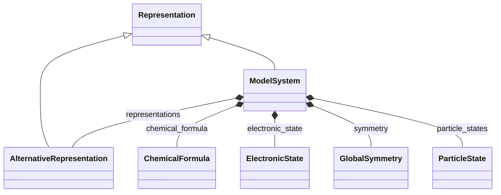

# Model System

**Purpose:** Root ModelSystem section with direct representation relationships and complete system tree

## Relationship map

Legend

<svg class="uml-legend__swatch" viewBox="0 0 64 16" aria-hidden="true"><line class="uml-legend__line" x1="54" y1="8" x2="22" y2="8"/><path class="uml-legend__head uml-legend__head--open" d="M10 8 L22 2 L22 14 Z"/></svg>inheritance (is-a)

<svg class="uml-legend__swatch" viewBox="0 0 64 16" aria-hidden="true"><path class="uml-legend__head uml-legend__head--filled" d="M10 8 L16 2 L22 8 L16 14 Z"/><line class="uml-legend__line" x1="22" y1="8" x2="52" y2="8"/></svg>composition (has-a)

## Quantities by Key Sections

### `ModelSystem`

| Section | Description | MetaInfo |
|---|---|---|
| `ModelSystem` | Model system used as an input for simulating the material. | [Open in MetaInfo browser](https://nomad-lab.eu/prod/v1/develop/gui/analyze/metainfo/nomad_simulations/section_definitions@nomad_simulations.schema_packages.model_system.ModelSystem){:target="_blank"} |

| Quantity | Type | Description |
|---|---|---|
| `name` | m_str(str) | Any verbose naming refering to the ModelSystem. Can be left empty if it is a simple crystal or it can be filled up. For example, an heterostructure of graphene (G) sandwiched in between hexagonal boron nitrides (hBN) slabs could be named 'hBN/G/hBN'. |
| `type` | Enum | Type of the system (atom, bulk, surface, etc.) which is determined by the normalizer. |
| `dimensionality` | m_int32(int32) | Dimensionality of the system: 0, 1, 2, or 3 dimensions. For atomistic systems this is automatically evaluated by using the topology-scaling algorithm: https://doi.org/10.1103/PhysRevLett.118.106101. |
| `is_representative` | m_bool(bool) | If the model system section is the one representative of the computational simulation. Defaults to False and set to True by the `Computation.normalize()`. If set to True, the `ModelSystem.normalize()` function is ran (otherwise, it is not). |
| `time_step` | m_int32(int32) | Specific time snapshot of the ModelSystem. The time evolution is then encoded in a list of ModelSystems under Computation where for each element this quantity defines the time step. |
| `branch_label` | m_str(str) | Label of the specific branch in the hierarchical `ModelSystem` tree. |
| `branch_depth` | m_int32(int32) | Index refering to the depth of a branch in the hierarchical `ModelSystem` tree. |
| `particle_indices` | m_int32(int32) (shape: ['*']) | 

Global indices of the particles that belong to this subsystem,
Global indices of the particles that belong to this subsystem, counted from the representative (top-level) ModelSystem. **Example (SrTiO_3 primitive cell)** parent particle_states   : ['Sr', 'Ti', 'O', 'O', 'O']  # → indices 0-4 Ti-only subsystem      : particle_indices = [1] Ti + apical-O subsystem: particle_indices = [1, 4]
 |
| `n_particles` | m_int32(int32) | Number of particles/atoms in the simulation. |
| `positions` | m_float64(float64) (shape: ['*', 3]) | 

Cartesian coordinates of all atoms in the system.
Cartesian coordinates of all atoms in the system. Values are expressed in an implicit Cartesian coordinate system with axes ordered as (x, y, z). The orientation of this frame is determined by the simulation code or parser that generates the data. All subsystems reference these positions via particle_indices.
 |
| `velocities` | m_float64(float64) (shape: ['*', 3]) | Velocities of the particles: I.e., the change in cartesian coordinates of the particle position with time. |
| `bond_list` | m_int32(int32) (shape: ['*', 2]) | List of pairs of atom indices corresponding to bonds (e.g., as defined by a force field) within this atoms_group. |
| `composition_formula` | m_str(str) | 

The overall composition of the system with respect to its subsystems.
The overall composition of the system with respect to its subsystems. The syntax for a system composed of X and Y with x and y components of each, respectively, is X(x)Y(y). At the deepest branch in the hierarchy, the composition_formula is expressed in terms of the atomic labels. Example: A system composed of 3 water molecules with the following hierarchy TotalSystem \| group_H2O \|   \|   \| H2O H2O H2O has the following compositional formulas at each branch: branch 0, index 0: "Total_System" composition_formula = group_H2O(1) branch 1, index 0: "group_H2O"    composition_formula = H2O(3) branch 2, index 0: "H2O"          composition_formula = H(1)O(2)
 |
| `total_charge` | m_int32(int32) | Total charge of the system. |
| `total_spin` | m_int32(int32) | 

Total spin quantum number **S** of the system (so Ŝ² ψ = S(S+1) ħ² ψ).
Total spin quantum number **S** of the system (so Ŝ² ψ = S(S+1) ħ² ψ). Stored as an integer or half-integer represented in doubled form (e.g. singlet → 0, doublet → 1, triplet → 2). Not to be confused with the spin multiplicity 2S+1.
 |

### `Representation`

| Section | Description | MetaInfo |
|---|---|---|
| `Representation` | A comprehensive section containing all representation information of a system, including lattice vectors, periodic boundary conditions, positions, and symmetry-related data. | [Open in MetaInfo browser](https://nomad-lab.eu/prod/v1/develop/gui/analyze/metainfo/nomad_simulations/section_definitions@nomad_simulations.schema_packages.model_system.Representation){:target="_blank"} |

| Quantity | Type | Description |
|---|---|---|
| `name` | m_str(str) | Name of the specific representation. This can be used for easy identification. |
| `coordinates_system` | Enum | 

Coordinate system convention used to interpret the positions quantity.
Coordinate system convention used to interpret the positions quantity. Defaults to 'cartesian', which is used in practice for almost all simulation data. For 'cartesian', positions and lattice_vectors are expressed in an implicit Cartesian frame (x, y, z). \| name       \| description \| dimensionalities \| coordinates \| \|------------\|-------------\|------------------\|-------------\| \| cartesian  \| implicit Cartesian coordinate system \| 1, 2, 3 \| x, y, z \| \| cylindrical\| cylindrical symmetry \| 3 \| r, theta, z \| \| spherical  \| spherical symmetry \| 3 \| r, theta, phi \| \| ellipsoidal\| spherically elongated system \| 3 \| r, theta, phi \| \| polar      \| spherical symmetry \| 2 \| r, theta \|
 |
| `lattice_vectors` | m_float64(float64) (shape: [3, 3]) | Lattice vectors of the simulated cell, stored as a 3x3 matrix where each row is a lattice vector. The first index runs over each lattice vector (a, b, c). The second index runs over the implicit Cartesian coordinate system (x, y, z), the same frame used for positions. |
| `periodic_boundary_conditions` | m_bool(bool) (shape: [3]) | Denotes whether periodic boundary conditions are applied. Runs over each axis. Requires `lattice_vectors` to be defined, else it is left empty. |
| `volume` | m_float64(float64) | Volume of a 3D real space entity. |
| `area` | m_float64(float64) | Area of a 2D real space entity. |
| `length` | m_float64(float64) | Total length of a 1D real space entity. |
| `boundary_area` | m_float64(float64) | Surface area of a 3D real space entity. |
| `boundary_length` | m_float64(float64) | Length of the boundary of a 2D real space entity. |
| `fractional_coordinates` | m_float64(float64) (shape: ['*', 3]) | Fractional coordinates of all atoms in the system with respect to the lattice vectors. Values typically range from 0 to 1 within the unit cell, though atoms may lie outside this range in non-periodic directions or due to wrapping conventions. |

### `AlternativeRepresentation`

| Section | Description | MetaInfo |
|---|---|---|
| `AlternativeRepresentation` | A representation relative to another, reference representation, typically the original computed system. | [Open in MetaInfo browser](https://nomad-lab.eu/prod/v1/develop/gui/analyze/metainfo/nomad_simulations/section_definitions@nomad_simulations.schema_packages.model_system.AlternativeRepresentation){:target="_blank"} |

| Quantity | Type | Description |
|---|---|---|
| `origin_shift` | m_float64(float64) (shape: [3]) | 

Translation vector relating the origin of this representation to the reference r...
Translation vector relating the origin of this representation to the reference representation, expressed in fractional coordinates. Together with transformation_matrix, defines how fractional coordinates transform between representations: x_alt = P @ x_ref + p, where both representations use the same implicit Cartesian frame but different lattice vectors. Commonly used to relate input cells to standardized conventional cells in symmetry analysis (e.g., from [spglib](https://spglib.readthedocs.io/en/latest/definition.html)).
 |
| `transformation_matrix` | m_float64(float64) (shape: [3, 3]) | 

Transformation matrix P relating lattice vectors between this representation and...
Transformation matrix P relating lattice vectors between this representation and the reference representation. Lattice vectors transform as: (a_alt, b_alt, c_alt) = (a_ref, b_ref, c_ref) @ P^-1. Together with origin_shift, defines how fractional coordinates transform: x_alt = P @ x_ref + p. Both representations use the same implicit Cartesian frame; this matrix only changes how fractional coordinates are expressed relative to different lattice vectors. Commonly used in symmetry analysis to relate input cells to standardized conventional cells (e.g., from [spglib](https://spglib.readthedocs.io/en/latest/definition.html)).
 |
| `crystal_cell_type` | Enum | Representation type of the cell structure. It might be: - 'primitive' as the primitive unit cell, - 'conventional' as the conventional cell used for referencing. |
| `supercell_matrix` | m_int32(int32) (shape: [3, 3]) | 

Specifies the matrix that transforms the primitive unit cell into the supercell ...
Specifies the matrix that transforms the primitive unit cell into the supercell in which the actual calculation is performed. In the easiest example, it is a diagonal matrix whose elements multiply the lattice_vectors, e.g., [[3, 0, 0], [0, 3, 0], [0, 0, 3]] is a $3 x 3 x 3$ superlattice.
 |

## Related Pages

- [ModelSystem](../explanation/model_system/overview.md)
