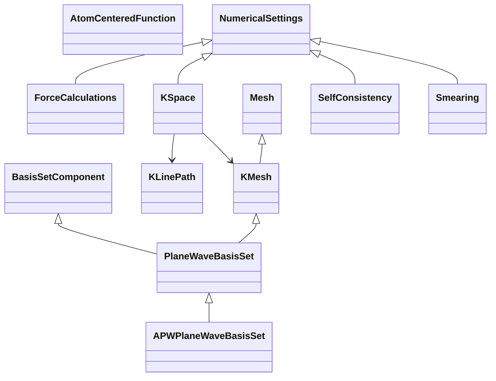

# Numerical Settings - Full Screen Diagram

!!! tip "Interactive Zoom & Pan"
    - **Scroll wheel** or **+/-** buttons to zoom
    - **Click and drag** to pan
    - **Keyboard shortcuts**: `+`/`-` to zoom, `0` to reset, `f` to fit
    - **↗** button to open in separate window
    - **⬇** button to download as SVG

This diagram shows the relationships between schema classes:

Legend

<svg class="uml-legend__swatch" viewBox="0 0 64 16" aria-hidden="true"><line class="uml-legend__line" x1="50" y1="8" x2="22" y2="8"/><path class="uml-legend__head uml-legend__head--filled" d="M22 8 L32 3 L32 13 Z"/></svg><code>Parent &lt;|-- Child</code> is-a relationship, Parent-Child inheritance

<svg class="uml-legend__swatch" viewBox="0 0 64 16" aria-hidden="true"><line class="uml-legend__line" x1="8" y1="8" x2="40" y2="8"/><path class="uml-legend__head uml-legend__head--open" d="M40 8 L48 4 M40 8 L48 12"/></svg><code>Owner --&gt; SubSection</code> has-a relationship, Owner-SubSection composition

