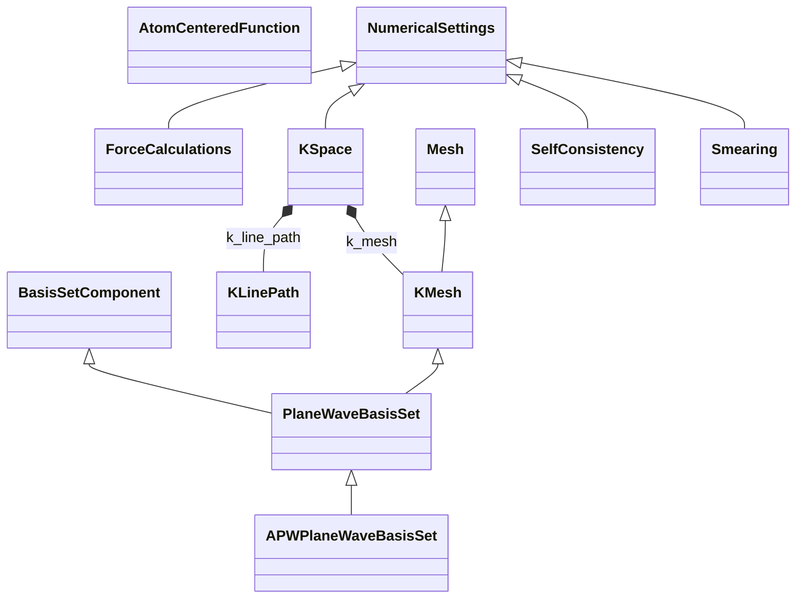

# Numerical Settings

**Purpose:** Computational parameters: meshes, basis sets, convergence, and discretization

## Relationship map

Legend

<svg class="uml-legend__swatch" viewBox="0 0 64 16" aria-hidden="true"><line class="uml-legend__line" x1="54" y1="8" x2="22" y2="8"/><path class="uml-legend__head uml-legend__head--open" d="M10 8 L22 2 L22 14 Z"/></svg>inheritance (is-a)

<svg class="uml-legend__swatch" viewBox="0 0 64 16" aria-hidden="true"><path class="uml-legend__head uml-legend__head--filled" d="M10 8 L16 2 L22 8 L16 14 Z"/><line class="uml-legend__line" x1="22" y1="8" x2="52" y2="8"/></svg>composition (has-a)

## Quantities by Key Sections

### `NumericalSettings`

| Section | Description | MetaInfo |
|---|---|---|
| `NumericalSettings` | A base section used to define how a chosen `ModelMethod` is realized numerically in a simulation. | [Open in MetaInfo browser](https://nomad-lab.eu/prod/v1/develop/gui/analyze/metainfo/nomad_simulations/section_definitions@nomad_simulations.schema_packages.numerical_settings.NumericalSettings){:target="_blank"} |

| Quantity | Type | Description |
|---|---|---|
| `name` | m_str(str) | Name of the numerical settings section. This is typically used for easy identification of the `NumericalSettings` section within a `ModelMethod`. Possible values: "KMesh", "FrequencyMesh", "TimeMesh", "SelfConsistency", "BasisSet". |

### `Mesh`

| Section | Description | MetaInfo |
|---|---|---|
| `Mesh` | A base section used to specify the settings of a sampling mesh. | [Open in MetaInfo browser](https://nomad-lab.eu/prod/v1/develop/gui/analyze/metainfo/nomad_simulations/section_definitions@nomad_simulations.schema_packages.numerical_settings.Mesh){:target="_blank"} |

| Quantity | Type | Description |
|---|---|---|
| `spacing` | Enum (shape: ['dimensionality']) | 

Identifier for the spacing of the Mesh.
Identifier for the spacing of the Mesh. Defaults to 'Equidistant' if not defined. It can take the values: \| Name      \| Description                      \| \| --------- \| -------------------------------- \| \| `'Equidistant'`  \| Equidistant grid (also known as 'Newton-Cotes') \| \| `'Logarithmic'`  \| log distance grid \| \| `'Tan'`  \| Non-uniform tan mesh for grids. More dense at low abs values of the points, while less dense for higher values \|
 |
| `quadrature` | Enum | 

Quadrature rule used for integration of the Mesh.
Quadrature rule used for integration of the Mesh. This quantity is relevant for 1D meshes: \| Name      \| Description                      \| \| --------- \| -------------------------------- \| \| `'Gauss-Legendre'` \| Quadrature rule for integration using Legendre polynomials \| \| `'Gauss-Laguerre'` \| Quadrature rule for integration using Laguerre polynomials \| \| `'Clenshaw-Curtis'`  \| Quadrature rule for integration using Chebyshev polynomials using discrete cosine transformations \| \| `'Gauss-Hermite'`  \| Quadrature rule for integration using Hermite polynomials \|
 |
| `n_points` | m_int32(int32) | Number of points in the mesh. |
| `dimensionality` | m_int32(int32) | Dimensionality of the mesh: 1, 2, or 3. Defaults to 3. |
| `grid` | m_int32(int32) (shape: ['dimensionality']) | Amount of mesh point sampling along each axis. See `type` for the axes definition. |
| `points` | m_complex128(complex128) (shape: ['n_points', 'dimensionality']) | List of all the points in the mesh. |
| `multiplicities` | m_float64(float64) (shape: ['n_points']) | The amount of times the same point reappears. A value larger than 1, typically indicates a symmetry operation that was applied to the `Mesh`. This quantity is equivalent to `weights`: multiplicities = n_points * weights |
| `weights` | m_float64(float64) (shape: ['n_points']) | Weight of each point. A value smaller than 1, typically indicates a symmetry operation that was applied to the mesh. This quantity is equivalent to `multiplicities`: weights = multiplicities / n_points |

### `KMesh`

| Section | Description | MetaInfo |
|---|---|---|
| `KMesh` | A base section used to specify the settings of a sampling mesh in reciprocal space. | [Open in MetaInfo browser](https://nomad-lab.eu/prod/v1/develop/gui/analyze/metainfo/nomad_simulations/section_definitions@nomad_simulations.schema_packages.numerical_settings.KMesh){:target="_blank"} |

| Quantity | Type | Description |
|---|---|---|
| `label` | Enum | 

Label used to identify the meaning of the reciprocal grid.
Label used to identify the meaning of the reciprocal grid. The actual meaning of `k` vs `g` vs `q` is context-dependent, though typically: - `g` is used for the primitive vectors (typically within the Brillouin zone). - `k` for a generic reciprocal vector. - `q` for any momentum change imparted by a scattering event.
 |
| `center` | Enum | 

Identifier for the center of the Mesh:
Identifier for the center of the Mesh: \| Name      \| Description                      \| \| --------- \| -------------------------------- \| \| `'Gamma-centered'` \| Regular mesh is centered around Gamma. No offset. \| \| `'Monkhorst-Pack'` \| Regular mesh with an offset of half the reciprocal lattice vector. \| \| `'Gamma-offcenter'` \| Regular mesh with an offset that is neither `'Gamma-centered'`, nor `'Monkhorst-Pack'`. \|
 |
| `offset` | m_float64(float64) (shape: [3]) | Offset vector shifting the mesh with respect to a Gamma-centered case (where it is defined as [0, 0, 0]). |
| `all_points` | m_float64(float64) (shape: ['*', 3]) | Full list of the mesh points without any symmetry operations in units of the `reciprocal_lattice_vectors`. In the presence of symmetry operations, this quantity is a larger list than `points` (as it will contain all the points in the Brillouin zone). |
| `high_symmetry_points` | JSON | 

Dictionary containing the high-symmetry point labels and their values in units of `reciprocal_lattice_vectors`.
Dictionary containing the high-symmetry point labels and their values in units of `reciprocal_lattice_vectors`. E.g., in a cubic lattice: high_symmetry_points = { 'Gamma': [0, 0, 0], 'X': [0.5, 0, 0], 'Y': [0, 0.5, 0], ... ]
 |
| `k_line_density` | m_float64(float64) | Amount of sampled k-points per unit reciprocal length along each axis. Contains the least precise density out of all axes. Should only be compared between calculations of similar dimensionality. |

### `KLinePath`

| Section | Description | MetaInfo |
|---|---|---|
| `KLinePath` | A base section used to define the settings of a k-line path within a multidimensional mesh. | [Open in MetaInfo browser](https://nomad-lab.eu/prod/v1/develop/gui/analyze/metainfo/nomad_simulations/section_definitions@nomad_simulations.schema_packages.numerical_settings.KLinePath){:target="_blank"} |

| Quantity | Type | Description |
|---|---|---|
| `high_symmetry_path_names` | m_str(str) (shape: ['*']) | List of the high-symmetry path names followed in the k-line path. This quantity is directly coupled with `high_symmetry_path_value`. E.g., in a cubic lattice: `high_symmetry_path_names = ['Gamma', 'X', 'Y', 'Gamma']`. |
| `high_symmetry_path_values` | m_float64(float64) (shape: ['*', 3]) | List of the high-symmetry path values in units of the `reciprocal_lattice_vectors` in the k-line path. This quantity is directly coupled with `high_symmetry_path_names`. E.g., in a cubic lattice: `high_symmetry_path_value = [[0, 0, 0], [0.5, 0, 0], [0, 0.5, 0], [0, 0, 0]]`. |
| `n_line_points` | m_int32(int32) | Number of points in the k-line path. |
| `points` | m_float64(float64) (shape: ['n_line_points', 3]) | List of all the points in the k-line path in units of the `reciprocal_lattice_vectors`. |

### `KSpace`

| Section | Description | MetaInfo |
|---|---|---|
| `KSpace` | A base section used to specify the settings of the k-space. | [Open in MetaInfo browser](https://nomad-lab.eu/prod/v1/develop/gui/analyze/metainfo/nomad_simulations/section_definitions@nomad_simulations.schema_packages.numerical_settings.KSpace){:target="_blank"} |

| Quantity | Type | Description |
|---|---|---|
| `reciprocal_lattice_vectors` | m_float64(float64) (shape: [3, 3]) | Reciprocal lattice vectors of the simulated cell, in Cartesian coordinates and including the $2 pi$ pre-factor. The first index runs over each lattice vector. The second index runs over the $x, y, z$ Cartesian coordinates. |

### `Smearing`

| Section | Description | MetaInfo |
|---|---|---|
| `Smearing` | Section specifying the smearing of the occupation numbers to either simulate temperature effects or improve SCF convergence. | [Open in MetaInfo browser](https://nomad-lab.eu/prod/v1/develop/gui/analyze/metainfo/nomad_simulations/section_definitions@nomad_simulations.schema_packages.numerical_settings.Smearing){:target="_blank"} |

| Quantity | Type | Description |
|---|---|---|
| `name` | Enum | Smearing routine employed. |

### `SelfConsistency`

| Section | Description | MetaInfo |
|---|---|---|
| `SelfConsistency` | A base section used to define the convergence settings of self-consistent field (SCF) calculation. | [Open in MetaInfo browser](https://nomad-lab.eu/prod/v1/develop/gui/analyze/metainfo/nomad_simulations/section_definitions@nomad_simulations.schema_packages.numerical_settings.SelfConsistency){:target="_blank"} |

| Quantity | Type | Description |
|---|---|---|
| `scf_minimization_algorithm` | m_str(str) | Specifies the algorithm used for self consistency minimization. |
| `n_max_iterations` | m_int32(int32) | Specifies the maximum number of allowed self-consistent iterations. The simulation `is_scf_converged` if the number of iterations is not larger or equal than this quantity. |
| `threshold_change` | m_float64(float64) | Specifies the threshold for the change between two subsequent self-consistent iterations on a given output property. The simulation `is_scf_converged` if this total change is below this threshold. |
| `threshold_change_unit` | m_str(str) | Unit using the pint UnitRegistry() notation for the `threshold_change`. |

### `ForceCalculations`

| Section | Description | MetaInfo |
|---|---|---|
| `ForceCalculations` | Section containing the parameters describing how a ForceField model is evaluated during a simulation. | [Open in MetaInfo browser](https://nomad-lab.eu/prod/v1/develop/gui/analyze/metainfo/nomad_simulations/section_definitions@nomad_simulations.schema_packages.force_field.ForceCalculations){:target="_blank"} |

| Quantity | Type | Description |
|---|---|---|
| `vdw_cutoff` | m_float64(float64) | Cutoff for calculating VDW forces. |
| `coulomb_type` | Enum | 

Method used for calculating long-ranged Coulomb forces.
Method used for calculating long-ranged Coulomb forces. Allowed values are: \| Method Name          \| Description                               \| \| ---------------------- \| ----------------------------------------- \| \| `""`                   \| No thermostat               \| \| `"Cutoff"`          \| Simple cutoff scheme. \| \| `"Ewald"` \| Standard Ewald summation as described in any solid-state physics text. \| \| `"Multi-Level Summation"` \|  D. Hardy, J.E. Stone, and K. Schulten, [Parallel. Comput. **35**, 164](https://doi.org/10.1016/j.parco.2008.12.005)\| \| `"Particle-Mesh-Ewald"`        \| T. Darden, D. York, and L. Pedersen, [J. Chem. Phys. **98**, 10089 (1993)](https://doi.org/10.1063/1.464397) \| \| `"Particle-Particle Particle-Mesh"` \| See e.g. Hockney and Eastwood, Computer Simulation Using Particles, Adam Hilger, NY (1989). \| \| `"Reaction-Field"` \| J.A. Barker and R.O. Watts, [Mol. Phys. **26**, 789 (1973)](https://doi.org/10.1080/00268977300102101)\|
 |
| `coulomb_cutoff` | m_float64(float64) | Cutoff for calculating short-ranged Coulomb forces. |
| `neighbor_update_frequency` | m_int32(int) | Number of timesteps between updating the neighbor list. |
| `neighbor_update_cutoff` | m_float64(float64) | The distance cutoff for determining the neighbor list. |

### `BasisSetComponent`

| Section | Description | MetaInfo |
|---|---|---|
| `BasisSetComponent` | A type section denoting a basis set component of a simulation. | [Open in MetaInfo browser](https://nomad-lab.eu/prod/v1/develop/gui/analyze/metainfo/nomad_simulations/section_definitions@nomad_simulations.schema_packages.basis_set.BasisSetComponent){:target="_blank"} |

| Quantity | Type | Description |
|---|---|---|
| `name` | m_str(str) | Name of the basis set component. |
| `species_scope` | Reference (shape: ['*']) | Reference to the section `AtomsState` specifying the localization of the basis set. |
| `hamiltonian_scope` | Reference (shape: ['*']) | Reference to the section `BaseModelMethod` containing the information of the Hamiltonian term to which the basis set applies. |

### `PlaneWaveBasisSet`

| Section | Description | MetaInfo |
|---|---|---|
| `PlaneWaveBasisSet` | Basis set over a reciprocal mesh, where each point $k_n$ represents a planar-wave basis function $rac{1}{\sqrt{\omega}} e^{i k_n r}$. | [Open in MetaInfo browser](https://nomad-lab.eu/prod/v1/develop/gui/analyze/metainfo/nomad_simulations/section_definitions@nomad_simulations.schema_packages.basis_set.PlaneWaveBasisSet){:target="_blank"} |

| Quantity | Type | Description |
|---|---|---|
| `cutoff_energy` | m_float64(float64) | Cutoff energy for the plane-wave basis set. The simulation uses plane waves with energies below this cutoff. |
| `cutoff_radius` | m_float64(float64) | Cutoff radius for the plane-wave basis set. Is the less frequently used dual to `cutoff_energy`. |

### `APWPlaneWaveBasisSet`

| Section | Description | MetaInfo |
|---|---|---|
| `APWPlaneWaveBasisSet` | A `PlaneWaveBasisSet` specialized to the APW use case. | [Open in MetaInfo browser](https://nomad-lab.eu/prod/v1/develop/gui/analyze/metainfo/nomad_simulations/section_definitions@nomad_simulations.schema_packages.basis_set.APWPlaneWaveBasisSet){:target="_blank"} |

| Quantity | Type | Description |
|---|---|---|
| `cutoff_fractional` | m_float64(float64) | The spherical cutoff parameter for the interstitial plane waves in the APW family. This cutoff has no units, referring to the product of the smallest muffin-tin radius and the length of the cutoff reciprocal vector ($r_{MT} * \|K_{cut}\|$). |

### `AtomCenteredFunction`

| Section | Description | MetaInfo |
|---|---|---|
| `AtomCenteredFunction` | Specifies a single contracted basis function in an atom-centered basis set. | [Open in MetaInfo browser](https://nomad-lab.eu/prod/v1/develop/gui/analyze/metainfo/nomad_simulations/section_definitions@nomad_simulations.schema_packages.basis_set.AtomCenteredFunction){:target="_blank"} |

| Quantity | Type | Description |
|---|---|---|
| `angular_type` | Enum | Angular basis used when expanding this shell into AOs. |
| `function_type` | Enum | Angular-momentum label (s, p, d, f, etc.). |
| `angular_momentum` | m_int32(int32) | Angular momentum quantum number ℓ. |
| `r_power` | m_int32(int32) | Radial power n_s for this shell's analytic form (typically 0 for GTOs). |
| `shell_normalization` | m_float64(float64) | Unitless normalization factor applied to each contracted atomic orbital (or shell) to satisfy the chosen normalization convention. It defines how normalized primitives are scaled when forming the final AO. |
| `n_primitive` | m_int32(int32) | Number of primitives in this shell. A primitive is a single uncontracted radial basis function such as one Gaussian or Slater-type orbital before contraction into a full atomic orbital. |
| `exponents` | m_float32(float32) (shape: ['n_primitive']) | Primitive exponents. |
| `contraction_coefficients` | m_float32(float32) (shape: ['n_primitive']) | Contraction coefficients for the primitives in this single-ℓ shell. |
| `primitive_factor` | m_float64(float64) (shape: ['n_primitive']) | Extra per-primitive multiplier (dimensionless). |
| `point_charge` | m_float32(float32) | Optional embedded point charge. |

## Related Pages

- [Model Method Overview](../explanation/model_method/overview.md)
- [ModelMethod vs NumericalSettings](../explanation/model_method/model_method_vs_numerical_settings.md)
