# Numerical Settings

**Purpose:** Computational parameters: meshes, basis sets, convergence, and discretization

**In scope:**

- K-point meshes and line paths for band structures
- Real-space meshes and grids
- Basis set specifications: plane-wave, APW, atom-centered
- Convergence thresholds and maximum iterations
- Smearing functions: Fermi-Dirac, Gaussian, Methfessel-Paxton
- Force calculation settings

**Out of scope:**

- Methods that use these settings
- Systems these apply to

## Relationship map


{: style="width: 80%; cursor: pointer;" class="click-zoom-img" title="Click to zoom"}


## Key sections

| Section | Description | MetaInfo |
|---|---|---|
| `NumericalSettings` | A base section used to define the numerical settings used in a simulation. | [Open in MetaInfo browser](https://nomad-lab.eu/prod/v1/develop/gui/analyze/metainfo/nomad_simulations/section_definitions@nomad_simulations.schema_packages.numerical_settings.NumericalSettings){:target="_blank"} |
| `Mesh` | A base section used to specify the settings of a sampling mesh. | [Open in MetaInfo browser](https://nomad-lab.eu/prod/v1/develop/gui/analyze/metainfo/nomad_simulations/section_definitions@nomad_simulations.schema_packages.numerical_settings.Mesh){:target="_blank"} |
| `KMesh` | A base section used to specify the settings of a sampling mesh in reciprocal space. | [Open in MetaInfo browser](https://nomad-lab.eu/prod/v1/develop/gui/analyze/metainfo/nomad_simulations/section_definitions@nomad_simulations.schema_packages.numerical_settings.KMesh){:target="_blank"} |
| `KLinePath` | A base section used to define the settings of a k-line path within a multidimensional mesh. | [Open in MetaInfo browser](https://nomad-lab.eu/prod/v1/develop/gui/analyze/metainfo/nomad_simulations/section_definitions@nomad_simulations.schema_packages.numerical_settings.KLinePath){:target="_blank"} |
| `KSpace` | A base section used to specify the settings of the k-space. | [Open in MetaInfo browser](https://nomad-lab.eu/prod/v1/develop/gui/analyze/metainfo/nomad_simulations/section_definitions@nomad_simulations.schema_packages.numerical_settings.KSpace){:target="_blank"} |
| `Smearing` | Section specifying the smearing of the occupation numbers to either simulate temperature effects or improve SCF convergence. | [Open in MetaInfo browser](https://nomad-lab.eu/prod/v1/develop/gui/analyze/metainfo/nomad_simulations/section_definitions@nomad_simulations.schema_packages.numerical_settings.Smearing){:target="_blank"} |
| `SelfConsistency` | A base section used to define the convergence settings of self-consistent field (SCF) calculation. | [Open in MetaInfo browser](https://nomad-lab.eu/prod/v1/develop/gui/analyze/metainfo/nomad_simulations/section_definitions@nomad_simulations.schema_packages.numerical_settings.SelfConsistency){:target="_blank"} |
| `ForceCalculations` | Section containing the parameters for force calculations according to a ForceField model. | [Open in MetaInfo browser](https://nomad-lab.eu/prod/v1/develop/gui/analyze/metainfo/nomad_simulations/section_definitions@nomad_simulations.schema_packages.numerical_settings.ForceCalculations){:target="_blank"} |
| `BasisSetComponent` | A type section denoting a basis set component of a simulation. | [Open in MetaInfo browser](https://nomad-lab.eu/prod/v1/develop/gui/analyze/metainfo/nomad_simulations/section_definitions@nomad_simulations.schema_packages.basis_set.BasisSetComponent){:target="_blank"} |
| `PlaneWaveBasisSet` | Basis set over a reciprocal mesh, where each point $k_n$ represents a planar-wave basis function $rac{1}{\sqrt{\omega}} e^{i k_n r}$. | [Open in MetaInfo browser](https://nomad-lab.eu/prod/v1/develop/gui/analyze/metainfo/nomad_simulations/section_definitions@nomad_simulations.schema_packages.basis_set.PlaneWaveBasisSet){:target="_blank"} |
| `APWPlaneWaveBasisSet` | A `PlaneWaveBasisSet` specialized to the APW use case. | [Open in MetaInfo browser](https://nomad-lab.eu/prod/v1/develop/gui/analyze/metainfo/nomad_simulations/section_definitions@nomad_simulations.schema_packages.basis_set.APWPlaneWaveBasisSet){:target="_blank"} |
| `AtomCenteredFunction` | Specifies a single contracted basis function in an atom-centered basis set. | [Open in MetaInfo browser](https://nomad-lab.eu/prod/v1/develop/gui/analyze/metainfo/nomad_simulations/section_definitions@nomad_simulations.schema_packages.basis_set.AtomCenteredFunction){:target="_blank"} |


## Micro-examples

=== "YAML"

    ```yaml
    NumericalSettings:
      name:
      - null
    Mesh:
      spacing:
      - null
      quadrature:
      - null
      n_points:
      - null
      dimensionality: 3
      grid:
      - null
      points:
      - null
      multiplicities:
      - null
      weights:
      - null
    KMesh:
      label: k-mesh
      center:
      - null
      offset:
      - null
      all_points:
      - null
      high_symmetry_points:
      - null
      k_line_density:
      - null
    KLinePath:
      high_symmetry_path_names:
      - null
      high_symmetry_path_values:
      - null
      n_line_points:
      - null
      points:
      - null
    KSpace:
      reciprocal_lattice_vectors:
      - null
      k_mesh:
      - {}
      k_line_path: {}
    Smearing:
      name:
      - null
    SelfConsistency:
      scf_minimization_algorithm:
      - null
      n_max_iterations:
      - null
      threshold_change:
      - null
      threshold_change_unit:
      - null
    ForceCalculations:
      vdw_cutoff:
      - null
      coulomb_type:
      - null
      coulomb_cutoff:
      - null
      neighbor_update_frequency:
      - null
      neighbor_update_cutoff:
      - null
    BasisSetComponent:
      name:
      - null
      species_scope:
      - null
      hamiltonian_scope:
      - null
    PlaneWaveBasisSet:
      cutoff_energy:
      - null
      cutoff_radius:
      - null
    APWPlaneWaveBasisSet:
      cutoff_fractional:
      - null
    AtomCenteredFunction:
      angular_type: spherical
      function_type:
      - null
      angular_momentum:
      - null
      r_power:
      - null
      shell_normalization:
      - null
      n_primitive:
      - null
      exponents:
      - null
      contraction_coefficients:
      - null
      primitive_factor:
      - null
      point_charge:
      - null
    ```