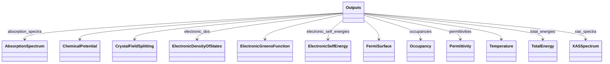
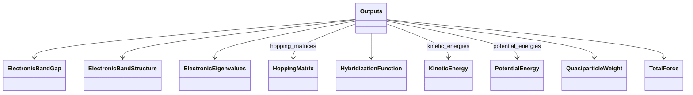

# Outputs Base - Full Screen Diagram

!!! tip "Interactive Zoom & Pan"
    - **Scroll wheel** or **+/-** buttons to zoom
    - **Click and drag** to pan
    - **Keyboard shortcuts**: `+`/`-` to zoom, `0` to reset, `f` to fit
    - **↗** button to open in separate window
    - **⬇** button to download as SVG

This diagram shows the relationships between schema classes:

- **Solid arrows** (-->) represent SubSection containment
- **Dashed arrows** (..->) represent Quantity references
- **Inheritance arrows** (<|--) represent class inheritance

---

_Diagram 2 of 2 (split due to large number of children)_

<b>Legend:</b>
<svg width="60" height="30" style="vertical-align: middle; margin: 0 6px;"><line x1="50" y1="15" x2="10" y2="15" stroke="currentColor" stroke-width="2.5"/><polygon points="10,15 20,8 20,22" fill="none" stroke="currentColor" stroke-width="2.5" stroke-linejoin="miter"/></svg> inheritance ·
<svg width="60" height="30" style="vertical-align: middle; margin: 0 6px;"><line x1="10" y1="15" x2="50" y2="15" stroke="currentColor" stroke-width="2.5"/><polygon points="50,15 40,8 40,22" fill="currentColor"/></svg> containment ·
<svg width="60" height="30" style="vertical-align: middle; margin: 0 6px;"><line x1="10" y1="15" x2="50" y2="15" stroke="currentColor" stroke-width="2.5" stroke-dasharray="4,4"/><polygon points="50,15 40,8 40,22" fill="currentColor"/></svg> reference

