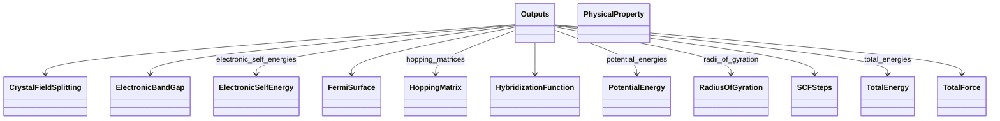

# Outputs - Full Screen Diagram

!!! tip "Interactive Zoom & Pan"
    - **Scroll wheel** or **+/-** buttons to zoom
    - **Click and drag** to pan
    - **Keyboard shortcuts**: `+`/`-` to zoom, `0` to reset, `f` to fit
    - **↗** button to open in separate window
    - **⬇** button to download as SVG

This diagram shows the relationships between schema classes:

```mermaid
classDiagram
    class AbsorptionSpectrum {
    }
    class ChemicalPotential {
    }
    class ElectronicBandStructure {
    }
    class ElectronicDensityOfStates {
    }
    class ElectronicEigenvalues {
    }
    class ElectronicGreensFunction {
    }
    class KineticEnergy {
    }
    class Occupancy {
    }
    class Outputs {
    }
    class Permittivity {
    }
    class PhysicalProperty {
    }
    class QuasiparticleWeight {
    }
    class Temperature {
    }
    class XASSpectrum {
    }
    Outputs --> AbsorptionSpectrum : absorption_spectra
    Outputs --> ChemicalPotential
    Outputs --> ElectronicBandStructure
    Outputs --> ElectronicDensityOfStates : electronic_dos
    Outputs --> ElectronicEigenvalues
    Outputs --> ElectronicGreensFunction
    Outputs --> KineticEnergy : kinetic_energies
    Outputs --> Occupancy : occupancies
    Outputs --> Permittivity : permittivities
    Outputs --> QuasiparticleWeight
    Outputs --> Temperature
    Outputs --> XASSpectrum : xas_spectra
```

---

_Diagram 2 of 2 (split due to large number of children)_

Legend

<svg class="uml-legend__swatch" viewBox="0 0 64 16" aria-hidden="true"><line class="uml-legend__line" x1="8" y1="8" x2="40" y2="8"/><path class="uml-legend__head uml-legend__head--open" d="M40 8 L48 4 M40 8 L48 12"/></svg><code>Owner --&gt; SubSection</code> has-a relationship, Owner-SubSection composition

