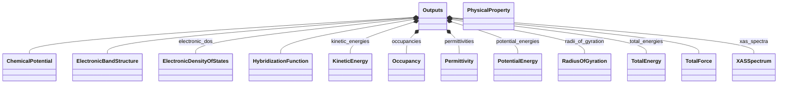
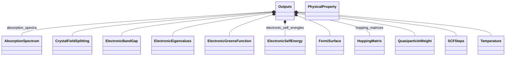

# Outputs - Full Screen Diagram

!!! tip "Interactive Zoom & Pan"
    - **Scroll wheel** or **+/-** buttons to zoom
    - **Click and drag** to pan
    - **Keyboard shortcuts**: `+`/`-` to zoom, `0` to reset, `f` to fit
    - **↗** button to open in separate window
    - **⬇** button to download as SVG

This diagram shows the relationships between schema classes:

---

_Diagram 2 of 2 (split due to large number of children)_

Legend

<svg class="uml-legend__swatch" viewBox="0 0 64 16" aria-hidden="true"><path class="uml-legend__head uml-legend__head--filled" d="M10 8 L16 2 L22 8 L16 14 Z"/><line class="uml-legend__line" x1="22" y1="8" x2="52" y2="8"/></svg>composition (has-a)

