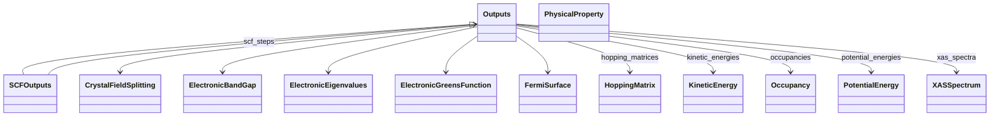

# Outputs - Full Screen Diagram

!!! tip "Interactive Zoom & Pan"
    - **Scroll wheel** or **+/-** buttons to zoom
    - **Click and drag** to pan
    - **Keyboard shortcuts**: `+`/`-` to zoom, `0` to reset, `f` to fit
    - **↗** button to open in separate window
    - **⬇** button to download as SVG

This diagram shows the relationships between schema classes:

```mermaid
classDiagram
    class AbsorptionSpectrum {
    }
    class ChemicalPotential {
    }
    class ElectronicBandStructure {
    }
    class ElectronicDensityOfStates {
    }
    class ElectronicSelfEnergy {
    }
    class HybridizationFunction {
    }
    class Outputs {
    }
    class Permittivity {
    }
    class PhysicalProperty {
    }
    class QuasiparticleWeight {
    }
    class RadiusOfGyration {
    }
    class SCFOutputs {
    }
    class Temperature {
    }
    class TotalEnergy {
    }
    class TotalForce {
    }
    Outputs <|-- SCFOutputs
    Outputs --> AbsorptionSpectrum : absorption_spectra
    Outputs --> ChemicalPotential
    Outputs --> ElectronicBandStructure
    Outputs --> ElectronicDensityOfStates : electronic_dos
    Outputs --> ElectronicSelfEnergy : electronic_self_energies
    Outputs --> HybridizationFunction
    Outputs --> Permittivity : permittivities
    Outputs --> QuasiparticleWeight
    Outputs --> RadiusOfGyration : radii_of_gyration
    Outputs --> Temperature
    Outputs --> TotalEnergy : total_energies
    Outputs --> TotalForce
    SCFOutputs --> Outputs : scf_steps
```

<svg width="56" height="16" aria-hidden="true"><line x1="48" y1="8" x2="18" y2="8" stroke="currentColor" stroke-width="1.8"/><polygon points="18,8 26,4 26,12" fill="white" stroke="currentColor" stroke-width="1.8"/></svg><code>Parent &lt;|-- Child</code> inheritance (Child extends Parent)

<svg width="56" height="16" aria-hidden="true"><line x1="8" y1="8" x2="38" y2="8" stroke="currentColor" stroke-width="1.8"/><polygon points="46,8 38,4 38,12" fill="currentColor"/></svg><code>Owner --&gt; SubSection</code> containment/subsection

---

_Diagram 2 of 2 (split due to large number of children)_

