# Outputs Base

**Purpose:** Base output structure and common property definitions

**In scope:**

- Outputs section that references ModelSystem and ModelMethod
- SCFOutputs with scf_steps for iteration history
- PhysicalProperty base class for all computed properties
- Property contributions and derivations
- SCF convergence checking

**Out of scope:**

- Specific property types
- Electronic structure properties
- Many-body properties
- Spectroscopic properties
- Thermodynamic properties

## Relationship map

{: style="width: 80%; cursor: pointer;" class="click-zoom-img" title="Click to zoom"}

<b>Legend:</b>
<svg width="24" height="12" style="vertical-align: middle; margin: 0 2px;"><line x1="20" y1="6" x2="4" y2="6" stroke="currentColor" stroke-width="1.5"/><polygon points="4,6 8,3 8,9" fill="none" stroke="currentColor" stroke-width="1.5"/></svg> inheritance ·
<svg width="24" height="12" style="vertical-align: middle; margin: 0 2px;"><line x1="4" y1="6" x2="20" y2="6" stroke="currentColor" stroke-width="1.5"/><polygon points="20,6 16,3 16,9" fill="currentColor"/></svg> containment ·
<svg width="24" height="12" style="vertical-align: middle; margin: 0 2px;"><line x1="4" y1="6" x2="20" y2="6" stroke="currentColor" stroke-width="1.5" stroke-dasharray="2,2"/><polygon points="20,6 16,3 16,9" fill="currentColor"/></svg> reference

## Key sections

| Section | Description | MetaInfo |
|---|---|---|
| `Outputs` | Output properties of a simulation. | [Open in MetaInfo browser](https://nomad-lab.eu/prod/v1/develop/gui/analyze/metainfo/nomad_simulations/section_definitions@nomad_simulations.schema_packages.outputs.Outputs){:target="_blank"} |
| `SCFOutputs` | This section contains the self-consistent (SCF) steps performed to converge an output property. | [Open in MetaInfo browser](https://nomad-lab.eu/prod/v1/develop/gui/analyze/metainfo/nomad_simulations/section_definitions@nomad_simulations.schema_packages.outputs.SCFOutputs){:target="_blank"} |
| `PhysicalProperty` | A base section for computational output properties, containing all relevant (meta)data. | [Open in MetaInfo browser](https://nomad-lab.eu/prod/v1/develop/gui/analyze/metainfo/nomad_simulations/section_definitions@nomad_simulations.schema_packages.physical_property.PhysicalProperty){:target="_blank"} |

## Quantities by section

### `Outputs`

| Quantity | Type | Description |
|---|---|---|
| `model_system_ref` | <nomad.metainfo.metainfo.Reference object at 0x706240731310> | Reference to the `ModelSystem` section in which the output physical properties were calculated. |
| `model_method_ref` | <nomad.metainfo.metainfo.Reference object at 0x70624079ede0> | Reference to the `ModelMethod` section containing the details of the mathematical model with which the output physical properties were calculated. |

### `SCFOutputs`

*This section has no direct quantities.*

### `PhysicalProperty`

| Quantity | Type | Description |
|---|---|---|
| `name` | m_str(str) | Name of the physical property. Example: `'ElectronicBandGap'`. |
| `iri` | URL | Internationalized Resource Identifier (IRI) pointing to a definition, typically within a larger, ontological framework. |
| `type` | m_str(str) | Type categorization of the physical property. Example: an `ElectronicBandGap` can be `'direct'` or `'indirect'`. |
| `contribution_type` | m_str(str) | Type of contribution to the physical property. Hence, only applies to `contributions` instances. Example: `TotalEnergy` may have contributions like _kinetic_, _potential_, etc. |
| `label` | m_str(str) | Label for additional classification of the physical property. Example: an `ElectronicBandGap` can be labeled as `'DFT'` or `'GW'` depending on the methodology used to calculate it. |
| `entity_ref` | <nomad.metainfo.metainfo.Reference object at 0x706240717530> | Reference to the entity that the physical property refers to. Examples: - a simulated physical property might refer to the macroscopic system or instead of a specific atom in the unit cell. In the first case, `outputs.model_system_ref` (see outputs.py) will point to the `ModelSystem` section, while in the second case, `entity_ref` will point to `AtomsState` section (see atoms_state.py). |
| `is_derived` | m_bool(bool) | Flag indicating whether the physical property is derived from other physical properties. We make the distinction between directly parsed and derived physical properties: - Directly parsed: the physical property is directly parsed from the simulation output files. - Derived: the physical property is derived from other physical properties. No extra numerical settings are required to calculate the physical property. |
| `physical_property_ref` | <nomad.metainfo.metainfo.Reference object at 0x706240717b00> | Reference to the `PhysicalProperty` section from which the physical property was derived. If `physical_property_ref` is populated, the quantity `is_derived` is set to True via normalization. |
| `is_scf_converged` | m_bool(bool) | Flag indicating whether the physical property is converged or not after a SCF process. This quantity is connected with `SelfConsistency` defined in the `numerical_settings.py` module. |
| `self_consistency_ref` | <nomad.metainfo.metainfo.Reference object at 0x706240715ac0> | Reference to the `SelfConsistency` section that defines the numerical settings to converge the physical property (see numerical_settings.py). |

