# Outputs

**Purpose:** Base output structure and common property definitions

**In scope:**

- Outputs section that references ModelSystem and ModelMethod
- SCFOutputs with scf_steps for iteration history
- PhysicalProperty base class for all computed properties
- Property contributions and derivations
- SCF convergence checking

## Relationship map

```mermaid
classDiagram
    class AbsorptionSpectrum
    class ChemicalPotential
    class CrystalFieldSplitting
    class ElectronicBandGap
    class ElectronicBandStructure
    class ElectronicDensityOfStates
    class ElectronicEigenvalues
    class ElectronicGreensFunction
    class ElectronicSelfEnergy
    class FermiSurface
    class HoppingMatrix
    class HybridizationFunction
    class KineticEnergy
    class Occupancy
    class Outputs
    class Permittivity
    class PhysicalProperty
    class PotentialEnergy
    class QuasiparticleWeight
    class RadiusOfGyration
    class SCFOutputs
    class Temperature
    class TotalEnergy
    class TotalForce
    class XASSpectrum
    Outputs <|-- SCFOutputs
    Outputs --> AbsorptionSpectrum : absorption_spectra
    Outputs --> ChemicalPotential : chemical_potentials
    Outputs --> CrystalFieldSplitting : crystal_field_splittings
    Outputs --> ElectronicBandGap : electronic_band_gaps
    Outputs --> ElectronicBandStructure : electronic_band_structures
    Outputs --> ElectronicDensityOfStates : electronic_dos
    Outputs --> ElectronicEigenvalues : electronic_eigenvalues
    Outputs --> ElectronicGreensFunction : electronic_greens_functions
    Outputs --> ElectronicSelfEnergy : electronic_self_energies
    Outputs --> FermiSurface : fermi_surfaces
    Outputs --> HoppingMatrix : hopping_matrices
    Outputs --> HybridizationFunction : hybridization_functions
    Outputs --> KineticEnergy : kinetic_energies
    Outputs --> Occupancy : occupancies
    Outputs --> Permittivity : permittivities
    Outputs --> PotentialEnergy : potential_energies
    Outputs --> QuasiparticleWeight : quasiparticle_weights
    Outputs --> RadiusOfGyration : radii_of_gyration
    Outputs --> Temperature : temperatures
    Outputs --> TotalEnergy : total_energies
    Outputs --> TotalForce : total_forces
    Outputs --> XASSpectrum : xas_spectra
    SCFOutputs --> Outputs : scf_steps
```

**Legend**

<svg width="56" height="16" aria-hidden="true"><line x1="48" y1="8" x2="18" y2="8" stroke="currentColor" stroke-width="1.8"/><polygon points="18,8 26,4 26,12" fill="white" stroke="currentColor" stroke-width="1.8"/></svg><code>Parent &lt;|-- Child</code> inheritance (Child extends Parent)

<svg width="56" height="16" aria-hidden="true"><line x1="8" y1="8" x2="38" y2="8" stroke="currentColor" stroke-width="1.8"/><polygon points="46,8 38,4 38,12" fill="currentColor"/></svg><code>Owner --&gt; SubSection</code> containment/subsection

## Key sections

| Section | Description | MetaInfo |
|---|---|---|
| `Outputs` | Output properties of a simulation. | [Open in MetaInfo browser](https://nomad-lab.eu/prod/v1/develop/gui/analyze/metainfo/nomad_simulations/section_definitions@nomad_simulations.schema_packages.outputs.Outputs){:target="_blank"} |
| `SCFOutputs` | This section contains the self-consistent (SCF) steps performed to converge an output property. | [Open in MetaInfo browser](https://nomad-lab.eu/prod/v1/develop/gui/analyze/metainfo/nomad_simulations/section_definitions@nomad_simulations.schema_packages.outputs.SCFOutputs){:target="_blank"} |
| `PhysicalProperty` | A base section for computational output properties, containing all relevant (meta)data. | [Open in MetaInfo browser](https://nomad-lab.eu/prod/v1/develop/gui/analyze/metainfo/nomad_simulations/section_definitions@nomad_simulations.schema_packages.physical_property.PhysicalProperty){:target="_blank"} |

## Quantities by section

### `Outputs`

| Quantity | Type | Description |
|---|---|---|
| `model_system_ref` | <nomad.metainfo.metainfo.Reference object at 0x7bbe80273f20> | Reference to the `ModelSystem` section in which the output physical properties were calculated. |
| `model_method_ref` | <nomad.metainfo.metainfo.Reference object at 0x7bbe80272a50> | Reference to the `ModelMethod` section containing the details of the mathematical model with which the output physical properties were calculated. |

### `SCFOutputs`

*This section has no direct quantities.*

### `PhysicalProperty`

| Quantity | Type | Description |
|---|---|---|
| `name` | m_str(str) | Name of the physical property. Example: `'ElectronicBandGap'`. |
| `iri` | URL | Internationalized Resource Identifier (IRI) pointing to a definition, typically within a larger, ontological framework. |
| `type` | m_str(str) | Type categorization of the physical property. Example: an `ElectronicBandGap` can be `'direct'` or `'indirect'`. |
| `contribution_type` | m_str(str) | Type of contribution to the physical property. Hence, only applies to `contributions` instances. Example: `TotalEnergy` may have contributions like _kinetic_, _potential_, etc. |
| `label` | m_str(str) | Label for additional classification of the physical property. Example: an `ElectronicBandGap` can be labeled as `'DFT'` or `'GW'` depending on the methodology used to calculate it. |
| `entity_ref` | <nomad.metainfo.metainfo.Reference object at 0x7bbe8023dfa0> | 

Reference to the entity that the physical property refers to.
Reference to the entity that the physical property refers to. Examples: - a simulated physical property might refer to the macroscopic system or instead of a specific atom in the unit cell. In the first case, `outputs.model_system_ref` (see outputs.py) will point to the `ModelSystem` section, while in the second case, `entity_ref` will point to `AtomsState` section (see atoms_state.py).
 |
| `is_derived` | m_bool(bool) | 

Flag indicating whether the physical property is derived from other physical properties.
Flag indicating whether the physical property is derived from other physical properties. We make the distinction between directly parsed and derived physical properties: - Directly parsed: the physical property is directly parsed from the simulation output files. - Derived: the physical property is derived from other physical properties. No extra numerical settings are required to calculate the physical property.
 |
| `physical_property_ref` | <nomad.metainfo.metainfo.Reference object at 0x7bbe8045bef0> | Reference to the `PhysicalProperty` section from which the physical property was derived. If `physical_property_ref` is populated, the quantity `is_derived` is set to True via normalization. |
| `is_scf_converged` | m_bool(bool) | Flag indicating whether the physical property is converged or not after a SCF process. This quantity is connected with `SelfConsistency` defined in the `numerical_settings.py` module. |
| `self_consistency_ref` | <nomad.metainfo.metainfo.Reference object at 0x7bbe8023d520> | Reference to the `SelfConsistency` section that defines the numerical settings to converge the physical property (see numerical_settings.py). |

