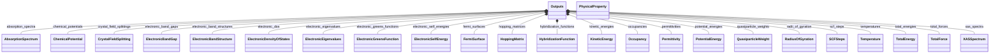

# Outputs

**Purpose:** Base output structure and common property definitions

## Notes

One `Outputs` section represents the calculated properties of one system
configuration, identified through `model_system_ref`. A sequence of
configurations, such as geometry-optimization steps, is represented using
multiple output sections, normally `WorkflowOutputs`, ordered by
`WorkflowOutputs.step`.

One `TotalEnergy` represents the converged total energy of that configuration.
Energy components belong inside that `TotalEnergy` through its `contributions`
subsections. The listed contributions do not have to be exhaustive, so the total
energy is not necessarily equal to their sum. Although `Outputs.total_energies`
has `repeats=True`, the schema currently defines neither an ordering nor a
sequence meaning for repeated entries.

`SCFSteps.energies_total` is the ordered sequence of total energies from the SCF
iterations within one configuration. `SCFSteps.delta_energies_total` contains
differences between consecutive values from that SCF sequence.

Conceptual geometry-optimization layout:

```text
WorkflowOutputs(step=0)
    TotalEnergy for configuration 0
    SCFSteps.energies_total for the SCF iterations of configuration 0

WorkflowOutputs(step=1)
    TotalEnergy for configuration 1
    SCFSteps.energies_total for the SCF iterations of configuration 1
```


## Relationship map


<div class="uml-diagram-card" markdown="1">


```mermaid
classDiagram
    class AbsorptionSpectrum
    class ChemicalPotential
    class CrystalFieldSplitting
    class ElectronicBandGap
    class ElectronicBandStructure
    class ElectronicDensityOfStates
    class ElectronicEigenvalues
    class ElectronicGreensFunction
    class ElectronicSelfEnergy
    class FermiSurface
    class HoppingMatrix
    class HybridizationFunction
    class KineticEnergy
    class Occupancy
    class Outputs
    class Permittivity
    class PhysicalProperty
    class PotentialEnergy
    class QuasiparticleWeight
    class RadiusOfGyration
    class SCFSteps
    class Temperature
    class TotalEnergy
    class TotalForce
    class XASSpectrum
    Outputs *-- AbsorptionSpectrum : absorption_spectra
    Outputs *-- ChemicalPotential : chemical_potentials
    Outputs *-- CrystalFieldSplitting : crystal_field_splittings
    Outputs *-- ElectronicBandGap : electronic_band_gaps
    Outputs *-- ElectronicBandStructure : electronic_band_structures
    Outputs *-- ElectronicDensityOfStates : electronic_dos
    Outputs *-- ElectronicEigenvalues : electronic_eigenvalues
    Outputs *-- ElectronicGreensFunction : electronic_greens_functions
    Outputs *-- ElectronicSelfEnergy : electronic_self_energies
    Outputs *-- FermiSurface : fermi_surfaces
    Outputs *-- HoppingMatrix : hopping_matrices
    Outputs *-- HybridizationFunction : hybridization_functions
    Outputs *-- KineticEnergy : kinetic_energies
    Outputs *-- Occupancy : occupancies
    Outputs *-- Permittivity : permittivities
    Outputs *-- PotentialEnergy : potential_energies
    Outputs *-- QuasiparticleWeight : quasiparticle_weights
    Outputs *-- RadiusOfGyration : radii_of_gyration
    Outputs *-- SCFSteps : scf_steps
    Outputs *-- Temperature : temperatures
    Outputs *-- TotalEnergy : total_energies
    Outputs *-- TotalForce : total_forces
    Outputs *-- XASSpectrum : xas_spectra
```

<p class="uml-legend__title">Legend</p>
<div class="uml-legend" role="list" aria-label="Diagram relationship legend">
<div class="uml-legend__item" role="listitem"><svg class="uml-legend__swatch" viewBox="0 0 64 16" aria-hidden="true"><path class="uml-legend__head uml-legend__head--filled" d="M10 8 L16 2 L22 8 L16 14 Z"/><line class="uml-legend__line" x1="22" y1="8" x2="52" y2="8"/></svg><span>composition (has-a)</span></div>
</div>

</div>


## Quantities by Key Sections

### `Outputs`

| Section | Description | MetaInfo |
|---|---|---|
| `Outputs` | Output properties of a simulation. | [Open in MetaInfo browser](https://nomad-lab.eu/prod/v1/develop/gui/analyze/metainfo/nomad_simulations/section_definitions@nomad_simulations.schema_packages.outputs.Outputs){:target="_blank"} |

| Quantity | Type | Description |
|---|---|---|
| `model_system_ref` | Reference | Reference to the `ModelSystem` section in which the output physical properties were calculated. |
| `model_method_ref` | Reference | Reference to the `ModelMethod` section containing the details of the mathematical model with which the output physical properties were calculated. |

### `SCFSteps`

| Section | Description | MetaInfo |
|---|---|---|
| `SCFSteps` | Data recorded at each step of a self-consistent DFT calculation. | [Open in MetaInfo browser](https://nomad-lab.eu/prod/v1/develop/gui/analyze/metainfo/nomad_simulations/section_definitions@nomad_simulations.schema_packages.outputs.SCFSteps){:target="_blank"} |

| Quantity | Type | Description |
|---|---|---|
| `energies_total` | m_float64(float) (shape: ['*']) | Ordered sequence of total energies from the SCF iterations within one system configuration. |
| `delta_energies_total` | m_float64(float) (shape: ['*']) | <details><summary>Absolute change of total energy between consecutive SCF steps.</summary>Absolute change of total energy between consecutive SCF steps. When<br>derived from `energies_total`, the values follow<br>$\Delta E_i = \lvert E_{i+1} - E_i \rvert$, so N SCF energies<br>produce N - 1 energy deltas.</details> |
| `energy_error_estimate` | m_float64(float) (shape: ['*']) | <details><summary>Estimate of the remaining error in the total energy at each SCF step,</summary>Estimate of the remaining error in the total energy at each SCF step,<br>derived from the density residual rather than from the change of the<br>total energy itself. For example, Quantum ESPRESSO's "estimated scf<br>accuracy" is the Hartree self-energy of the density residual. Distinct<br>from `delta_energies_total`, which is the change of the total energy<br>between consecutive steps.</details> |
| `delta_potential_rms` | m_float64(float) (shape: ['*']) | Root mean square of change of potential energy at each SCF step. |
| `delta_charge_abs` | m_float64(float) (shape: ['*']) | <details><summary>Volume-integrated absolute change of the electron density between</summary>Volume-integrated absolute change of the electron density between<br>consecutive SCF steps, `integral \|rho_n(r) - rho_(n-1)(r)\| d^3r`,<br>expressed as a charge (equivalently a number of electrons). Reported by<br>all-electron codes such as WIEN2k (`:DIS`). The exact norm and any<br>normalization are a code-reported convention that the schema does not<br>enforce.</details> |
| `delta_charge_density_rms` | m_float64(float) (shape: ['*']) | <details><summary>Root mean square, over real-space grid points, of the change of the</summary>Root mean square, over real-space grid points, of the change of the<br>electron density between consecutive SCF steps. Unlike `delta_charge_abs`<br>the volume is retained, so this is a charge density. Reported by<br>plane-wave codes such as VASP (`rms(c)`).</details> |
| `delta_charge_relative` | m_float64(float) (shape: ['*']) | Integrated absolute density change normalized by the electron count, `integral \|rho_n - rho_(n-1)\| d^3r / N`, hence dimensionless. Reported by exciting ("charge distance") and GPAW (per valence electron). |
| `delta_density_matrix_rms` | m_float64(float) (shape: ['*']) | <details><summary>Root mean square of the change of the density-matrix elements `P_munu`</summary>Root mean square of the change of the density-matrix elements `P_munu`<br>(in the non-orthonormal atomic-orbital basis) between consecutive SCF<br>steps. The elements are dimensionless, so is this residual. Reported by<br>Gaussian-basis codes such as CRYSTAL (`tst`) and ORCA (`RMS-DP`).</details> |
| `delta_density_matrix_max` | m_float64(float) (shape: ['*']) | <details><summary>Maximum absolute change of the density-matrix elements `P_munu` between</summary>Maximum absolute change of the density-matrix elements `P_munu` between<br>consecutive SCF steps; the max-norm counterpart of<br>`delta_density_matrix_rms`. Reported by Gaussian-basis codes such as<br>CP2K, CRYSTAL (`PX`), and ORCA (`Max-DP`).</details> |
| `delta_wavefunction_rms` | m_float64(float) (shape: ['*']) | Root mean square of change of wavefunction coefficients at each SCF step. Dimensionless quantity representing convergence of orbital coefficients. |
| `delta_force_abs` | m_float64(float) (shape: ['*']) | Absolute change of forces at each SCF step. |
| `durations` | m_float64(float) (shape: ['*']) | Time spent at each SCF step. |
| `code_specific_quantities` | JSON | Code specific quantities that are recorded during SCF convergence. |

### `PhysicalProperty`

| Section | Description | MetaInfo |
|---|---|---|
| `PhysicalProperty` | A base section for computational output properties, containing all relevant (meta)data. | [Open in MetaInfo browser](https://nomad-lab.eu/prod/v1/develop/gui/analyze/metainfo/nomad_simulations/section_definitions@nomad_simulations.schema_packages.physical_property.PhysicalProperty){:target="_blank"} |

| Quantity | Type | Description |
|---|---|---|
| `name` | m_str(str) | Name of the physical property. Example: `'ElectronicBandGap'`. |
| `iri` | URL | Internationalized Resource Identifier (IRI) pointing to a definition, typically within a larger, ontological framework. |
| `type` | m_str(str) | Type categorization of the physical property. Example: an `ElectronicBandGap` can be `'direct'` or `'indirect'`. |
| `contribution_type` | m_str(str) | Type of contribution to the physical property. Hence, only applies to `contributions` instances. Example: `TotalEnergy` may have contributions like _kinetic_, _potential_, etc. |
| `label` | m_str(str) | Label for additional classification of the physical property. Example: an `ElectronicBandGap` can be labeled as `'DFT'` or `'GW'` depending on the methodology used to calculate it. |
| `entity_ref` | Reference | <details><summary>Reference to the entity that the physical property refers to.</summary>Reference to the entity that the physical property refers to. Examples:<br>- a simulated physical property may refer to the macroscopic system as a whole. In that case,<br>`outputs.model_system_ref` (see outputs.py) points to the `ModelSystem` section.<br>- a simulated physical property may instead refer to a specific entity within that system, such as<br>an `AtomsState`, a `CGBeadState`, another `ParticleState` subclass, or an<br>`ElectronicState`, via `entity_ref`.</details> |
| `is_derived` | m_bool(bool) | <details><summary>Flag indicating whether the physical property is derived from other physical properties.</summary>Flag indicating whether the physical property is derived from other physical properties. We make<br>the distinction between directly parsed and derived physical properties:<br>- Directly parsed: the physical property is directly parsed from the simulation output files.<br>- Derived: the physical property is derived from other physical properties. No extra numerical settings<br>are required to calculate the physical property.</details> |
| `physical_property_ref` | Reference | Reference to the `PhysicalProperty` section from which the physical property was derived. If `physical_property_ref` is populated, the quantity `is_derived` is set to True via normalization. |
| `is_converged` | m_bool(bool) | Flag indicating whether the calculation that yields this physical property is converged or not after a SCF or optimization process. This information is obtained from the workflow section. |


