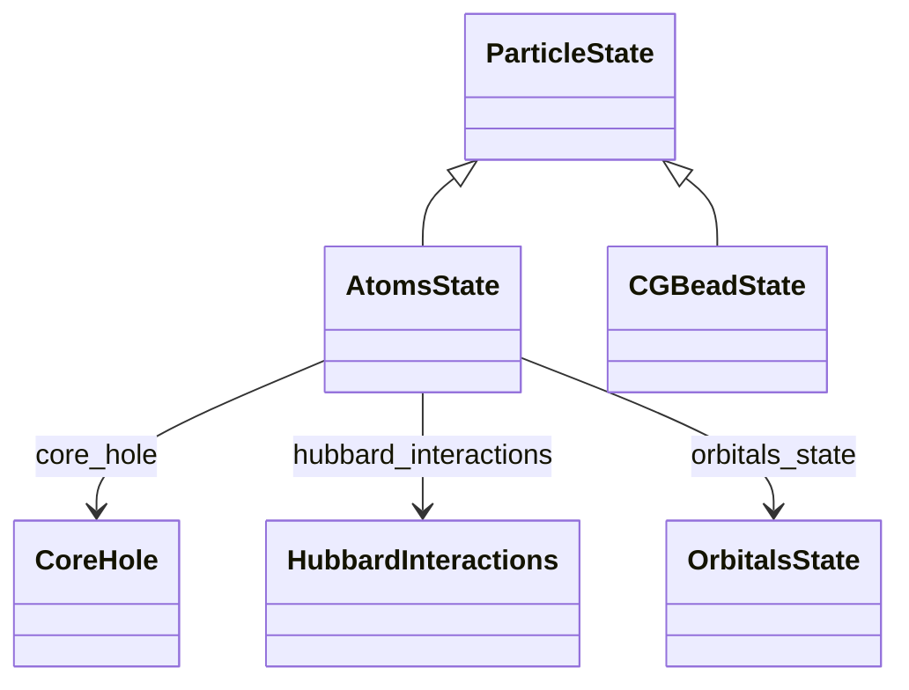

# Particle States

**Purpose:** Complete particle state hierarchy: ParticleState base class, AtomsState with detailed atomic properties, and CGBeadState

**In scope:**

- ParticleState: base class for all particle information
- AtomsState: atomic particle states with chemical symbols
- CGBeadState: coarse-grained bead states
- OrbitalsState: quantum numbers (n, l, ml, j, mj, ms) within AtomsState
- Orbital degeneracy and occupation
- CoreHole: excited electron states for spectroscopy
- HubbardInteractions: U matrix, U_effective, J_Hunds for correlated systems
- Slater integrals for many-body interactions
- Particle indices, velocities, forces
- Chemical symbols and particle organization

**Out of scope:**

- Cell and geometric information
- Methods that use these properties

## Relationship map

<b>Legend:</b>
<svg width="24" height="12" style="vertical-align: middle; margin: 0 2px;"><line x1="20" y1="6" x2="4" y2="6" stroke="currentColor" stroke-width="1.5"/><polygon points="4,6 8,3 8,9" fill="none" stroke="currentColor" stroke-width="1.5"/></svg> inheritance ·
<svg width="24" height="12" style="vertical-align: middle; margin: 0 2px;"><line x1="4" y1="6" x2="20" y2="6" stroke="currentColor" stroke-width="1.5"/><polygon points="20,6 16,3 16,9" fill="currentColor"/></svg> containment ·
<svg width="24" height="12" style="vertical-align: middle; margin: 0 2px;"><line x1="4" y1="6" x2="20" y2="6" stroke="currentColor" stroke-width="1.5" stroke-dasharray="2,2"/><polygon points="20,6 16,3 16,9" fill="currentColor"/></svg> reference

## Key sections

| Section | Description | MetaInfo |
|---|---|---|
| `ParticleState` | Generic base section representing the state of a particle in a simulation. | [Open in MetaInfo browser](https://nomad-lab.eu/prod/v1/develop/gui/analyze/metainfo/nomad_simulations/section_definitions@nomad_simulations.schema_packages.atoms_state.ParticleState){:target="_blank"} |
| `AtomsState` | A base section to define each atom state information. | [Open in MetaInfo browser](https://nomad-lab.eu/prod/v1/develop/gui/analyze/metainfo/nomad_simulations/section_definitions@nomad_simulations.schema_packages.atoms_state.AtomsState){:target="_blank"} |
| `CGBeadState` | A section to define coarse-grained bead state information. | [Open in MetaInfo browser](https://nomad-lab.eu/prod/v1/develop/gui/analyze/metainfo/nomad_simulations/section_definitions@nomad_simulations.schema_packages.atoms_state.CGBeadState){:target="_blank"} |
| `OrbitalsState` | A base section used to define the orbital state of an atom. | [Open in MetaInfo browser](https://nomad-lab.eu/prod/v1/develop/gui/analyze/metainfo/nomad_simulations/section_definitions@nomad_simulations.schema_packages.atoms_state.OrbitalsState){:target="_blank"} |
| `CoreHole` | A base section used to define the core-hole state of an atom by referencing the `OrbitalsState` section where the core-hole was generated. | [Open in MetaInfo browser](https://nomad-lab.eu/prod/v1/develop/gui/analyze/metainfo/nomad_simulations/section_definitions@nomad_simulations.schema_packages.atoms_state.CoreHole){:target="_blank"} |
| `HubbardInteractions` | A base section to define the Hubbard interactions of the system. | [Open in MetaInfo browser](https://nomad-lab.eu/prod/v1/develop/gui/analyze/metainfo/nomad_simulations/section_definitions@nomad_simulations.schema_packages.atoms_state.HubbardInteractions){:target="_blank"} |

## Quantities by section

### `ParticleState`

| Quantity | Type | Description |
|---|---|---|
| `label` | m_str(str) | User- or program-package-defined identifier for this particle. |

### `AtomsState`

| Quantity | Type | Description |
|---|---|---|
| `chemical_symbol` | Enum | Symbol of the element, e.g. 'H', 'Pb'. This quantity is equivalent to `atomic_numbers`. |
| `atomic_number` | m_int32(int32) | Atomic number Z. This quantity is equivalent to `chemical_symbol`. |
| `charge` | m_int32(int32) | 

Charge of the atom.
Charge of the atom. It is defined as the number of extra electrons or holes in the atom. If the atom is neutral, charge = 0 and the summation of all (if available) the`OrbitalsState.occupation` coincides with the `atomic_number`. Otherwise, charge can be any positive integer (+1, +2...) for cations or any negative integer (-1, -2...) for anions. Note: for `CoreHole` systems we do not consider the charge of the atom even if we do not store the final `OrbitalsState` where the electron was excited to.
 |
| `spin` | m_int32(int32) | Total spin quantum number, S. |
| `label` | m_str(str) | User- or program-package-defined identifier for this atomic site. e.g. 'H1', 'H1a', 'C_eq'. It doesn't replace `chemical_symbol`, but merely gives users a more specialized token for the unique site name. |

### `CGBeadState`

| Quantity | Type | Description |
|---|---|---|
| `bead_symbol` | m_str(str) | Symbol(s) describing the (base) CG particle type. Equivalent to chemical_symbol for atomic elements. |
| `label` | m_str(str) | 

User- or program-package-defined identifier for this bead site.
User- or program-package-defined identifier for this bead site. This could be used to store primary FF labels in cases where only a secondary specification is required. Otherwise, `alt_labels` are used to document more complex bead identifiers, e.g., bead interactions based on connectivity.
 |
| `alt_labels` | m_str(str) (shape: ['*']) | A list of bead labels for multifaceted bead characterization. |
| `mass` | m_float64(float64) | Total mass of the particle. |
| `charge` | m_float64(float64) | Total charge of the particle. |

### `OrbitalsState`

| Quantity | Type | Description |
|---|---|---|
| `n_quantum_number` | m_int32(int32) | Principal quantum number of the orbital state. |
| `l_quantum_number` | m_int32(int32) | Azimuthal quantum number of the orbital state. This quantity is equivalent to `l_quantum_symbol`. |
| `l_quantum_symbol` | m_str(str) | Azimuthal quantum symbol of the orbital state, "s", "p", "d", "f", etc. This quantity is equivalent to `l_quantum_number`. |
| `ml_quantum_number` | m_int32(int32) | Azimuthal projection number of the `l` vector. This quantity is equivalent to `ml_quantum_symbol`. |
| `ml_quantum_symbol` | m_str(str) | Azimuthal projection symbol of the `l` vector, "x", "y", "z", etc. This quantity is equivalent to `ml_quantum_number`. |
| `j_quantum_number` | m_float64(float64) (shape: ['1..2']) | Total angular momentum quantum number $j = \|l-s\| ... l+s$. Necessary with strong L-S coupling or non-collinear spin systems. |
| `mj_quantum_number` | m_float64(float64) (shape: ['*']) | Azimuthal projection of the `j` vector. Necessary with strong L-S coupling or non-collinear spin systems. |
| `ms_quantum_number` | m_float64(float64) | Spin quantum number. Set to -1 for spin down and +1 for spin up. In non-collinear spin systems, the projection axis $z$ should also be defined. |
| `ms_quantum_symbol` | Enum | Spin quantum symbol. Set to 'down' for spin down and 'up' for spin up. In non-collinear spin systems, the projection axis $z$ should also be defined. |
| `degeneracy` | m_int32(int32) | The degeneracy of the orbital state. The degeneracy is the number of states with the same energy. It is equal to 2 * l + 1 for non-relativistic systems and 2 * j + 1 for relativistic systems, if ms_quantum_number is defined (otherwise a factor of 2 is included). |
| `occupation` | m_float64(float64) | The number of electrons in the orbital state. The state is fully occupied if occupation = degeneracy. |

### `CoreHole`

| Quantity | Type | Description |
|---|---|---|
| `orbital_ref` | <nomad.metainfo.metainfo.Reference object at 0x77b0e355b1d0> | Reference to the OrbitalsState section that is used as a basis to obtain the `CoreHole` section. |
| `n_excited_electrons` | m_float64(float64) | The electron charge excited for modelling purposes. This is a number between 0 and 1 (Janak state). If `dscf_state` is set to 'initial', then this quantity is set to None (but assumed to be excited to an excited state). |
| `dscf_state` | Enum | 

Tag used to identify the role in the workflow of the same name.
Tag used to identify the role in the workflow of the same name. Allowed values are 'initial' (not to be confused with the _initial-state approximation_) and 'final'. If 'initial' is used, then `n_excited_electrons` is set to None and the `orbital_ref.degeneracy` is set to 1.
 |

### `HubbardInteractions`

| Quantity | Type | Description |
|---|---|---|
| `n_orbitals` | m_int32(int32) | Number of orbitals used to define the Hubbard interactions. |
| `orbitals_ref` | <nomad.metainfo.metainfo.Reference object at 0x77b0e35329f0> (shape: ['n_orbitals']) | Reference to the `OrbitalsState` sections that are used as a basis to obtain the Hubbard interaction matrices. |
| `u_matrix` | m_float64(float64) (shape: ['n_orbitals', 'n_orbitals']) | Value of the local Hubbard interaction matrix. The order of the rows and columns coincide with the elements in `orbital_ref`. |
| `u_interaction` | m_float64(float64) | Value of the (intraorbital) Hubbard interaction |
| `j_hunds_coupling` | m_float64(float64) | Value of the (interorbital) Hund's coupling. |
| `u_interorbital_interaction` | m_float64(float64) | Value of the (interorbital) Coulomb interaction. In rotational invariant systems, u_interorbital_interaction = u_interaction - 2 * j_hunds_coupling. |
| `j_local_exchange_interaction` | m_float64(float64) | Value of the exchange interaction. In rotational invariant systems, j_local_exchange_interaction = j_hunds_coupling. |
| `u_effective` | m_float64(float64) | Value of the effective U parameter (u_interaction - j_local_exchange_interaction). |
| `slater_integrals` | m_float64(float64) (shape: [3]) | 

Value of the Slater integrals [F0, F2, F4] in spherical harmonics used to derive
Value of the Slater integrals [F0, F2, F4] in spherical harmonics used to derive the local Hubbard interactions: u_interaction = ((2.0 / 7.0) ** 2) * (F0 + 5.0 * F2 + 9.0 * F4) / (4.0*np.pi) u_interorbital_interaction = ((2.0 / 7.0) ** 2) * (F0 - 5.0 * F2 + 3.0 * 0.5 * F4) / (4.0*np.pi) j_hunds_coupling = ((2.0 / 7.0) ** 2) * (5.0 * F2 + 15.0 * 0.25 * F4) / (4.0*np.pi) See e.g., Elbio Dagotto, Nanoscale Phase Separation and Colossal Magnetoresistance, Chapter 4, Springer Berlin (2003).
 |
| `double_counting_correction` | m_str(str) | Name of the double counting correction algorithm applied. |

