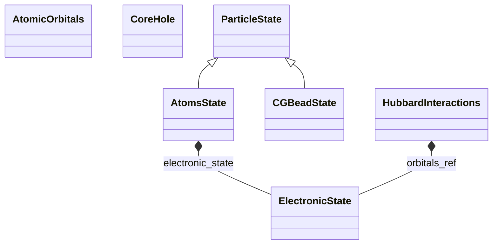

# Particle States

**Purpose:** Complete particle state hierarchy: ParticleState base class, AtomsState with detailed atomic properties, and CGBeadState

**In scope:**

- ParticleState: base class for all particle information
- AtomsState: atomic particle states with chemical symbols
- CGBeadState: coarse-grained bead states
- AtomicOrbitals: quantum numbers (n, l, ml, j, mj, ms) within AtomsState
- Orbital degeneracy and occupation
- CoreHole: excited electron states for spectroscopy
- HubbardInteractions: U matrix, U_effective, J_Hunds for correlated systems
- Slater integrals for many-body interactions
- Particle indices, velocities, forces
- Chemical symbols and particle organization

## Relationship map

Legend

<svg class="uml-legend__swatch" viewBox="0 0 64 16" aria-hidden="true"><line class="uml-legend__line" x1="54" y1="8" x2="28" y2="8"/><path class="uml-legend__head uml-legend__head--open" d="M18 8 L30 2 L30 14 Z"/></svg>inheritance (is-a)

<svg class="uml-legend__swatch" viewBox="0 0 64 16" aria-hidden="true"><path class="uml-legend__head uml-legend__head--filled" d="M10 8 L16 2 L22 8 L16 14 Z"/><line class="uml-legend__line" x1="22" y1="8" x2="52" y2="8"/></svg>composition (has-a)

## Key sections

| Section | Description | MetaInfo |
|---|---|---|
| `ParticleState` | Generic base section for particle-level entities in a simulation. | [Open in MetaInfo browser](https://nomad-lab.eu/prod/v1/develop/gui/analyze/metainfo/nomad_simulations/section_definitions@nomad_simulations.schema_packages.atoms_state.ParticleState){:target="_blank"} |
| `AtomsState` | A base section to define each atom's state information. | [Open in MetaInfo browser](https://nomad-lab.eu/prod/v1/develop/gui/analyze/metainfo/nomad_simulations/section_definitions@nomad_simulations.schema_packages.atoms_state.AtomsState){:target="_blank"} |
| `CGBeadState` | A section to define coarse-grained bead state information. | [Open in MetaInfo browser](https://nomad-lab.eu/prod/v1/develop/gui/analyze/metainfo/nomad_simulations/section_definitions@nomad_simulations.schema_packages.atoms_state.CGBeadState){:target="_blank"} |
| `AtomicOrbitals` | Expanded **atomic orbital (AO) layer** associated with a specific `AtomCenteredBasisSet`. | [Open in MetaInfo browser](https://nomad-lab.eu/prod/v1/develop/gui/analyze/metainfo/nomad_simulations/section_definitions@nomad_simulations.schema_packages.basis_set.AtomicOrbitals){:target="_blank"} |
| `CoreHole` | A section used to define the core-hole state of an atom by extending the `ElectronicState` section with core-hole specific properties like excited electron count and DSCF state. | [Open in MetaInfo browser](https://nomad-lab.eu/prod/v1/develop/gui/analyze/metainfo/nomad_simulations/section_definitions@nomad_simulations.schema_packages.atoms_state.CoreHole){:target="_blank"} |
| `HubbardInteractions` | A base section to define the Hubbard interactions of the system. | [Open in MetaInfo browser](https://nomad-lab.eu/prod/v1/develop/gui/analyze/metainfo/nomad_simulations/section_definitions@nomad_simulations.schema_packages.atoms_state.HubbardInteractions){:target="_blank"} |

## Quantities by section

### `ParticleState`

| Quantity | Type | Description |
|---|---|---|
| `label` | m_str(str) | User- or program-package-defined identifier for this particle. |
| `mass` | m_float_bounded(float) | 

Mass associated with this particle/site, in kilograms.
Mass associated with this particle/site, in kilograms. This is an immutable per-particle descriptor intended for downstream analyses that require per-particle masses. For `AtomsState`, it is the mass of the modeled atomic site (including isotope/effective choices provided by the source data). For `CGBeadState`, it is the bead mass. Method-related mass assignments belong in method-specific sections.
 |

### `AtomsState`

| Quantity | Type | Description |
|---|---|---|
| `chemical_symbol` | Enum | Symbol of the element, e.g. 'H', 'Pb'. This quantity is equivalent to `atomic_numbers`. |
| `atomic_number` | m_int32(int32) | Atomic number Z. This quantity is equivalent to `chemical_symbol`. |
| `charge` | m_int32(int32) | 

Formal integer charge of the atom, defined as the number of extra
Formal integer charge of the atom, defined as the number of extra electrons (negative) or holes (positive) relative to the neutral atom. For neutral atoms `charge = 0`. Note: for `CoreHole` systems we do not consider the charge of the atom even if we do not store the final `ElectronicState` where the electron was excited to.
 |
| `spin` | m_int32(int32) | Total spin quantum number, S. |
| `label` | m_str(str) | User- or program-package-defined identifier for this atomic site. e.g. 'H1', 'H1a', 'C_eq'. It doesn't replace `chemical_symbol`, but merely gives users a more specialized token for the unique site name. |

### `CGBeadState`

| Quantity | Type | Description |
|---|---|---|
| `bead_symbol` | m_str(str) | Symbol(s) describing the (base) CG particle type. Equivalent to chemical_symbol for atomic elements. |
| `label` | m_str(str) | 

User- or program-package-defined identifier for this bead site.
User- or program-package-defined identifier for this bead site. This could be used to store primary FF labels in cases where only a secondary specification is required. Otherwise, `alt_labels` are used to document more complex bead identifiers, e.g., bead interactions based on connectivity.
 |
| `alt_labels` | m_str(str) (shape: ['*']) | A list of bead labels for multifaceted bead characterization. |
| `charge` | m_float64(float64) | Total charge of the particle. |

### `AtomicOrbitals`

| Quantity | Type | Description |
|---|---|---|
| `type` | Enum | Angular representation of this atomic orbital. |
| `n_atomic_orbitals` | m_int32(int32) | Total number of AOs (contracted). |
| `shell_index` | m_int32(int32) (shape: ['n_atomic_orbitals']) | For each AO: index of AtomCenteredFunction (the 'shell') it belongs to. |
| `normalization` | m_float64(float64) (shape: ['n_atomic_orbitals']) | 

Unitless normalization factor for each atomic orbital after shell expansion.
Unitless normalization factor for each atomic orbital after shell expansion. It may include additional scaling applied during AO orthogonalization or transformation steps reported by the code. Distinct from shell_normalization, which normalizes contracted functions before expansion into individual AOs.
 |

### `CoreHole`

| Quantity | Type | Description |
|---|---|---|
| `n_excited_electrons` | m_float_bounded(float) | The electron charge excited for modelling purposes. This is a number between 0 and 1 (Janak state). If `dscf_state` is set to 'initial', then this quantity is set to None (but assumed as excited state). |
| `dscf_state` | Enum | Tag used to identify the role in the workflow of the same name. Allowed values are 'initial' (not to be confused with the _initial-state approximation_) and 'final'. If 'initial' is used, then `n_excited_electrons` is set to 0 and the degeneracy is set to 1. |

### `HubbardInteractions`

| Quantity | Type | Description |
|---|---|---|
| `n_orbitals` | m_int32(int32) | Number of orbitals used to define the Hubbard interactions. |
| `u_matrix` | m_float64(float64) (shape: ['n_orbitals', 'n_orbitals']) | Value of the local Hubbard interaction matrix. The order of the rows and columns coincide with the elements in `orbitals_ref`. |
| `u_interaction` | m_float_bounded(float) | Value of the (intra-orbital) Hubbard interaction |
| `j_hunds_coupling` | m_float64(float64) | Value of the (interorbital) Hund's coupling. |
| `u_interorbital_interaction` | m_float64(float64) | Value of the (interorbital) Coulomb interaction. In rotational invariant systems, u_interorbital_interaction = u_interaction - 2 * j_hunds_coupling. |
| `j_local_exchange_interaction` | m_float64(float64) | Value of the exchange interaction. In rotational invariant systems, j_local_exchange_interaction = j_hunds_coupling. |
| `u_effective` | m_float64(float64) | Value of the effective U parameter (u_interaction - j_local_exchange_interaction). |
| `slater_integrals` | m_float64(float64) (shape: [3]) | 

Value of the Slater integrals [F0, F2, F4] in spherical harmonics used to derive
Value of the Slater integrals [F0, F2, F4] in spherical harmonics used to derive the local Hubbard interactions: u_interaction = ((2.0 / 7.0) ** 2) * (F0 + 5.0 * F2 + 9.0 * F4) / (4.0*np.pi) u_interorbital_interaction = ((2.0 / 7.0) ** 2) * (F0 - 5.0 * F2 + 3.0 * 0.5 * F4) / (4.0*np.pi) j_hunds_coupling = ((2.0 / 7.0) ** 2) * (5.0 * F2 + 15.0 * 0.25 * F4) / (4.0*np.pi) See e.g., Elbio Dagotto, Nanoscale Phase Separation and Colossal Magnetoresistance, Chapter 4, Springer Berlin (2003).
 |
| `double_counting_correction` | m_str(str) | Name of the double counting correction algorithm applied. |

