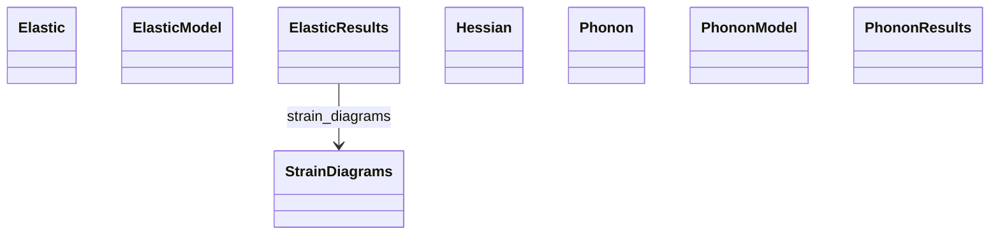

```mermaid
classDiagram
    class Elastic
    class ElasticModel
    class ElasticResults
    class Hessian
    class Phonon
    class PhononModel
    class PhononResults
    class StrainDiagrams
    ElasticResults --> StrainDiagrams : strain_diagrams
```