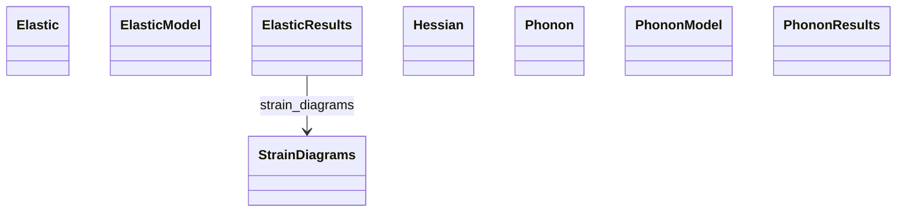

# Vibrations, Phonons & Elastic

**Purpose.** Lattice dynamics models and results, elastic tensors, and Hessians.
**In scope:** phonon dispersions, force constants, elastic constants
**Out of scope:** thermo integration over phonons (see Thermodynamics)

## Relationship map





## Key sections

| Section | MetaInfo |
|---|---|
| `Phonon` | [Open in MetaInfo browser](https://nomad-lab.eu/prod/v1/gui/analyze/metainfo) |
| `PhononModel` | [Open in MetaInfo browser](https://nomad-lab.eu/prod/v1/gui/analyze/metainfo) |
| `PhononResults` | [Open in MetaInfo browser](https://nomad-lab.eu/prod/v1/gui/analyze/metainfo) |
| `Elastic` | [Open in MetaInfo browser](https://nomad-lab.eu/prod/v1/gui/analyze/metainfo) |
| `ElasticModel` | [Open in MetaInfo browser](https://nomad-lab.eu/prod/v1/gui/analyze/metainfo) |
| `ElasticResults` | [Open in MetaInfo browser](https://nomad-lab.eu/prod/v1/gui/analyze/metainfo) |
| `Hessian` | [Open in MetaInfo browser](https://nomad-lab.eu/prod/v1/gui/analyze/metainfo) |


## Micro-examples

=== "YAML"

    ```yaml
    Phonon: {}
    PhononModel:
      force_calculator:
      - null
      phonon_calculator:
      - null
      mesh_density:
      - null
      random_displacements:
      - null
      with_non_analytic_correction:
      - null
      with_grueneisen_parameters:
      - null
    PhononResults:
      n_imaginary_frequencies:
      - null
      n_bands:
      - null
      n_qpoints:
      - null
      qpoints:
      - null
      group_velocity:
      - null
      n_displacements:
      - null
      n_atoms:
      - null
      displacements:
      - null
    Elastic: {}
    ElasticModel:
      program:
      - null
      calculation_method:
      - null
      elastic_constants_order:
      - null
      fitting_error_maximum:
      - null
      strain_maximum:
      - null
    ElasticResults:
      n_deformations:
      - null
      deformation_types:
      - null
      n_strains:
      - null
      is_mechanically_stable:
      - null
      elastic_constants_notation_matrix_second_order:
      - null
      elastic_constants_matrix_second_order:
      - null
      elastic_constants_matrix_third_order:
      - null
      compliance_matrix_second_order:
      - null
      elastic_constants_gradient_matrix_second_order:
      - null
      bulk_modulus_voigt:
      - null
      shear_modulus_voigt:
      - null
      bulk_modulus_reuss:
      - null
      shear_modulus_reuss:
      - null
      bulk_modulus_hill:
      - null
      shear_modulus_hill:
      - null
      young_modulus_voigt:
      - null
      poisson_ratio_voigt:
      - null
      young_modulus_reuss:
      - null
      poisson_ratio_reuss:
      - null
      young_modulus_hill:
      - null
      poisson_ratio_hill:
      - null
      elastic_anisotropy:
      - null
      pugh_ratio_hill:
      - null
      debye_temperature:
      - null
      speed_sound_transverse:
      - null
      speed_sound_longitudinal:
      - null
      speed_sound_average:
      - null
      eigenvalues_elastic:
      - null
      strain_diagrams:
      - {}
    Hessian:
      value:
      - null
    ```