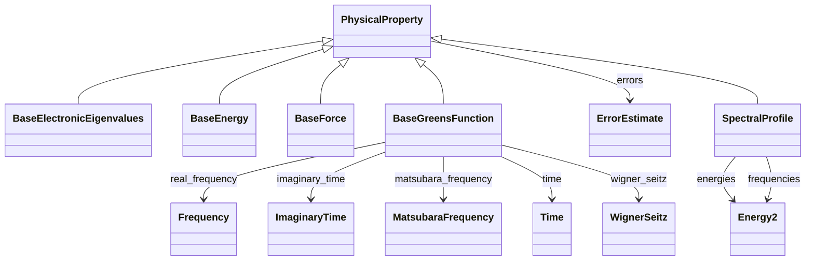

# Physical Property Backbone

**Purpose:** Shared base classes for physical-property types and their common metadata structure

**In scope:**

- PhysicalProperty as the common base for computed properties
- ErrorEstimate subsection used for uncertainty/error metadata
- Abstract/base property families for electronic, Green-function, energy, force, and spectral data
- Cross-domain backbone used by specialized output verticals

## Relationship map

**Legend**

<svg width="56" height="16" aria-hidden="true"><line x1="48" y1="8" x2="18" y2="8" stroke="currentColor" stroke-width="1.8"/><polygon points="18,8 26,4 26,12" fill="white" stroke="currentColor" stroke-width="1.8"/></svg><code>Parent &lt;|-- Child</code> inheritance (Child extends Parent)

<svg width="56" height="16" aria-hidden="true"><line x1="8" y1="8" x2="38" y2="8" stroke="currentColor" stroke-width="1.8"/><polygon points="46,8 38,4 38,12" fill="currentColor"/></svg><code>Owner --&gt; SubSection</code> containment/subsection

## Key sections

| Section | Description | MetaInfo |
|---|---|---|
| `PhysicalProperty` | A base section for computational output properties, containing all relevant (meta)data. | [Open in MetaInfo browser](https://nomad-lab.eu/prod/v1/develop/gui/analyze/metainfo/nomad_simulations/section_definitions@nomad_simulations.schema_packages.physical_property.PhysicalProperty){:target="_blank"} |
| `ErrorEstimate` | A generic container for uncertainty/error information associated with a PhysicalProperty. | [Open in MetaInfo browser](https://nomad-lab.eu/prod/v1/develop/gui/analyze/metainfo/nomad_simulations/section_definitions@nomad_simulations.schema_packages.errors.ErrorEstimate){:target="_blank"} |
| `BaseElectronicEigenvalues` | A base section used to define basic quantities for the `ElectronicEigenvalues`  and `ElectronicBandStructure` properties. | [Open in MetaInfo browser](https://nomad-lab.eu/prod/v1/develop/gui/analyze/metainfo/nomad_simulations/section_definitions@nomad_simulations.schema_packages.properties.electronic_eigenvalues.BaseElectronicEigenvalues){:target="_blank"} |
| `BaseGreensFunction` | A base class used to define shared commonalities between Green's function-related properties. | [Open in MetaInfo browser](https://nomad-lab.eu/prod/v1/develop/gui/analyze/metainfo/nomad_simulations/section_definitions@nomad_simulations.schema_packages.properties.greens_function.BaseGreensFunction){:target="_blank"} |
| `BaseEnergy` | Abstract class used to define a common `value` quantity with the appropriate units for different types of energies, which avoids repeating the definit... | [Open in MetaInfo browser](https://nomad-lab.eu/prod/v1/develop/gui/analyze/metainfo/nomad_simulations/section_definitions@nomad_simulations.schema_packages.properties.energies.BaseEnergy){:target="_blank"} |
| `BaseForce` | Base class used to define a common `value` quantity with the appropriate units for different types of forces, which avoids repeating the definitions f... | [Open in MetaInfo browser](https://nomad-lab.eu/prod/v1/develop/gui/analyze/metainfo/nomad_simulations/section_definitions@nomad_simulations.schema_packages.properties.forces.BaseForce){:target="_blank"} |
| `SpectralProfile` | A base section used to define the spectral profile. | [Open in MetaInfo browser](https://nomad-lab.eu/prod/v1/develop/gui/analyze/metainfo/nomad_simulations/section_definitions@nomad_simulations.schema_packages.properties.spectral_profile.SpectralProfile){:target="_blank"} |

## Quantities by section

### `PhysicalProperty`

| Quantity | Type | Description |
|---|---|---|
| `name` | m_str(str) | Name of the physical property. Example: `'ElectronicBandGap'`. |
| `iri` | URL | Internationalized Resource Identifier (IRI) pointing to a definition, typically within a larger, ontological framework. |
| `type` | m_str(str) | Type categorization of the physical property. Example: an `ElectronicBandGap` can be `'direct'` or `'indirect'`. |
| `contribution_type` | m_str(str) | Type of contribution to the physical property. Hence, only applies to `contributions` instances. Example: `TotalEnergy` may have contributions like _kinetic_, _potential_, etc. |
| `label` | m_str(str) | Label for additional classification of the physical property. Example: an `ElectronicBandGap` can be labeled as `'DFT'` or `'GW'` depending on the methodology used to calculate it. |
| `entity_ref` | <nomad.metainfo.metainfo.Reference object at 0x7b28dcab9580> | 

Reference to the entity that the physical property refers to.
Reference to the entity that the physical property refers to. Examples: - a simulated physical property might refer to the macroscopic system or instead of a specific atom in the unit cell. In the first case, `outputs.model_system_ref` (see outputs.py) will point to the `ModelSystem` section, while in the second case, `entity_ref` will point to `AtomsState` section (see atoms_state.py).
 |
| `is_derived` | m_bool(bool) | 

Flag indicating whether the physical property is derived from other physical properties.
Flag indicating whether the physical property is derived from other physical properties. We make the distinction between directly parsed and derived physical properties: - Directly parsed: the physical property is directly parsed from the simulation output files. - Derived: the physical property is derived from other physical properties. No extra numerical settings are required to calculate the physical property.
 |
| `physical_property_ref` | <nomad.metainfo.metainfo.Reference object at 0x7b28dcab9850> | Reference to the `PhysicalProperty` section from which the physical property was derived. If `physical_property_ref` is populated, the quantity `is_derived` is set to True via normalization. |
| `is_scf_converged` | m_bool(bool) | Flag indicating whether the physical property is converged or not after a SCF process. This quantity is connected with `SelfConsistency` defined in the `numerical_settings.py` module. |
| `self_consistency_ref` | <nomad.metainfo.metainfo.Reference object at 0x7b28dcabb140> | Reference to the `SelfConsistency` section that defines the numerical settings to converge the physical property (see numerical_settings.py). |

### `ErrorEstimate`

| Quantity | Type | Description |
|---|---|---|
| `metric` | Enum | 

The type of error or uncertainty metric being reported.
The type of error or uncertainty metric being reported. Allowed values are: \| Value             \| Description                                                                 \| \|-------------------\|-----------------------------------------------------------------------------\| \| `"std"`           \| Standard deviation of the observable.                                       \| \| `"stderr"`        \| Standard error of the mean (std / √N).                                      \| \| `"variance"`      \| Variance of the observable (σ²).                                            \| \| `"rmse"`          \| Root-mean-square error between predictions and reference values.            \| \| `"mae"`           \| Mean absolute error between predictions and reference values.               \| \| `"mape"`          \| Mean absolute percentage error, expressed relative to reference values.     \| \| `"ci"`            \| Confidence interval for the observable, typically with a specified level.   \| \| `"pi"`            \| Prediction interval for new observations.                                   \| \| `"iqr"`           \| Interquartile range (Q3 – Q1).                                              \| \| `"mad"`           \| Median absolute deviation (robust alternative to standard deviation).       \| \| `"systematic_bias"` \| Estimated systematic offset (bias) between observed and true values.      \| \| `"model_uncertainty"` \| Uncertainty arising from the model itself (e.g., ML predictive spread). \| \| `"other"`         \| A different metric not covered above; further specified in `notes` or `definition_iri`. \|
 |
| `definition_iri` | m_str(str) | IRI/URL pointing to a formal metric definition. |
| `method` | m_str(str) | Computation method for the estimate (e.g., bootstrap, jackknife, analytical). |
| `n_samples` | m_int32(int32) | Number of samples used to compute the estimate (if applicable). |
| `scope` | Enum | 

The application scope of the estimate:
The application scope of the estimate: - global: single number applies to the whole property; - per_value: array aligned with the property's value array; - per_component: aligned with a named component axis (see `component_axis`); - per_entity: aligned with referenced entities.
 |
| `component_axis` | m_str(str) | Name of the component axis this estimate aligns to (used with scope=per_component). |
| `value` | m_float64(float64) (shape: ['*']) | Error/uncertainty values for metrics such as std, stderr, rmse, mae, etc. |
| `interval_type` | Enum | Type of interval if an interval is provided. |
| `level` | m_float64(float64) | Interval level (e.g., 0.95 for 95% intervals). |
| `lower` | m_float64(float64) (shape: ['*']) | Lower bound of the interval (scalar or array aligned to the target). |
| `upper` | m_float64(float64) (shape: ['*']) | Upper bound of the interval (scalar or array aligned to the target). |
| `bias` | m_float64(float64) (shape: ['*']) | Estimated systematic bias (scalar or array). |
| `notes` | m_str(str) | Free-text provenance or remarks about the estimate. |

### `BaseElectronicEigenvalues`

| Quantity | Type | Description |
|---|---|---|
| `n_levels` | m_int32(int32) | 

Number of energy levels per sampling point.
Number of energy levels per sampling point. In periodic systems these correspond to electronic bands; in molecular calculations they correspond to (spin-resolved) molecular orbitals or similar one-particle states.
 |
| `value` | m_float64(float64) (shape: ['*', '*']) | Value of the electronic eigenvalues. |

### `BaseGreensFunction`

| Quantity | Type | Description |
|---|---|---|
| `n_atoms` | m_int32(int32) | Number of atoms involved in the correlations effect and used for the matrix representation of the property. Can be derived from entity_ref if needed. |
| `entity_ref` | <nomad.metainfo.metainfo.Reference object at 0x7b28dcaf7cb0> | Reference to the `ElectronicState` section describing the correlated orbitals for which the Green's function properties are calculated. The parent AtomsState can be accessed via `entity_ref.get_parent_entity()`. |
| `spin_channel` | m_int32(int32) | Spin channel of the corresponding electronic property. It can take values of 0 and 1. |
| `local_model_type` | Enum | 

Type of Green's function calculated from the mapping of the local Hubbard-Kanamo...
Type of Green's function calculated from the mapping of the local Hubbard-Kanamori model into the Anderson impurity model. The `impurity` Green's function describe the electronic correlations for the impurity, and it is a local function. The `lattice` Green's function includes the coupling to the lattice and hence it is a non-local function. In DMFT, the `lattice` term is approximated to be the `impurity` one, so that these simulations are converged if both types of the local part of the `lattice` Green's function coincides with the `impurity` Green's function.
 |
| `space_id` | Enum | 

String used to identify the space in which the Green's function property is represented.
String used to identify the space in which the Green's function property is represented. The spaces are: \| `space_id` \| variable type \| \| ------ \| ------ \| \| 'r' \| WignerSeitz \| \| 'rt' \| WignerSeitz + Time \| \| 'rw' \| WignerSeitz + Frequency \| \| 'rit' \| WignerSeitz + ImaginaryTime \| \| 'riw' \| WignerSeitz + MatsubaraFrequency \| \| 'k' \| KMesh \| \| 'kt' \| KMesh + Time \| \| 'kw' \| KMesh + Frequency \| \| 'kit' \| KMesh + ImaginaryTime \| \| 'kiw' \| KMesh + MatsubaraFrequency \| \| 't' \| Time \| \| 'it' \| Frequency \| \| 'w' \| ImaginaryTime \| \| 'iw' \| MatsubaraFrequency \|
 |

### `BaseEnergy`

| Quantity | Type | Description |
|---|---|---|
| `value` | m_float64(float64) | No description available. |

### `BaseForce`

| Quantity | Type | Description |
|---|---|---|
| `value` | m_float64(float64) (shape: ['*', '*']) | No description available. |

### `SpectralProfile`

| Quantity | Type | Description |
|---|---|---|
| `value` | m_float_bounded(float) (shape: ['*']) | The value of the intensities of a spectral profile. Must be positive. |

