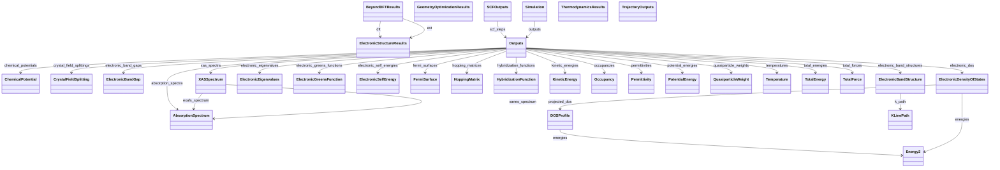

```mermaid
classDiagram
    class AbsorptionSpectrum
    class BeyondDFTResults
    class ChemicalPotential
    class CrystalFieldSplitting
    class DOSProfile
    class ElectronicBandGap
    class ElectronicBandStructure
    class ElectronicDensityOfStates
    class ElectronicEigenvalues
    class ElectronicGreensFunction
    class ElectronicSelfEnergy
    class ElectronicStructureResults
    class Energy2
    class FermiSurface
    class GeometryOptimizationResults
    class HoppingMatrix
    class HybridizationFunction
    class KLinePath
    class KineticEnergy
    class Occupancy
    class Outputs
    class Permittivity
    class PotentialEnergy
    class QuasiparticleWeight
    class SCFOutputs
    class Simulation
    class Temperature
    class ThermodynamicsResults
    class TotalEnergy
    class TotalForce
    class TrajectoryOutputs
    class XASSpectrum
    BeyondDFTResults --> ElectronicStructureResults : dft
    BeyondDFTResults --> ElectronicStructureResults : ext
    DOSProfile --> Energy2 : energies
    ElectronicBandStructure --> KLinePath : k_path
    ElectronicDensityOfStates --> DOSProfile : projected_dos
    ElectronicDensityOfStates --> Energy2 : energies
    Outputs --> AbsorptionSpectrum : absorption_spectra
    Outputs --> ChemicalPotential : chemical_potentials
    Outputs --> CrystalFieldSplitting : crystal_field_splittings
    Outputs --> ElectronicBandGap : electronic_band_gaps
    Outputs --> ElectronicBandStructure : electronic_band_structures
    Outputs --> ElectronicDensityOfStates : electronic_dos
    Outputs --> ElectronicEigenvalues : electronic_eigenvalues
    Outputs --> ElectronicGreensFunction : electronic_greens_functions
    Outputs --> ElectronicSelfEnergy : electronic_self_energies
    Outputs --> FermiSurface : fermi_surfaces
    Outputs --> HoppingMatrix : hopping_matrices
    Outputs --> HybridizationFunction : hybridization_functions
    Outputs --> KineticEnergy : kinetic_energies
    Outputs --> Occupancy : occupancies
    Outputs --> Permittivity : permittivities
    Outputs --> PotentialEnergy : potential_energies
    Outputs --> QuasiparticleWeight : quasiparticle_weights
    Outputs --> Temperature : temperatures
    Outputs --> TotalEnergy : total_energies
    Outputs --> TotalForce : total_forces
    Outputs --> XASSpectrum : xas_spectra
    SCFOutputs --> Outputs : scf_steps
    Simulation --> Outputs : outputs
    XASSpectrum --> AbsorptionSpectrum : exafs_spectrum
    XASSpectrum --> AbsorptionSpectrum : xanes_spectrum
```