# Results & Provenance

**Purpose.** Canonical scientific outputs and provenance bundles.
**In scope:** band structures, DOS, gaps, SCF history, trajectories
**Out of scope:** raw logs, plot styling

## Relationship map

```mermaid
classDiagram
    class AbsorptionSpectrum
    class BeyondDFTResults
    class ChemicalPotential
    class CrystalFieldSplitting
    class DOSProfile
    class ElectronicBandGap
    class ElectronicBandStructure
    class ElectronicDensityOfStates
    class ElectronicEigenvalues
    class ElectronicGreensFunction
    class ElectronicSelfEnergy
    class ElectronicStructureResults
    class Energy2
    class FermiSurface
    class GeometryOptimizationResults
    class HoppingMatrix
    class HybridizationFunction
    class KLinePath
    class KineticEnergy
    class Occupancy
    class Outputs
    class Permittivity
    class PotentialEnergy
    class QuasiparticleWeight
    class SCFOutputs
    class Simulation
    class Temperature
    class ThermodynamicsResults
    class TotalEnergy
    class TotalForce
    class TrajectoryOutputs
    class XASSpectrum
    BeyondDFTResults --> ElectronicStructureResults : dft
    BeyondDFTResults --> ElectronicStructureResults : ext
    DOSProfile --> Energy2 : energies
    ElectronicBandStructure --> KLinePath : k_path
    ElectronicDensityOfStates --> DOSProfile : projected_dos
    ElectronicDensityOfStates --> Energy2 : energies
    Outputs --> AbsorptionSpectrum : absorption_spectra
    Outputs --> ChemicalPotential : chemical_potentials
    Outputs --> CrystalFieldSplitting : crystal_field_splittings
    Outputs --> ElectronicBandGap : electronic_band_gaps
    Outputs --> ElectronicBandStructure : electronic_band_structures
    Outputs --> ElectronicDensityOfStates : electronic_dos
    Outputs --> ElectronicEigenvalues : electronic_eigenvalues
    Outputs --> ElectronicGreensFunction : electronic_greens_functions
    Outputs --> ElectronicSelfEnergy : electronic_self_energies
    Outputs --> FermiSurface : fermi_surfaces
    Outputs --> HoppingMatrix : hopping_matrices
    Outputs --> HybridizationFunction : hybridization_functions
    Outputs --> KineticEnergy : kinetic_energies
    Outputs --> Occupancy : occupancies
    Outputs --> Permittivity : permittivities
    Outputs --> PotentialEnergy : potential_energies
    Outputs --> QuasiparticleWeight : quasiparticle_weights
    Outputs --> Temperature : temperatures
    Outputs --> TotalEnergy : total_energies
    Outputs --> TotalForce : total_forces
    Outputs --> XASSpectrum : xas_spectra
    SCFOutputs --> Outputs : scf_steps
    Simulation --> Outputs : outputs
    XASSpectrum --> AbsorptionSpectrum : exafs_spectrum
    XASSpectrum --> AbsorptionSpectrum : xanes_spectrum
```





## Key sections

| Section | Description | MetaInfo |
|---|---|---|
| `Outputs` | Output properties of a simulation. | [Open in MetaInfo browser](https://nomad-lab.eu/prod/v1/oasis/gui/analyze/metainfo) |
| `ElectronicStructureResults` | Contains definitions for results of an electronic structure simulation. | [Open in MetaInfo browser](https://nomad-lab.eu/prod/v1/oasis/gui/analyze/metainfo) |
| `ElectronicBandStructure` | Accessible energies by the charges (electrons and holes) in the reciprocal space. | [Open in MetaInfo browser](https://nomad-lab.eu/prod/v1/oasis/gui/analyze/metainfo) |
| `ElectronicDensityOfStates` | Number of electronic states accessible for the charges per energy and per volume. | [Open in MetaInfo browser](https://nomad-lab.eu/prod/v1/oasis/gui/analyze/metainfo) |
| `ElectronicBandGap` | Energy difference between the highest occupied electronic state and the lowest unoccupied electronic state. | [Open in MetaInfo browser](https://nomad-lab.eu/prod/v1/oasis/gui/analyze/metainfo) |
| `FermiSurface` | Energy boundary in reciprocal space that separates the filled and empty electronic states in a metal. | [Open in MetaInfo browser](https://nomad-lab.eu/prod/v1/oasis/gui/analyze/metainfo) |
| `SCFOutputs` | This section contains the self-consistent (SCF) steps performed to converge an output property. | [Open in MetaInfo browser](https://nomad-lab.eu/prod/v1/oasis/gui/analyze/metainfo) |
| `TrajectoryOutputs` | This section contains output properties that depend on a single system, but were calculated as part of a trajectory (e.g., temperatures from a molecul... | [Open in MetaInfo browser](https://nomad-lab.eu/prod/v1/oasis/gui/analyze/metainfo) |
| `ThermodynamicsResults` |  | [Open in MetaInfo browser](https://nomad-lab.eu/prod/v1/oasis/gui/analyze/metainfo) |
| `GeometryOptimizationResults` |  | [Open in MetaInfo browser](https://nomad-lab.eu/prod/v1/oasis/gui/analyze/metainfo) |


## Micro-examples

=== "YAML"

    ```yaml
    Outputs:
      model_system_ref:
      - null
      model_method_ref:
      - null
      chemical_potentials:
      - {}
      crystal_field_splittings:
      - {}
      hopping_matrices:
      - {}
      electronic_eigenvalues:
      - {}
      electronic_band_gaps:
      - {}
      electronic_dos:
      - {}
      fermi_surfaces:
      - {}
      electronic_band_structures:
      - {}
      occupancies:
      - {}
      electronic_greens_functions:
      - {}
      electronic_self_energies:
      - {}
      hybridization_functions:
      - {}
      quasiparticle_weights:
      - {}
      permittivities:
      - {}
      absorption_spectra:
      - {}
      xas_spectra:
      - {}
      total_energies:
      - {}
      kinetic_energies:
      - {}
      potential_energies:
      - {}
      total_forces:
      - {}
      temperatures:
      - {}
    ElectronicStructureResults:
      dos:
      - null
    ElectronicBandStructure:
      k_path: {}
    ElectronicDensityOfStates:
      spin_channel:
      - null
      energies_origin:
      - null
      normalization_factor:
      - null
      energies: {}
      projected_dos:
      - {}
    ElectronicBandGap:
      type:
      - null
      momentum_transfer:
      - null
      spin_channel:
      - null
      value:
      - null
    FermiSurface:
      n_bands:
      - null
    SCFOutputs:
      scf_steps:
      - {}
    TrajectoryOutputs:
      time:
      - null
    ThermodynamicsResults:
      n_values:
      - null
      temperature:
      - null
      pressure:
      - null
    GeometryOptimizationResults:
      n_steps:
      - null
      energies:
      - null
      steps:
      - null
      final_energy_difference:
      - null
      final_force_maximum:
      - null
      final_displacement_maximum:
      - null
      is_converged_geometry:
      - null
    ```