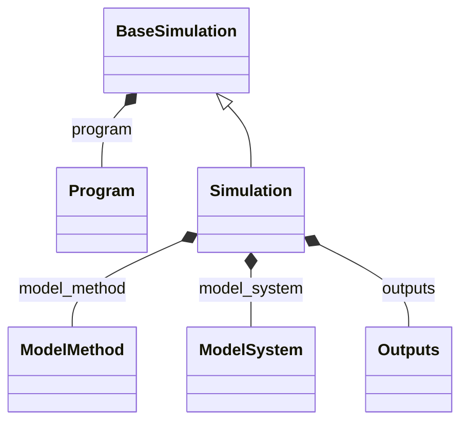

# Simulation Entry

**Purpose:** Root entry point for simulations: Simulation, BaseSimulation, and Program

## Relationship map

Legend

<svg class="uml-legend__swatch" viewBox="0 0 64 16" aria-hidden="true"><line class="uml-legend__line" x1="54" y1="8" x2="22" y2="8"/><path class="uml-legend__head uml-legend__head--open" d="M10 8 L22 2 L22 14 Z"/></svg>inheritance (is-a)

<svg class="uml-legend__swatch" viewBox="0 0 64 16" aria-hidden="true"><path class="uml-legend__head uml-legend__head--filled" d="M10 8 L16 2 L22 8 L16 14 Z"/><line class="uml-legend__line" x1="22" y1="8" x2="52" y2="8"/></svg>composition (has-a)

## Quantities by Key Sections

### `Simulation`

| Section | Description | MetaInfo |
|---|---|---|
| `Simulation` | A `Simulation` is a computational calculation that produces output data from a given input model system and input (model) methodological parameters. | [Open in MetaInfo browser](https://nomad-lab.eu/prod/v1/develop/gui/analyze/metainfo/nomad_simulations/section_definitions@nomad_simulations.schema_packages.general.Simulation){:target="_blank"} |

| Quantity | Type | Description |
|---|---|---|
| `representative_system_index` | m_int32(int32) | The index of the "representative system" in the `model_system` list. |

### `BaseSimulation`

| Section | Description | MetaInfo |
|---|---|---|
| `BaseSimulation` | A computational simulation that produces output data from a given input model system and input methodological parameters. | [Open in MetaInfo browser](https://nomad-lab.eu/prod/v1/develop/gui/analyze/metainfo/nomad_simulations/section_definitions@nomad_simulations.schema_packages.general.BaseSimulation){:target="_blank"} |

| Quantity | Type | Description |
|---|---|---|
| `finished_without_errors` | m_bool(bool) | Indicates whether this code run terminated without error (true), or if it exited with an error code unequal to zero (false). |

### `Program`

| Section | Description | MetaInfo |
|---|---|---|
| `Program` | A base section used to specify a well-defined program used for computation. | [Open in MetaInfo browser](https://nomad-lab.eu/prod/v1/develop/gui/analyze/metainfo/nomad_simulations/section_definitions@nomad_simulations.schema_packages.general.Program){:target="_blank"} |

| Quantity | Type | Description |
|---|---|---|
| `name` | m_str(str) | The name of the program. |
| `version` | m_str(str) | The version label of the program. |
| `link` | m_str(str) | Website link to the program in published information. |
| `version_internal` | m_str(str) | Specifies a program version tag used internally for development purposes. Any kind of tagging system is supported, including git commit hashes. |
| `subroutine_name_internal` | m_str(str) | 

Specifies the name of the subroutine of the program at large.
Specifies the name of the subroutine of the program at large. This only applies when the routine produced (almost) all of the output, so the naming is representative. This naming is mostly meant for users who are familiar with the program's structure.
 |
| `compilation_host` | m_str(str) | Specifies the host on which the program was compiled. |
| `compiler_name` | m_str(str) | Name of the compiler that was used to compile the program code. |
| `compiler_version` | m_str(str) | Version of the compiler that was used to compile the program code. |
| `warnings` | m_str(str) (shape: ['*']) | Warnings emitted by the code. |

