# Simulation Entry

**Purpose:** Root entry point for simulations: Simulation, BaseSimulation, and Program

**In scope:**

- Root Simulation section that contains all simulation metadata
- Timing information (cpu1_start, cpu1_end, wall_start, wall_end)
- Program details (name, version, link)
- Entry point that references the four main subsections

**Out of scope:**

- ModelSystem details
- ModelMethod details
- Outputs details
- Workflow classes (separate schema)

## Relationship map

{: style="width: 80%; cursor: pointer;" class="click-zoom-img" title="Click to zoom"}

<b>Legend:</b>
<svg width="24" height="12" style="vertical-align: middle; margin: 0 2px;"><line x1="20" y1="6" x2="4" y2="6" stroke="currentColor" stroke-width="1.5"/><polygon points="4,6 8,3 8,9" fill="none" stroke="currentColor" stroke-width="1.5"/></svg> inheritance ·
<svg width="24" height="12" style="vertical-align: middle; margin: 0 2px;"><line x1="4" y1="6" x2="20" y2="6" stroke="currentColor" stroke-width="1.5"/><polygon points="20,6 16,3 16,9" fill="currentColor"/></svg> containment ·
<svg width="24" height="12" style="vertical-align: middle; margin: 0 2px;"><line x1="4" y1="6" x2="20" y2="6" stroke="currentColor" stroke-width="1.5" stroke-dasharray="2,2"/><polygon points="20,6 16,3 16,9" fill="currentColor"/></svg> reference

## Key sections

| Section | Description | MetaInfo |
|---|---|---|
| `Simulation` | A `Simulation` is a computational calculation that produces output data from a given input model system and input (model) methodological parameters. | [Open in MetaInfo browser](https://nomad-lab.eu/prod/v1/develop/gui/analyze/metainfo/nomad_simulations/section_definitions@nomad_simulations.schema_packages.general.Simulation){:target="_blank"} |
| `BaseSimulation` | A computational simulation that produces output data from a given input model system and input methodological parameters. | [Open in MetaInfo browser](https://nomad-lab.eu/prod/v1/develop/gui/analyze/metainfo/nomad_simulations/section_definitions@nomad_simulations.schema_packages.general.BaseSimulation){:target="_blank"} |
| `Program` | A base section used to specify a well-defined program used for computation. | [Open in MetaInfo browser](https://nomad-lab.eu/prod/v1/develop/gui/analyze/metainfo/nomad_simulations/section_definitions@nomad_simulations.schema_packages.general.Program){:target="_blank"} |

## Quantities by section

### `Simulation`

| Quantity | Type | Description |
|---|---|---|
| `representative_system_index` | m_int32(int32) | The index of the "representative system" in the `model_system` list. |

### `BaseSimulation`

| Quantity | Type | Description |
|---|---|---|
| `datetime_end` | Datetime | The date and time when this computation ended. |
| `cpu1_start` | m_float64(float64) | The starting time of the computation on the (first) CPU 1. |
| `cpu1_end` | m_float64(float64) | The end time of the computation on the (first) CPU 1. |
| `wall_start` | m_float64(float64) | The internal wall-clock time from the starting of the computation. |
| `wall_end` | m_float64(float64) | The internal wall-clock time from the end of the computation. |

### `Program`

| Quantity | Type | Description |
|---|---|---|
| `name` | m_str(str) | The name of the program. |
| `version` | m_str(str) | The version label of the program. |
| `link` | m_str(str) | Website link to the program in published information. |
| `version_internal` | m_str(str) | Specifies a program version tag used internally for development purposes. Any kind of tagging system is supported, including git commit hashes. |
| `subroutine_name_internal` | m_str(str) | 

Specifies the name of the subroutine of the program at large.
Specifies the name of the subroutine of the program at large. This only applies when the routine produced (almost) all of the output, so the naming is representative. This naming is mostly meant for users who are familiar with the program's structure.
 |
| `compilation_host` | m_str(str) | Specifies the host on which the program was compiled. |

