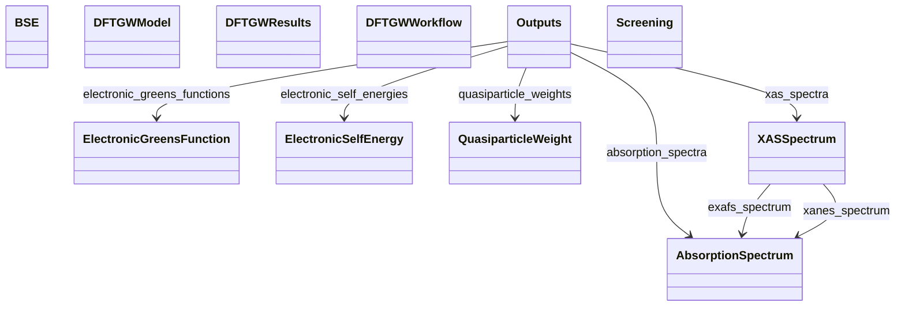

```mermaid
classDiagram
    class AbsorptionSpectrum
    class BSE
    class DFTGWModel
    class DFTGWResults
    class DFTGWWorkflow
    class ElectronicGreensFunction
    class ElectronicSelfEnergy
    class Outputs
    class QuasiparticleWeight
    class Screening
    class XASSpectrum
    Outputs --> AbsorptionSpectrum : absorption_spectra
    Outputs --> ElectronicGreensFunction : electronic_greens_functions
    Outputs --> ElectronicSelfEnergy : electronic_self_energies
    Outputs --> QuasiparticleWeight : quasiparticle_weights
    Outputs --> XASSpectrum : xas_spectra
    XASSpectrum --> AbsorptionSpectrum : exafs_spectrum
    XASSpectrum --> AbsorptionSpectrum : xanes_spectrum
```