# Spectroscopic Properties

**Purpose:** Absorption spectra, XAS, and dielectric response

**In scope:**

- Spectral profile base class
- Absorption spectra from BSE calculations
- X-ray absorption spectra (XAS) from core hole calculations
- Frequency-dependent dielectric functions (permittivity)

**Out of scope:**

- Methods that compute spectra (BSE, CoreHoleSpectra in model_method)
- DOS profiles

## Relationship map


{: style="width: 80%; cursor: pointer;" class="click-zoom-img" title="Click to zoom"}

<div style="font-size: 0.9em; color: #666; margin-top: 8px; margin-bottom: 8px;">
<b>Legend:</b>
<svg width="24" height="12" style="vertical-align: middle; margin: 0 2px;"><line x1="20" y1="6" x2="4" y2="6" stroke="currentColor" stroke-width="1.5"/><polygon points="4,6 8,3 8,9" fill="none" stroke="currentColor" stroke-width="1.5"/></svg> inheritance ·
<svg width="24" height="12" style="vertical-align: middle; margin: 0 2px;"><line x1="4" y1="6" x2="20" y2="6" stroke="currentColor" stroke-width="1.5"/><polygon points="20,6 16,3 16,9" fill="currentColor"/></svg> containment ·
<svg width="24" height="12" style="vertical-align: middle; margin: 0 2px;"><line x1="4" y1="6" x2="20" y2="6" stroke="currentColor" stroke-width="1.5" stroke-dasharray="2,2"/><polygon points="20,6 16,3 16,9" fill="currentColor"/></svg> reference
</div>


## Key sections

| Section | Description | MetaInfo |
|---|---|---|
| `SpectralProfile` | A base section used to define the spectral profile. | [Open in MetaInfo browser](https://nomad-lab.eu/prod/v1/develop/gui/analyze/metainfo/nomad_simulations/section_definitions@nomad_simulations.schema_packages.properties.spectral_profile.SpectralProfile){:target="_blank"} |
| `AbsorptionSpectrum` |  | [Open in MetaInfo browser](https://nomad-lab.eu/prod/v1/develop/gui/analyze/metainfo/nomad_simulations/section_definitions@nomad_simulations.schema_packages.properties.spectral_profile.AbsorptionSpectrum){:target="_blank"} |
| `XASSpectrum` | X-ray Absorption Spectrum (XAS). | [Open in MetaInfo browser](https://nomad-lab.eu/prod/v1/develop/gui/analyze/metainfo/nomad_simulations/section_definitions@nomad_simulations.schema_packages.properties.spectral_profile.XASSpectrum){:target="_blank"} |
| `Permittivity` | Response of the material to polarize in the presence of an electric field. | [Open in MetaInfo browser](https://nomad-lab.eu/prod/v1/develop/gui/analyze/metainfo/nomad_simulations/section_definitions@nomad_simulations.schema_packages.properties.permittivity.Permittivity){:target="_blank"} |


## Micro-examples

=== "YAML"

    ```yaml
    SpectralProfile:
      value:
      - null
      energies: {}
      frequencies: {}
    AbsorptionSpectrum:
      axis:
      - null
    XASSpectrum:
      xanes_spectrum: {}
      exafs_spectrum: {}
    Permittivity:
      type:
      - null
      value:
      - null
      frequencies: {}
      q_mesh: {}
    ```