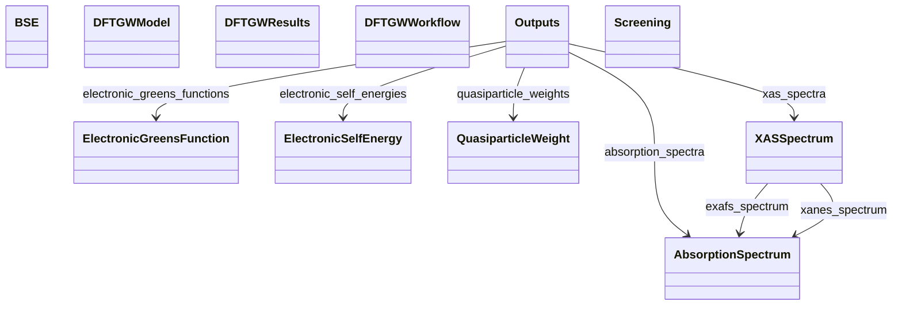

# Spectroscopy & Excitations

**Purpose.** Excited-state methods and spectra.
**In scope:** BSE/GW artifacts, response functions, quasiparticles
**Out of scope:** ground-state-only properties

## Relationship map





## Key sections

| Section | Description | MetaInfo |
|---|---|---|
| `AbsorptionSpectrum` |  | [Open in MetaInfo browser](https://nomad-lab.eu/prod/v1/oasis/gui/analyze/metainfo) |
| `XASSpectrum` | X-ray Absorption Spectrum (XAS). | [Open in MetaInfo browser](https://nomad-lab.eu/prod/v1/oasis/gui/analyze/metainfo) |
| `BSE` | A base section used to define the parameters of a BSE calculation. | [Open in MetaInfo browser](https://nomad-lab.eu/prod/v1/oasis/gui/analyze/metainfo) |
| `Screening` | A base section used to define the parameters that define the calculation of screening. | [Open in MetaInfo browser](https://nomad-lab.eu/prod/v1/oasis/gui/analyze/metainfo) |
| `ElectronicGreensFunction` | Charge-charge correlation functions. | [Open in MetaInfo browser](https://nomad-lab.eu/prod/v1/oasis/gui/analyze/metainfo) |
| `ElectronicSelfEnergy` | Corrections to the energy of an electron due to its interactions with its environment. | [Open in MetaInfo browser](https://nomad-lab.eu/prod/v1/oasis/gui/analyze/metainfo) |
| `QuasiparticleWeight` | Renormalization of the electronic mass due to the interactions with the environment. | [Open in MetaInfo browser](https://nomad-lab.eu/prod/v1/oasis/gui/analyze/metainfo) |
| `DFTGWModel` |  | [Open in MetaInfo browser](https://nomad-lab.eu/prod/v1/oasis/gui/analyze/metainfo) |
| `DFTGWResults` |  | [Open in MetaInfo browser](https://nomad-lab.eu/prod/v1/oasis/gui/analyze/metainfo) |
| `DFTGWWorkflow` | Definitions for GW calculations based on DFT. | [Open in MetaInfo browser](https://nomad-lab.eu/prod/v1/oasis/gui/analyze/metainfo) |


## Micro-examples

=== "YAML"

    ```yaml
    AbsorptionSpectrum:
      axis:
      - null
    XASSpectrum:
      xanes_spectrum: {}
      exafs_spectrum: {}
    BSE:
      type:
      - null
      solver:
      - null
      screening_ref:
      - null
    Screening:
      dielectric_infinity:
      - null
    ElectronicGreensFunction:
      value:
      - null
    ElectronicSelfEnergy:
      value:
      - null
    QuasiparticleWeight:
      system_correlation_strengths:
      - null
      n_atoms:
      - null
      atoms_state_ref:
      - null
      n_correlated_orbitals:
      - null
      correlated_orbitals_ref:
      - null
      spin_channel:
      - null
      value:
      - null
    DFTGWModel: {}
    DFTGWResults: {}
    DFTGWWorkflow: {}
    ```