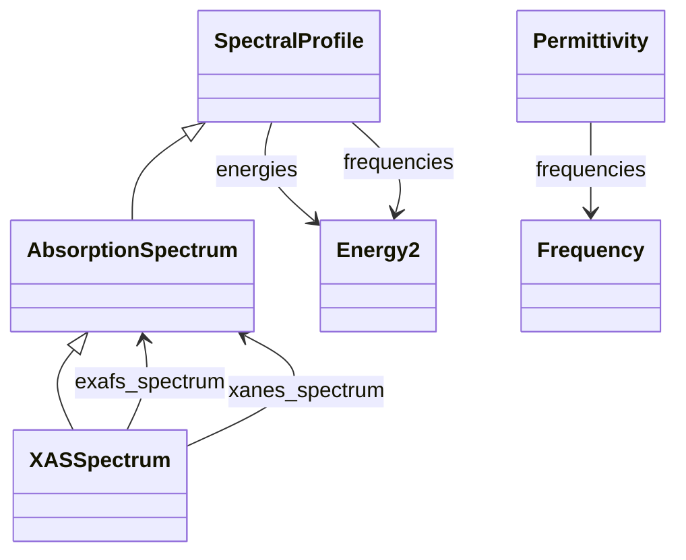

# Spectroscopic Properties

**Purpose:** Absorption spectra, XAS, and dielectric response

**In scope:**

- Spectral profile base class
- Absorption spectra from BSE calculations
- X-ray absorption spectra (XAS) from core hole calculations
- Frequency-dependent dielectric functions (permittivity)

## Relationship map

Legend

<svg class="uml-legend__swatch" viewBox="0 0 64 16" aria-hidden="true"><line class="uml-legend__line" x1="50" y1="8" x2="22" y2="8"/><path class="uml-legend__head uml-legend__head--filled" d="M22 8 L32 3 L32 13 Z"/></svg><code>Parent &lt;|-- Child</code> is-a relationship, Parent-Child inheritance

<svg class="uml-legend__swatch" viewBox="0 0 64 16" aria-hidden="true"><line class="uml-legend__line" x1="8" y1="8" x2="40" y2="8"/><path class="uml-legend__head uml-legend__head--open" d="M40 8 L48 4 M40 8 L48 12"/></svg><code>Owner --&gt; SubSection</code> has-a relationship, Owner-SubSection composition

## Key sections

| Section | Description | MetaInfo |
|---|---|---|
| `SpectralProfile` | A base section used to define the spectral profile. | [Open in MetaInfo browser](https://nomad-lab.eu/prod/v1/develop/gui/analyze/metainfo/nomad_simulations/section_definitions@nomad_simulations.schema_packages.properties.spectral_profile.SpectralProfile){:target="_blank"} |
| `AbsorptionSpectrum` |  | [Open in MetaInfo browser](https://nomad-lab.eu/prod/v1/develop/gui/analyze/metainfo/nomad_simulations/section_definitions@nomad_simulations.schema_packages.properties.spectral_profile.AbsorptionSpectrum){:target="_blank"} |
| `XASSpectrum` | X-ray Absorption Spectrum (XAS). | [Open in MetaInfo browser](https://nomad-lab.eu/prod/v1/develop/gui/analyze/metainfo/nomad_simulations/section_definitions@nomad_simulations.schema_packages.properties.spectral_profile.XASSpectrum){:target="_blank"} |
| `Permittivity` | Response of the material to polarize in the presence of an electric field. | [Open in MetaInfo browser](https://nomad-lab.eu/prod/v1/develop/gui/analyze/metainfo/nomad_simulations/section_definitions@nomad_simulations.schema_packages.properties.permittivity.Permittivity){:target="_blank"} |

## Quantities by section

### `SpectralProfile`

| Quantity | Type | Description |
|---|---|---|
| `value` | m_float_bounded(float) (shape: ['*']) | The value of the intensities of a spectral profile. Must be positive. |

### `AbsorptionSpectrum`

| Quantity | Type | Description |
|---|---|---|
| `axis` | Enum | Axis of the absorption spectrum. This is related with the polarization direction, and can be seen as the principal term in the tensor `Permittivity.value` (see permittivity.py module). |

### `XASSpectrum`

*This section has no direct quantities.*

### `Permittivity`

| Quantity | Type | Description |
|---|---|---|
| `type` | Enum | Type of permittivity which allows to identify if the permittivity depends on the frequency or not. |
| `value` | m_complex128(complex) (shape: ['*']) | Value of the permittivity tensor. If the value does not depend on the scattering vector `q`, then we can extract the optical absorption spectrum from the imaginary part of the permittivity tensor (this is also called macroscopic dielectric function). |

