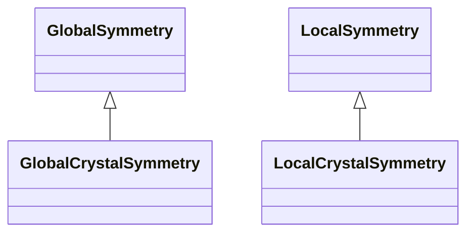

# Symmetry

**Purpose:** Crystallographic symmetry: local/global symmetry, space groups, point groups, Bravais lattices

**In scope:**

- Local and global symmetry section hierarchy
- Space group symbols and numbers
- Point group symbols
- Bravais lattice classifications
- Symmetry operations

## Relationship map

Legend

<svg class="uml-legend__swatch" viewBox="0 0 64 16" aria-hidden="true"><line class="uml-legend__line" x1="54" y1="8" x2="22" y2="8"/><path class="uml-legend__head uml-legend__head--open" d="M10 8 L22 2 L22 14 Z"/></svg>inheritance (is-a)

## Quantities by Key Sections

### `LocalSymmetry`

| Section | Description | MetaInfo |
|---|---|---|
| `LocalSymmetry` | Base class for per-particle local symmetry information. | [Open in MetaInfo browser](https://nomad-lab.eu/prod/v1/develop/gui/analyze/metainfo/nomad_simulations/section_definitions@nomad_simulations.schema_packages.model_system.LocalSymmetry){:target="_blank"} |

| Quantity | Type | Description |
|---|---|---|
| `equivalent_atoms` | m_int32(int32) (shape: ['*']) | 

Equivalence grouping of atoms by symmetry operations.
Equivalence grouping of atoms by symmetry operations. Atoms with the same index value are symmetrically equivalent. Examples: - [0, 1, 2, 3]: all four atoms are non-equivalent - [0, 0, 0, 3]: first three atoms are equivalent, fourth is unique
 |

### `LocalCrystalSymmetry`

| Section | Description | MetaInfo |
|---|---|---|
| `LocalCrystalSymmetry` | Crystallographic local symmetry for particles in a crystal structure. | [Open in MetaInfo browser](https://nomad-lab.eu/prod/v1/develop/gui/analyze/metainfo/nomad_simulations/section_definitions@nomad_simulations.schema_packages.model_system.LocalCrystalSymmetry){:target="_blank"} |

| Quantity | Type | Description |
|---|---|---|
| `site_symmetries` | m_str(str) (shape: ['*']) | 

Crystallographic point group symbol for each particle site in Hermann-Mauguin notation.
Crystallographic point group symbol for each particle site in Hermann-Mauguin notation. Each symbol (e.g., '3m', 'mmm', '432', '1') describes the local symmetry operations that leave the atomic site invariant within the crystal structure. These are the site symmetry groups—subgroups of the full space group that preserve the specific atomic position. The site symmetry is intrinsically linked to the Wyckoff position: atoms at the same Wyckoff position share the same site symmetry, though the converse is not always true. Higher symmetry positions (lower Wyckoff letters like 'a') typically have higher-order site symmetries. **Source**: Determined via spglib symmetry analysis (accessed through MatID), which uses the geometric positions of atoms to identify symmetry operations. Examples: - '1' - No symmetry (general position) - '3m' - Threefold rotation with mirror plane - 'mmm' - Three perpendicular mirror planes (orthorhombic) - '-43m' - Cubic tetrahedral symmetry
 |
| `wyckoff_letters` | m_str(str) (shape: ['*']) | 

Wyckoff letter designation for each atomic position in this representation.
Wyckoff letter designation for each atomic position in this representation. Wyckoff positions are the crystallographically distinct positions in a space group, as defined in the **International Tables for Crystallography** and accessible through resources like the **Bilbao Crystallographic Server** (https://www.cryst.ehu.es/) and the **International Union of Crystallography databases** (https://www.iucr.org/resources/data). The Wyckoff letter (a, b, c, ...) identifies positions in order of **decreasing site symmetry**, with `a` typically representing the **highest symmetry** (most special) position. **Important**: Wyckoff positions are determined using **geometric space group analysis** (via spglib/MatID), which considers **only atomic positions** and ignores chemical species. This means atoms of different elements may share the same Wyckoff designation if they occupy geometrically equivalent positions. For complete crystallographic uniqueness, combine `wyckoff_letters` with chemical information. Use the `wyckoff_sites` property to get the combined letter+multiplicity format (e.g., "a1", "b2"). References: - International Tables for Crystallography, Volume A: Space-group symmetry - Aroyo, M.I. et al. (2006). "Bilbao Crystallographic Server." Z. Kristallogr. 221, 15-27 - Aroyo, M.I. et al. (2011). "Crystallography online: Bilbao Crystallographic Server." Bulg. Chem. Commun. 43, 183-197
 |
| `site_multiplicities` | m_int32(int32) (shape: ['*']) | 

Multiplicity of the Wyckoff site for each particle.
Multiplicity of the Wyckoff site for each particle. The **multiplicity** indicates how many symmetrically equivalent positions are generated by applying all space group operations to this Wyckoff site within the **conventional unit cell**. For example: - Multiplicity 1: Special position with highest symmetry (unique in the unit cell) - Multiplicity 2, 4, 8, etc.: Positions with lower symmetry that appear multiple times Note: The multiplicity is determined from the conventional cell. In primitive cells or supercells, fewer or more atoms of this type may be present, but the multiplicity value remains the same as it's an intrinsic property of the Wyckoff position.
 |

### `GlobalSymmetry`

| Section | Description | MetaInfo |
|---|---|---|
| `GlobalSymmetry` | A base section specifying the global symmetry of the corresponding `ModelSystem` at large, which can be used for categorization and lookup. | [Open in MetaInfo browser](https://nomad-lab.eu/prod/v1/develop/gui/analyze/metainfo/nomad_simulations/section_definitions@nomad_simulations.schema_packages.model_system.GlobalSymmetry){:target="_blank"} |

*This section has no direct quantities.*

### `GlobalCrystalSymmetry`

| Section | Description | MetaInfo |
|---|---|---|
| `GlobalCrystalSymmetry` | A symmetry section specialized for identifying bulk crystal space groups. | [Open in MetaInfo browser](https://nomad-lab.eu/prod/v1/develop/gui/analyze/metainfo/nomad_simulations/section_definitions@nomad_simulations.schema_packages.model_system.GlobalCrystalSymmetry){:target="_blank"} |

| Quantity | Type | Description |
|---|---|---|
| `lattice_type` | Enum | 

Bravais lattice type (crystal family classification).
Bravais lattice type (crystal family classification). The first lowercase letter of Pearson notation, identifying the crystal family based on lattice symmetry: **3D lattices:** - a: triclinic - m: monoclinic - o: orthorhombic - t: tetragonal - r: trigonal - h: hexagonal - c: cubic **2D lattices:** - mp: oblique - op: rectangular - oc: centered rectangular - tp: square - hp: hexagonal 2D **1D lattices:** - ap: linear This quantity enables independent querying of crystal families (e.g., "all cubic systems" regardless of centering type).
 |
| `lattice_centering` | Enum | 

Lattice centering type.
Lattice centering type. The second uppercase letter of Pearson notation, describing how lattice points are distributed within the conventional unit cell: **3D centerings:** - P: primitive (lattice points only at cell corners) - R: rhombohedral (hexagonal setting with 2/3, 1/3 centering) - S: face centered (one pair of opposite faces centered) - I: body centered (center of cell) - F: all faces centered (all faces have centered points) **2D centerings:** - c: centered rectangular - p: primitive 2D **1D centerings:** - p: primitive 1D This quantity enables independent querying of centering types (e.g., "all face-centered lattices" regardless of crystal family).
 |
| `hall_symbol` | m_str(str) | 

Hall symbol for this system describing the minimum number of symmetry operations
Hall symbol for this system describing the minimum number of symmetry operations needed to uniquely define a space group. See https://cci.lbl.gov/sginfo/hall_symbols.html. Examples: - `F -4 2 3`, - `-P 4 2`, - `-F 4 2 3`.
 |
| `hall_number` | m_int32(int32) | Hall number uniquely identifying the Hall symbol. This is an integer from 1 to 530 for 3D space groups, providing a numerical index into the Hall symbol table. Different settings or origin choices of the same space group have different Hall numbers. |
| `point_group_symbol` | m_str(str) | 

Symbol of the crystallographic point group in the Hermann-Mauguin notation.
Symbol of the crystallographic point group in the Hermann-Mauguin notation. See https://en.wikipedia.org/wiki/Crystallographic_point_group. Examples: - `-43m`, - `4/mmm`, - `m-3m`.
 |
| `space_group_number` | m_int32(int32) | 

Specifies the International Union of Crystallography (IUC) space group number of...
Specifies the International Union of Crystallography (IUC) space group number of the 3D space group of this system. See https://en.wikipedia.org/wiki/List_of_space_groups. Examples: - `216`, - `123`, - `225`.
 |
| `space_group_symbol` | m_str(str) | 

Specifies the International Union of Crystallography (IUC) space group symbol of...
Specifies the International Union of Crystallography (IUC) space group symbol of the 3D space group of this system. See https://en.wikipedia.org/wiki/List_of_space_groups. Examples: - `F-43m`, - `P4/mmm`, - `Fm-3m`.
 |
| `strukturbericht_designation` | m_str(str) | 

Classification of the material according to the historically grown and similar c...
Classification of the material according to the historically grown and similar crystal structures ('strukturbericht'). Useful when using altogether with `space_group_symbol`. Examples: - `C1B`, `B3`, `C15b`, - `L10`, `L60`, - `L21`. Extracted from the AFLOW encyclopedia of crystallographic prototypes.
 |
| `prototype_formula` | m_str(str) | 

The formula of the prototypical material for this structure as extracted from th...
The formula of the prototypical material for this structure as extracted from the AFLOW encyclopedia of crystallographic prototypes. It is a string with the chemical symbols: - https://aflowlib.org/prototype-encyclopedia/chemical_symbols.html
 |
| `prototype_aflow_id` | m_str(str) | The identifier of this structure in the AFLOW encyclopedia of crystallographic prototypes: http://www.aflowlib.org/prototype-encyclopedia/index.html |
| `analysis_origin_shift` | m_float64(float64) (shape: [3]) | 

Origin shift vector (3-element) applied by spglib during symmetry standardization.
Origin shift vector (3-element) applied by spglib during symmetry standardization. This vector describes the shift from the standardized origin to the input structure's origin in fractional coordinates. During symmetry analysis, spglib may shift the origin to align with conventional crystallographic settings (e.g., placing inversion centers or high-symmetry points at the origin). The shift is applied as: **r_input = r_standardized + origin_shift** where r_input is a position in the input structure and r_standardized is the corresponding position in the standardized cell. **Source**: Extracted from spglib's symmetry dataset via MatID's `SymmetryAnalyzer`. **Note**: This transformation is specific to the symmetry analysis process and is distinct from user-defined representation transformations. See: https://spglib.readthedocs.io/en/stable/definition.html
 |
| `analysis_transformation_matrix` | m_float64(float64) (shape: [3, 3]) | 

Transformation matrix (3×3) from input lattice vectors to standardized lattice vectors.
Transformation matrix (3×3) from input lattice vectors to standardized lattice vectors. This matrix describes how spglib transforms the input unit cell into a standardized conventional cell during symmetry analysis. The transformation is defined such that: **L_input = L_standardized @ transformation_matrix** where L_input is the matrix of input lattice vectors (as columns) and L_standardized is the matrix of standardized lattice vectors. The standardization process orients the cell according to conventional crystallographic settings for the identified space group, which may involve: - Reorienting axes to align with symmetry elements - Converting between primitive and conventional cells - Standardizing the choice of basis vectors **Source**: Extracted from spglib's symmetry dataset via MatID's `SymmetryAnalyzer`. **Note**: This is specifically the transformation applied during symmetry detection and is distinct from user-defined representation transformations. See: https://spglib.readthedocs.io/en/stable/definition.html
 |

## Related Pages

- [ModelSystem](../explanation/model_system/overview.md)
