# Symmetry

**Purpose:** Crystallographic symmetry: space groups, point groups, Bravais lattices

**In scope:**

- Space group symbols and numbers
- Point group symbols
- Bravais lattice classifications
- Symmetry operations

**Out of scope:**

- Cell structure
- Atomic positions

## Relationship map

{: style="width: 40%; cursor: pointer;" class="click-zoom-img" title="Click to zoom"}

<b>Legend:</b>
<svg width="24" height="12" style="vertical-align: middle; margin: 0 2px;"><line x1="20" y1="6" x2="4" y2="6" stroke="currentColor" stroke-width="1.5"/><polygon points="4,6 8,3 8,9" fill="none" stroke="currentColor" stroke-width="1.5"/></svg> inheritance ·
<svg width="24" height="12" style="vertical-align: middle; margin: 0 2px;"><line x1="4" y1="6" x2="20" y2="6" stroke="currentColor" stroke-width="1.5"/><polygon points="20,6 16,3 16,9" fill="currentColor"/></svg> containment ·
<svg width="24" height="12" style="vertical-align: middle; margin: 0 2px;"><line x1="4" y1="6" x2="20" y2="6" stroke="currentColor" stroke-width="1.5" stroke-dasharray="2,2"/><polygon points="20,6 16,3 16,9" fill="currentColor"/></svg> reference

## Key sections

| Section | Description | MetaInfo |
|---|---|---|
| `Symmetry` | A base section used to specify the symmetry of the `AtomicCell`. | [Open in MetaInfo browser](https://nomad-lab.eu/prod/v1/develop/gui/analyze/metainfo/nomad_simulations/section_definitions@nomad_simulations.schema_packages.model_system.Symmetry){:target="_blank"} |

## Quantities by section

### `Symmetry`

| Quantity | Type | Description |
|---|---|---|
| `bravais_lattice` | m_str(str) | 

Bravais lattice in Pearson notation.
Bravais lattice in Pearson notation. The first lowercase letter identifies the crystal family: a (triclinic), b (monoclinic), o (orthorhombic), t (tetragonal), h (hexagonal), c (cubic). The second uppercase letter identifies the centring: P (primitive), S (face centered), I (body centred), R (rhombohedral centring), F (all faces centred).
 |
| `hall_symbol` | m_str(str) | 

Hall symbol for this system describing the minimum number of symmetry operations
Hall symbol for this system describing the minimum number of symmetry operations needed to uniquely define a space group. See https://cci.lbl.gov/sginfo/hall_symbols.html. Examples: - `F -4 2 3`, - `-P 4 2`, - `-F 4 2 3`.
 |
| `point_group_symbol` | m_str(str) | 

Symbol of the crystallographic point group in the Hermann-Mauguin notation.
Symbol of the crystallographic point group in the Hermann-Mauguin notation. See https://en.wikipedia.org/wiki/Crystallographic_point_group. Examples: - `-43m`, - `4/mmm`, - `m-3m`.
 |
| `space_group_number` | m_int32(int32) | 

Specifies the International Union of Crystallography (IUC) space group number of...
Specifies the International Union of Crystallography (IUC) space group number of the 3D space group of this system. See https://en.wikipedia.org/wiki/List_of_space_groups. Examples: - `216`, - `123`, - `225`.
 |
| `space_group_symbol` | m_str(str) | 

Specifies the International Union of Crystallography (IUC) space group symbol of...
Specifies the International Union of Crystallography (IUC) space group symbol of the 3D space group of this system. See https://en.wikipedia.org/wiki/List_of_space_groups. Examples: - `F-43m`, - `P4/mmm`, - `Fm-3m`.
 |
| `strukturbericht_designation` | m_str(str) | 

Classification of the material according to the historically grown and similar c...
Classification of the material according to the historically grown and similar crystal structures ('strukturbericht'). Useful when using altogether with `space_group_symbol`. Examples: - `C1B`, `B3`, `C15b`, - `L10`, `L60`, - `L21`. Extracted from the AFLOW encyclopedia of crystallographic prototypes.
 |
| `prototype_formula` | m_str(str) | 

The formula of the prototypical material for this structure as extracted from th...
The formula of the prototypical material for this structure as extracted from the AFLOW encyclopedia of crystallographic prototypes. It is a string with the chemical symbols: - https://aflowlib.org/prototype-encyclopedia/chemical_symbols.html
 |
| `prototype_aflow_id` | m_str(str) | The identifier of this structure in the AFLOW encyclopedia of crystallographic prototypes: http://www.aflowlib.org/prototype-encyclopedia/index.html |
| `atomic_cell_ref` | <nomad.metainfo.metainfo.Reference object at 0x76abc60441d0> | Reference to the AtomicCell section that the symmetry refers to. |

