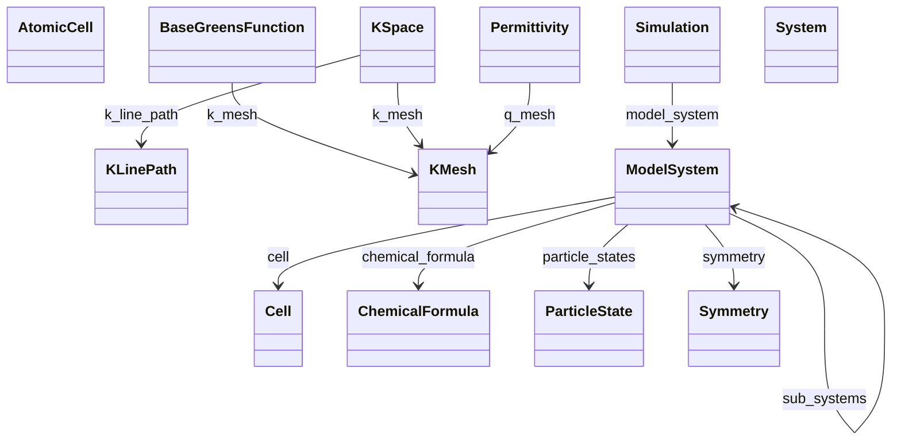

# System & Geometry

**Purpose.** Atomic structure, cell, symmetry and reciprocal space definitions.
**In scope:** lattice, positions, periodicity, k-space definitions, symmetry
**Out of scope:** workflow states, simulation outputs

## Relationship map





## Key sections

| Section | Description | MetaInfo |
|---|---|---|
| `ModelSystem` | Model system used as an input for simulating the material. | [Open in MetaInfo browser](https://nomad-lab.eu/prod/v1/oasis/gui/analyze/metainfo) |
| `System` | A base section for any system of materials which is investigated or used to construct other systems. | [Open in MetaInfo browser](https://nomad-lab.eu/prod/v1/oasis/gui/analyze/metainfo) |
| `AtomicCell` | A base section used to specify the atomic cell information of a system. | [Open in MetaInfo browser](https://nomad-lab.eu/prod/v1/oasis/gui/analyze/metainfo) |
| `Cell` | A base section used to specify the cell quantities of a system at a given moment in time. | [Open in MetaInfo browser](https://nomad-lab.eu/prod/v1/oasis/gui/analyze/metainfo) |
| `Symmetry` | A base section used to specify the symmetry of the `AtomicCell`. | [Open in MetaInfo browser](https://nomad-lab.eu/prod/v1/oasis/gui/analyze/metainfo) |
| `KSpace` | A base section used to specify the settings of the k-space. | [Open in MetaInfo browser](https://nomad-lab.eu/prod/v1/oasis/gui/analyze/metainfo) |
| `KMesh` | A base section used to specify the settings of a sampling mesh in reciprocal space. | [Open in MetaInfo browser](https://nomad-lab.eu/prod/v1/oasis/gui/analyze/metainfo) |
| `ChemicalFormula` | A base section used to store the chemical formulas of a `ModelSystem` in different formats. | [Open in MetaInfo browser](https://nomad-lab.eu/prod/v1/oasis/gui/analyze/metainfo) |


## Micro-examples

=== "YAML"

    ```yaml
    ModelSystem:
      name:
      - null
      type:
      - null
      dimensionality:
      - null
      is_representative: false
      time_step:
      - null
      branch_label:
      - null
      branch_depth:
      - null
      particle_indices:
      - null
      n_particles:
      - null
      positions:
      - null
      velocities:
      - null
      bond_list:
      - null
      composition_formula:
      - null
      total_charge:
      - null
      total_spin:
      - null
      cell:
      - {}
      symmetry:
      - {}
      chemical_formula: {}
      particle_states:
      - {}
      sub_systems:
      - {}
    System:
      formula:
      - null
      sub_systems:
      - {}
      geometry: {}
    AtomicCell:
      equivalent_atoms:
      - null
      wyckoff_letters:
      - null
    Cell:
      name:
      - null
      type:
      - null
      n_cell_points:
      - null
      lattice_vectors:
      - null
      periodic_boundary_conditions:
      - null
      supercell_matrix:
      - null
    Symmetry:
      bravais_lattice:
      - null
      hall_symbol:
      - null
      point_group_symbol:
      - null
      space_group_number:
      - null
      space_group_symbol:
      - null
      strukturbericht_designation:
      - null
      prototype_formula:
      - null
      prototype_aflow_id:
      - null
      atomic_cell_ref:
      - null
    KSpace:
      reciprocal_lattice_vectors:
      - null
      k_mesh:
      - {}
      k_line_path: {}
    KMesh:
      label: k-mesh
      center:
      - null
      offset:
      - null
      all_points:
      - null
      high_symmetry_points:
      - null
      k_line_density:
      - null
    ChemicalFormula:
      descriptive:
      - null
      reduced:
      - null
      iupac:
      - null
      hill:
      - null
      anonymous:
      - null
    ```