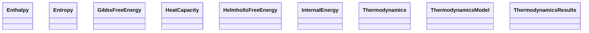

# Thermodynamics

**Purpose.** Thermodynamic state functions and models.
**In scope:** state functions, derived thermodynamic curves
**Out of scope:** MD raw trajectories (see Results)

## Relationship map





## Key sections

| Section | Description | MetaInfo |
|---|---|---|
| `Thermodynamics` |  | [Open in MetaInfo browser](https://nomad-lab.eu/prod/v1/oasis/gui/analyze/metainfo) |
| `ThermodynamicsModel` |  | [Open in MetaInfo browser](https://nomad-lab.eu/prod/v1/oasis/gui/analyze/metainfo) |
| `ThermodynamicsResults` |  | [Open in MetaInfo browser](https://nomad-lab.eu/prod/v1/oasis/gui/analyze/metainfo) |
| `HeatCapacity` | Amount of heat to be supplied to a material to produce a unit change in its temperature. | [Open in MetaInfo browser](https://nomad-lab.eu/prod/v1/oasis/gui/analyze/metainfo) |
| `Entropy` | A measure of the disorder or randomness in a system. | [Open in MetaInfo browser](https://nomad-lab.eu/prod/v1/oasis/gui/analyze/metainfo) |
| `HelmholtzFreeEnergy` | The energy available to do work in a system at constant volume and temperature, given by `InternalEnergy` - `Temperature` * `Entropy`. | [Open in MetaInfo browser](https://nomad-lab.eu/prod/v1/oasis/gui/analyze/metainfo) |
| `GibbsFreeEnergy` | The energy available to do work in a system at constant temperature and pressure, given by `Enthalpy` - `Temperature` * `Entropy`. | [Open in MetaInfo browser](https://nomad-lab.eu/prod/v1/oasis/gui/analyze/metainfo) |
| `Enthalpy` | The total heat content of a system, defined as 'InternalEnergy' + 'Pressure' * 'Volume'. | [Open in MetaInfo browser](https://nomad-lab.eu/prod/v1/oasis/gui/analyze/metainfo) |
| `InternalEnergy` | The total energy contained within a system, encompassing both kinetic and potential energies of the particles. | [Open in MetaInfo browser](https://nomad-lab.eu/prod/v1/oasis/gui/analyze/metainfo) |


## Micro-examples

=== "YAML"

    ```yaml
    Thermodynamics: {}
    ThermodynamicsModel: {}
    ThermodynamicsResults:
      n_values:
      - null
      temperature:
      - null
      pressure:
      - null
    HeatCapacity:
      value:
      - null
    Entropy:
      value:
      - null
    HelmholtzFreeEnergy: {}
    GibbsFreeEnergy: {}
    Enthalpy: {}
    InternalEnergy: {}
    ```